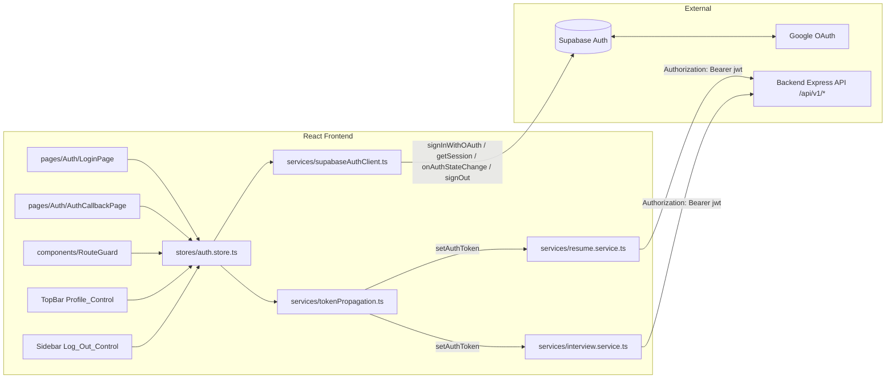
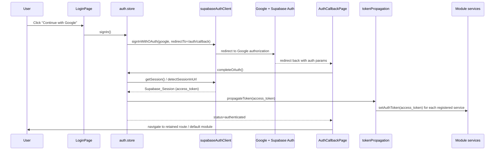

# Design Document

## Overview

This document describes the design for the **Auth** feature of the StayQualifAI platform. The feature adds the missing authentication and session layer to the React frontend so that backend `/api/v1/*` calls — already protected by the shared `requireAuth` middleware — succeed instead of returning HTTP 401.

Scope is intentionally narrow: **Google OAuth sign-in only**, performed through Supabase Auth (`signInWithOAuth` with provider `google`). There is no email/password flow, no magic links, and no additional identity providers. The feature delivers a login screen with a single "Continue with Google" action, handles the OAuth redirect/callback, establishes a `Supabase_Session`, propagates the session access token into every module service's `setAuthToken`, refreshes the token on rotation, guards routes, signs out through the existing sidebar "Log out" control, persists the session across reloads, and renders the signed-in user's identity in the existing top-bar profile control.

### Frontend-Only Feature

This is a **frontend-only** feature. The backend requires **no changes**: `backend/src/middleware/auth.ts` (`requireAuth`) already verifies Google-issued Supabase JWTs, attaches `req.user`, and builds a per-request, JWT-scoped `req.supabase` client so Row Level Security remains the source of truth for ownership. The design confirms this by tracing the token from the Supabase session, through `setAuthToken`, onto the `Authorization: Bearer <jwt>` header that `requireAuth` consumes. No route, controller, service, or middleware on the backend is added or modified.

### Scoped Supabase Client Exception

The platform steering rule states the frontend never imports the Supabase client. This feature introduces a **documented, scoped exception** (already recorded in `.kiro/steering/tech.md` "Authentication & Authorization"): the frontend MAY use a Supabase client **for authentication and session management only** — OAuth sign-in, session retrieval, token refresh, and sign-out. All application data (resume, interview, job search, upskilling, benchmarking) continues to flow exclusively through the backend Express API. The Supabase client is never used for database, storage, or realtime access (Requirement 10).

### Conventions Honored

The design mirrors the structure, depth, and conventions of the Module 1 (Resume) and Module 2 (Interview) designs and honors the steering rules:

- **TypeScript strict mode**, named exports only, explicit return types on all exported functions, no `any` (prefer `unknown` + type guards).
- **State management**: one Zustand store per domain — a new `auth.store.ts` owns all auth/session state.
- **Styling**: Tailwind utility classes; no inline styles or CSS modules.
- **Component architecture**: presentational components in `components/`, page-level composition in `pages/`, reusable logic in `hooks/`.
- **Data boundary**: module services keep talking only to the backend API; the Supabase client is isolated behind a single auth wrapper.
- **Accessibility / modern web**: keyboard-operable controls, semantic HTML, `aria-label` on icon-only controls, visible focus, lazy-loaded avatar image (`modern-web.md`).

### Key Design Decisions

1. **A single Supabase Auth client wrapper isolates the exception.** Only `frontend/src/services/supabaseAuthClient.ts` imports `@supabase/supabase-js`. It exposes a minimal auth-only surface (sign-in, get session, subscribe to changes, sign-out). Nothing else in the frontend touches the Supabase client, keeping the scoped exception auditable (Requirements 10.1, 10.3).

2. **One auth store is the single source of truth for session state.** `auth.store.ts` holds a discriminated `status` (`initializing | unauthenticated | authenticating | propagating | authenticated`), the current `Supabase_Session`, the derived `User_Identity`, and the last auth error. The Route_Guard, Login_Screen, and Profile_Control all derive their view from this one store, which guarantees that exactly one of {loading, login, module} is shown at any time (Requirements 3.x, 5.4, 7.3).

3. **Token propagation is a single fan-out registry.** A `tokenPropagation.ts` helper holds an ordered registry of every module service's `setAuthToken`. On any session/token change the store calls one `propagateToken(token | null)` that fans the value out to every registered service. New modules register their `setAuthToken` once at startup — the auth store never imports module services directly, avoiding cross-module coupling (Requirements 3.1, 4.1, 6.2, 7.2).

4. **The Supabase client owns refresh; the store reacts.** `autoRefreshToken` and `persistSession` are enabled on the wrapper so Supabase rotates the access token (≥60s before expiry) and persists the session to storage. The store subscribes to `onAuthStateChange` and re-propagates on `SIGNED_IN`, `TOKEN_REFRESHED`, and `SIGNED_OUT` (Requirements 4.2, 7.1).

5. **401 is treated as session invalidation.** Module services already throw typed `*ApiError` carrying `status`. A store-level `handleAuthFailure` (invoked by a thin API-failure listener / hook) detects `status === 401` and performs a forced sign-out: terminate session, clear tokens (propagate `null`), redirect to Login_Screen with a "session expired" message (Requirements 9.3, 9.4, 9.6).

6. **Pure logic is extracted for testability.** The fallback-initial derivation and the view-selection function are pure functions, enabling property-based tests; OAuth redirect, callback handling, route guarding, and Supabase session mechanics are validated by example/integration tests (mirroring the Resume/Interview testing convention).

## Architecture

### System Context



The Supabase client is reached **only** through `supabaseAuthClient.ts`. Module services never import it; they only receive a token string via `setAuthToken`, exactly as they do today.

### Session and Token Flow



### App Composition

`App.tsx` is restructured so the existing `AppShell` (Sidebar + TopBar + module `Routes`) renders only for authenticated users. The top-level route tree becomes:

- `/login` → `LoginPage` (no shell).
- `/auth/callback` → `AuthCallbackPage` (no shell).
- everything else → wrapped in `RouteGuard`, which renders `AppShell` (with the existing module routes unchanged) when authenticated, a full-screen loading state while `initializing`/`propagating`, or redirects to `/login` when unauthenticated.

A single `useAuthBootstrap()` effect at the app root triggers the store's `bootstrap()` (calls `getSession()`) and subscribes to `onAuthStateChange`. The existing `MODULE_LINKS`, nested `/resume` and `/interview` routes, and `ComingSoonPage` placeholders are preserved verbatim inside the guarded subtree.

### Startup / Initialization Order

1. App mounts → `auth.store` is created with `status = 'initializing'`.
2. `tokenPropagation` registry is populated once (module services register their `setAuthToken` at module load).
3. `useAuthBootstrap()` calls `bootstrap()`:
   - If `supabaseAuthClient` fails to initialize because a required env var is missing/empty, the store enters `status = 'unavailable'` and the Login_Screen renders an "authentication unavailable" state (Requirement 10.5).
   - Otherwise `getSession()` runs under a 10s timeout (Requirements 7.4, 7.5).
4. On a restored session with a non-empty access token → propagate, then `status = 'authenticated'`. Otherwise `status = 'unauthenticated'`.
5. `onAuthStateChange` subscription stays active for the app lifetime to handle `TOKEN_REFRESHED` and `SIGNED_OUT`.

## Components and Interfaces

All new files follow the steering placement rules:

| File | Responsibility |
|------|----------------|
| `frontend/src/services/supabaseAuthClient.ts` | The ONLY importer of `@supabase/supabase-js`; auth-only Supabase surface. |
| `frontend/src/services/tokenPropagation.ts` | Registry + fan-out of `setAuthToken` to every module service. |
| `frontend/src/stores/auth.store.ts` | Zustand store: single source of truth for session/auth state. |
| `frontend/src/types/auth.types.ts` | Shared auth types (session/user/identity/status). |
| `frontend/src/components/RouteGuard/RouteGuard.tsx` | Route protection + view selection. |
| `frontend/src/components/RouteGuard/viewSelection.ts` | Pure view-selection + fallback-initial helpers. |
| `frontend/src/pages/Auth/LoginPage.tsx` | Login_Screen with "Continue with Google". |
| `frontend/src/pages/Auth/AuthCallbackPage.tsx` | OAuth_Callback handler. |
| `frontend/src/components/ProfileControl/ProfileControl.tsx` | Profile_Control (avatar + identity popover). |
| `frontend/src/hooks/useAuthBootstrap.ts` | Bootstraps session + subscribes to auth changes. |
| `frontend/src/hooks/useApiAuthFailure.ts` | Bridges module-service 401s to the store's forced sign-out. |

### Supabase Auth Client Wrapper

Isolates the scoped exception. Reads `VITE_SUPABASE_URL` and `VITE_SUPABASE_ANON_KEY` from `import.meta.env`; throws a typed initialization error if either is missing/empty (Requirements 10.4, 10.5).

```typescript
import {
  createClient,
  type Session,
  type AuthChangeEvent,
  type Subscription,
} from '@supabase/supabase-js';

/** Thrown when required Supabase env configuration is absent or empty. */
export class AuthConfigError extends Error {}

/** Auth-only surface. No database, storage, or realtime methods are exposed. */
export interface ISupabaseAuthClient {
  signInWithGoogle(redirectTo: string): Promise<void>;
  getSession(): Promise<Session | null>;
  signOut(): Promise<void>;
  onAuthStateChange(
    handler: (event: AuthChangeEvent, session: Session | null) => void,
  ): Subscription;
}

/** Lazily build the client; throws AuthConfigError on missing env. */
export function createSupabaseAuthClient(): ISupabaseAuthClient;
```

The underlying `createClient` is configured with `auth: { persistSession: true, autoRefreshToken: true, detectSessionInUrl: true, flowType: 'pkce' }` so the library owns persistence, refresh (≥60s before expiry), and callback detection.

### Token Propagation Registry

A single fan-out point. Every module service registers its `setAuthToken` once; the auth store calls only `propagateToken`.

```typescript
/** The shape every module service already satisfies. */
export type SetAuthToken = (token: string | null) => void;

export interface IServiceRegistration {
  /** Stable identifier for logging/diagnostics, e.g. "resume", "interview". */
  readonly id: string;
  readonly setAuthToken: SetAuthToken;
}

/** Register a module service exactly once (idempotent by id). */
export function registerAuthTokenService(reg: IServiceRegistration): void;

/** Per-service propagation outcome. */
export interface IPropagationResult {
  readonly id: string;
  readonly ok: boolean;
  readonly error?: unknown;
}

/**
 * Fan the token (or null) out to every registered service. Never throws:
 * a failure in one service is captured as a result so unrelated modules can
 * still render (Requirement 3.4).
 */
export function propagateToken(token: string | null): IPropagationResult[];

/** Read-only view of registered ids (used by the store to gate module render). */
export function registeredServiceIds(): readonly string[];
```

At startup the resume and interview services register themselves (today's two modules); future modules register the same way without changing the store.

### Auth Store

```typescript
export type AuthStatus =
  | 'initializing'   // bootstrap in progress (Req 7.3 loading)
  | 'unauthenticated'// no session → Login_Screen
  | 'authenticating' // sign-in initiated, awaiting redirect (Req 1.7)
  | 'propagating'    // session established, tokens fanning out (Req 3.3)
  | 'authenticated'  // tokens propagated, modules may render
  | 'unavailable';   // Supabase client could not initialize (Req 10.5)

export interface IAuthError {
  type: 'oauth_failed' | 'session_expired' | 'signout_unconfirmed'
      | 'no_access_token' | 'config_missing' | 'unknown';
  message: string;
}

export interface IAuthState {
  status: AuthStatus;
  session: ISupabaseSession | null;
  identity: IUserIdentity | null;
  /** Route to return to after login (Requirements 5.1, 5.5). */
  redirectTo: string | null;
  error: IAuthError | null;
  /** True while a sign-out is in flight (Requirement 6.5). */
  isSigningOut: boolean;
}

export interface IAuthActions {
  bootstrap(): Promise<void>;                 // Req 7
  signIn(): Promise<void>;                     // Req 1, 2.1
  completeOAuth(): Promise<void>;              // Req 2.2–2.5, 3
  signOut(): Promise<void>;                    // Req 6
  handleAuthFailure(status: number): void;     // Req 9.3, 9.6
  setRedirectTo(path: string | null): void;    // Req 5.1, 5.5
  clearError(): void;
}

export type IAuthStore = IAuthState & IAuthActions;
```

Behavioral notes mapped to requirements:

- `signIn()` sets `status = 'authenticating'`, disables the button via state (Req 1.6), calls `signInWithGoogle(callbackUrl)`. On failure before redirect → `status = 'unauthenticated'`, `error = oauth_failed`, button re-enabled (Req 1.8).
- `completeOAuth()` resolves the session under a 10s timeout. On success with a non-empty access token → `status = 'propagating'`, call `propagateToken`, then `status = 'authenticated'`. On missing params or timeout → `status = 'unauthenticated'`, `error = oauth_failed`, no session (Req 2.5). On a session lacking a non-empty access token → leave token unset, `status = 'unauthenticated'`, `error = no_access_token` (Req 3.5).
- The `onAuthStateChange` handler re-propagates on `TOKEN_REFRESHED` (Req 4.1) and runs the forced-signout path on `SIGNED_OUT` / refresh rejection (Req 4.3).
- `signOut()` ignores re-entry while `isSigningOut` (Req 6.5), calls `signOut()` under a 5s timeout; whether it succeeds, times out, or fails, it always clears tokens (`propagateToken(null)`) and navigates to `/login`. A timeout/failure additionally sets `error = signout_unconfirmed` (Requirements 6.1–6.4).
- `handleAuthFailure(401)` terminates the session, propagates `null`, sets `error = session_expired`, `status = 'unauthenticated'` (Requirements 9.3, 9.4, 9.6).

### Route Guard and View Selection

The guard derives its render purely from `status` and renders exactly one outcome. The decision is a pure function for testability:

```typescript
export type GuardView = 'loading' | 'login' | 'module' | 'unavailable';

/** Pure: maps auth status + requested-route kind to exactly one view. */
export function selectGuardView(input: {
  status: AuthStatus;
  isLoginRoute: boolean;
}): GuardView;
```

- `initializing` / `propagating` → `loading` (Requirements 5.4, 7.3, 3.3).
- `authenticated` + module route → `module`; `authenticated` + login route → redirect to default module (Requirement 5.3).
- `unauthenticated` + module route → redirect to `/login`, retaining the requested route in `redirectTo` (Requirement 5.1); + login route → `login`.
- `unavailable` → `unavailable` login state (Requirement 10.5).
- On transition to `authenticated`, the guard navigates to `redirectTo` (or default module) (Requirement 5.5).

### Login Page

A presentational page reading `status`/`error` from the store.

```typescript
export function LoginPage(): JSX.Element;
```

- Renders exactly one sign-in control (Requirements 1.2, 1.3): a `<button type="button">` with visible text and accessible name "Continue with Google" (Req 1.5 — natively Tab-reachable and Enter/Space-operable).
- Disabled while `status === 'authenticating'`; shows a loading state until redirect (Requirements 1.6, 1.7).
- Renders the authentication-failed message when `error` is `oauth_failed`/`no_access_token`, and the "session expired" message for `session_expired`; the message persists until the user reactivates the button (Requirements 1.8, 9.1, 9.4). Cancelled authorization shows no error (Requirement 9.2).
- Renders an "authentication unavailable" notice (no sign-in action enabled) when `status === 'unavailable'` (Requirement 10.5).

### OAuth Callback Page

```typescript
export function AuthCallbackPage(): JSX.Element;
```

Mounts, shows a loading state, and calls `completeOAuth()` once. On success navigates to the retained route/default module (Requirement 2.4); on failure navigates back to `/login` with the appropriate error (Requirement 2.5). While processing it renders neither the Login_Screen nor a module (Requirement 2.3).

### Profile Control (TopBar)

Replaces the placeholder avatar button in `TopBar`. Uses a native `popover` for the identity panel (modern-web.md) and lazy-loads the avatar image.

```typescript
export interface IProfileControlProps {
  identity: IUserIdentity | null;
}
export function ProfileControl(props: IProfileControlProps): JSX.Element;
```

- Shows the avatar image when `avatarUrl` loads successfully within 5s (Requirement 8.1); on `onError` (or 5s load timeout) it hides the image and shows the fallback indicator only (Requirement 8.4).
- On activation, shows name + email as readable text (Requirement 8.2).
- Fallback indicator = first alphabetic character of name, else first character of email, else a default placeholder (Requirements 8.3, 8.5) — computed by the pure `deriveFallbackInitial` helper.

### Sidebar Log Out Wiring

The existing sidebar "Log out" `<button>` is wired to `signOut()`. It is disabled while `isSigningOut` so repeat activations are ignored (Requirement 6.5). No markup/visual change beyond the handler and disabled state.

### API 401 Bridge

Module services already throw `ResumeApiError` / `InterviewApiError` with a `status`. A small hook subscribes to store-level error reporting (each store maps service errors to `IStoreError` with `status`). `useApiAuthFailure` observes any `status === 401` and calls `auth.store.handleAuthFailure(401)`. This avoids modifying the module services or their stores beyond reading the already-present `status`.

```typescript
/** Wire module-store auth failures to the auth store's forced sign-out. */
export function useApiAuthFailure(): void;
```

## Data Models

Types live in `frontend/src/types/auth.types.ts`. The session/user shapes are narrowed projections of the Supabase `Session`/`User` objects — the store stores only what the UI needs.

```typescript
/** Narrowed projection of the Supabase user identity (from Google profile). */
export interface IUserIdentity {
  id: string;
  /** Display name from the Google profile, when present. */
  name: string | null;
  /** Email from the Google profile, when present. */
  email: string | null;
  /** Avatar URL from the Google profile, when present. */
  avatarUrl: string | null;
}

/** Narrowed projection of the Supabase session the UI depends on. */
export interface ISupabaseSession {
  /** The JWT sent as `Authorization: Bearer <token>` to the backend. */
  accessToken: string;
  /** Unix seconds at which the access token expires (for refresh reasoning). */
  expiresAt: number | null;
  identity: IUserIdentity;
}

/** Derived display value for the Profile_Control fallback indicator. */
export type FallbackIndicator = string; // single character, or default placeholder
```

Mapping from Supabase: `name` ← `user.user_metadata.full_name ?? user.user_metadata.name`, `avatarUrl` ← `user.user_metadata.avatar_url ?? user.user_metadata.picture`, `email` ← `user.email`. A pure `toUserIdentity(user)` performs this projection.

## Correctness Properties

*A property is a characteristic or behavior that should hold true across all valid executions of a system — essentially, a formal statement about what the system should do. Properties serve as the bridge between human-readable specifications and machine-verifiable correctness guarantees.*

Most of this feature is OAuth redirect/callback mechanics, route navigation, render assertions, accessibility behavior, Supabase session persistence, and architectural constraints — these are validated by example, integration, and smoke tests (see Testing Strategy), mirroring the Resume/Interview convention. Three pieces of logic are genuinely input-varying and pure enough to express as universal properties: the token-propagation invariant, the view-selection mutual-exclusion rule, and the fallback-indicator derivation. The prework reduced the many token-related acceptance criteria (3.1, 3.3, 3.4, 4.1, 6.2, 7.2, 9.6) to a single comprehensive propagation invariant, and the view-related criteria (1.1, 3.3, 5.3, 5.4, 7.3) to a single mutual-exclusion property, eliminating redundancy.

### Property 1: Token propagation matches session state

*For any* registry of module services and *any* session state (an active session with a non-empty access token, or no/empty session), after the Auth_System propagates the token, every registered module service holds exactly that access token when the session is active with a non-empty token, and holds `null` otherwise; and propagation always reports a per-service result and never throws, so a failure propagating to one service does not prevent the others from receiving the token.

**Validates: Requirements 3.1, 3.3, 3.4, 4.1, 6.2, 7.2, 9.6**

### Property 2: View selection is mutually exclusive and status-consistent

*For any* auth status and *any* requested-route kind (login route or module route), `selectGuardView` returns exactly one view, and that view is consistent with the status: an undetermined or propagating status yields `loading`, an authenticated status never yields `login` for a module route (and never yields `module` for the login route), and an unauthenticated status never yields `module`.

**Validates: Requirements 1.1, 3.3, 5.3, 5.4, 7.3**

### Property 3: Fallback indicator derivation

*For any* `User_Identity`, the derived fallback indicator equals the first alphabetic character of the name when the name contains an alphabetic character; otherwise the first character of the email when an email is present; otherwise a fixed default placeholder — and the result is always exactly one indicator value.

**Validates: Requirements 8.3, 8.5**

## Error Handling

All authentication failures resolve to one of the typed `IAuthError` values and a deterministic state transition; the user is never left in an ambiguous state, and exactly one of {loading, login, module} is always visible.

| Scenario | Detection | Handling | Requirements |
|----------|-----------|----------|--------------|
| OAuth initiation fails before redirect | `signInWithGoogle` rejects | Stay on Login, stop loading, `error = oauth_failed`, re-enable button | 1.8, 9.1 |
| User cancels Google authorization | Callback without auth params | Return to Login, **no** error message, button available | 9.2 |
| Callback missing params or session ≥10s | `completeOAuth` timeout/parse | No session, return to Login, `error = oauth_failed` | 2.5 |
| Session established without non-empty token | Empty `accessToken` | Leave token unset, no module render, Login + `no_access_token` | 3.5 |
| Token refresh rejected/expired | `onAuthStateChange` SIGNED_OUT / refresh error | Terminate session, `propagateToken(null)`, redirect, `session_expired` | 4.3 |
| Backend returns 401 on presumed-active session | Module store error `status === 401` via `useApiAuthFailure` | `handleAuthFailure(401)`: terminate, `propagateToken(null)`, redirect, `session_expired` | 9.3, 9.4, 9.6 |
| Sign-out fails or exceeds 5s | `signOut` reject/timeout | Still `propagateToken(null)`, navigate to Login, `signout_unconfirmed` | 6.4 |
| Stored session restore fails on load | `getSession` reject | Clear stored state, render Login, **no** error message | 9.5 |
| On-load determination exceeds 10s | bootstrap timeout | Stop loading, clear stored state, render Login | 7.5 |
| Missing/empty Supabase env var | `createSupabaseAuthClient` throws `AuthConfigError` | `status = 'unavailable'`, render auth-unavailable Login state | 10.5 |

`propagateToken` is intentionally total (never throws): it returns `IPropagationResult[]` so the store can let modules whose dependencies succeeded render while logging any isolated failure (Requirement 3.4).

## Testing Strategy

The feature uses the existing frontend toolchain (Vitest + Testing Library + jsdom, already configured in `vite.config.ts`). Property-based tests use **fast-check** (added as a frontend dev dependency) since the codebase has no PBT library yet; we do not hand-roll randomized testing.

### Dual Testing Approach

- **Property-based tests** (fast-check, minimum **100 iterations** each) cover the three universal properties above. Each test is tagged with a comment referencing its design property in the format **Feature: auth, Property {n}: {property text}**.
- **Unit / example tests** cover concrete render output, accessibility, disabled/loading states, navigation, and error scenarios.
- **Integration tests** cover the Supabase wrapper interactions (sign-in redirect, callback session establishment, restore, sign-out) using a mocked `supabaseAuthClient` so no real network or Supabase project is required.
- **Smoke / static checks** cover the architectural constraints (only the wrapper imports `@supabase/supabase-js`; no data operations).

### Property Test Mapping

| Property | Target (pure unit under test) | Generators |
|----------|-------------------------------|------------|
| Property 1 | `propagateToken` + `registerAuthTokenService` against fake services | random service registries (varying ids/counts), random sessions (active/empty/null), injected single-service failures |
| Property 2 | `selectGuardView` | all `AuthStatus` values × `{ isLoginRoute: true|false }` |
| Property 3 | `deriveFallbackInitial` | identities with random names (alphabetic, numeric, whitespace, empty), emails, and absent fields |

### Example / Integration Test Coverage (non-PBT)

- **LoginPage**: exactly one "Continue with Google" control with correct accessible name; no email/password/magic-link/other-provider controls; Tab/Enter/Space operability; disabled + loading while authenticating; error and session-expired messages; auth-unavailable state (Requirements 1.2–1.8, 9.1, 9.2, 10.5).
- **AuthCallbackPage**: loading-only during processing; navigation on success; return to Login with error on missing params/timeout (Requirements 2.2–2.5).
- **auth.store**: sign-in/callback/sign-out/refresh/401 orchestration with a mocked wrapper and fake timers for the 5s/10s bounds (Requirements 2.5, 3.5, 4.3, 6.1–6.5, 7.4, 7.5, 9.3–9.6).
- **RouteGuard**: redirect + `redirectTo` retention for unauthenticated module routes; no Login flash when authenticated; post-login navigation to retained/default route (Requirements 5.1, 5.2, 5.5).
- **ProfileControl**: avatar shown on successful load; image hidden + fallback shown on `onError`/5s timeout; name+email on activation (Requirements 8.1, 8.2, 8.4).
- **supabaseAuthClient**: reads `import.meta.env` config; throws `AuthConfigError` on missing env; exposes only auth methods (Requirements 10.1, 10.4, 10.5).
- **Architectural smoke check**: grep/lint asserting `@supabase/supabase-js` is imported only by `supabaseAuthClient.ts`, and no data operations are routed through it (Requirements 10.2, 10.3).

## Prerequisites / External Configuration

The following is **manual configuration**, not code, and must be completed once before the feature works end-to-end. It is performed in the Google Cloud Console and the Supabase dashboard (project ref `mlnhocdsbwlaeqemluvp`).

### Google Cloud OAuth Client

1. In Google Cloud Console, create (or reuse) an OAuth 2.0 Client ID of type **Web application**.
2. Configure the OAuth consent screen (app name, support email, scopes: `email`, `profile`, `openid`).
3. Record the generated **Client ID** and **Client secret**.
4. Add the Supabase callback URL to **Authorized redirect URIs**: `https://<project-ref>.supabase.co/auth/v1/callback` (i.e. `https://mlnhocdsbwlaeqemluvp.supabase.co/auth/v1/callback`).

### Supabase Auth Provider

1. In the Supabase dashboard → **Authentication → Providers → Google**, enable the Google provider.
2. Paste the Google **Client ID** and **Client secret** from the step above.
3. In **Authentication → URL Configuration**, set the **Site URL** and add the app's callback route to the **Redirect URLs** allow-list:
   - Local dev: `http://localhost:5173/auth/callback`
   - Production: `https://<app-domain>/auth/callback`

### Frontend Environment Variables

The frontend needs its **own** `VITE_`-prefixed variables (Vite only exposes `import.meta.env` vars prefixed with `VITE_`). These are distinct from the backend's `SUPABASE_URL` / `SUPABASE_ANON_KEY`. Add to `frontend/.env` (and document in a `frontend/.env.example`, never commit `.env`):

```dotenv
# Frontend Supabase Auth (project ref: mlnhocdsbwlaeqemluvp)
VITE_SUPABASE_URL=https://mlnhocdsbwlaeqemluvp.supabase.co
VITE_SUPABASE_ANON_KEY=<public anon key>
```

The anon (public) key is safe to ship to the browser; it is gated by RLS on the backend. No service-role key is ever placed in the frontend. If either variable is absent/empty at startup, `createSupabaseAuthClient` throws `AuthConfigError` and the Auth_System renders the auth-unavailable Login state (Requirement 10.5).
