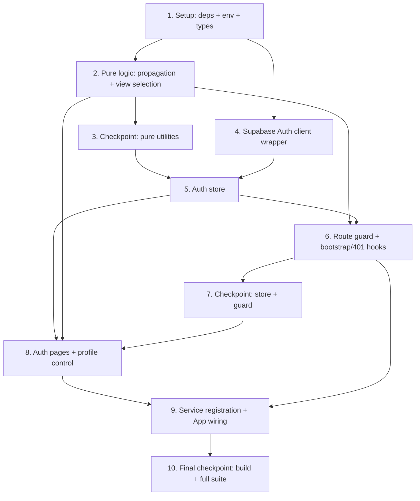

# Implementation Plan: Auth

## Overview

This plan converts the approved Auth design into incremental, test-driven coding tasks. This is a **frontend-only** feature: the backend `requireAuth` middleware, routes, controllers, and services require **no changes**, so no backend file is added or modified. Work happens entirely under `frontend/src/` and `frontend/` package config, adding the login screen, the Supabase Auth client wrapper, the auth Zustand store, the token-propagation registry, the route guard, the profile control, the bootstrap/401 hooks, and the `App.tsx` wiring that ties them together.

Work proceeds in dependency order so there is no orphaned code — every component is wired into the app by the end. Project setup (the `@supabase/supabase-js` dependency, the `fast-check` dev dependency, `frontend/.env.example`, and the shared auth types + pure `toUserIdentity` projection) comes first. Then the two pure logic units (`tokenPropagation.ts` and `viewSelection.ts`) that the property-based tests target. Then the Supabase Auth client wrapper (the ONLY importer of `@supabase/supabase-js`). Then the auth store (single source of truth). Then the route guard and the bootstrap/401 hooks. Then the login page, callback page, and profile control. Finally the startup service registration and the `App.tsx` wiring (routes, guard, sidebar "Log out", top-bar profile, bootstrap + 401 hooks), closed by an architectural smoke check and a final build + full-suite checkpoint.

The design defines exactly **3 correctness properties** (P1–P3), each mapping to exactly one `fast-check` property-based test (minimum **100 iterations**, tagged `// Feature: auth, Property {n}: ...`): P1 → `tokenPropagation`, P2 → `selectGuardView`, P3 → `deriveFallbackInitial`. OAuth redirect/callback mechanics, route navigation, render assertions, accessibility behavior, Supabase session persistence, and the architectural constraint are validated by example, integration, and smoke tests per the design's Testing Strategy.

Conventions enforced throughout (from steering): React + TypeScript strict mode, named exports only, explicit return types on all exported functions, no `any` (prefer `unknown` + type guards), Tailwind utility classes (no inline styles / CSS modules), one Zustand store per domain, and the scoped Supabase exception — the Supabase client is used for **authentication only** and is reached only through `supabaseAuthClient.ts`; all application data continues to flow through the backend Express API.

## Task Dependency Graph



```json
{
  "waves": [
    { "id": 0, "tasks": ["1.1", "1.3"] },
    { "id": 1, "tasks": ["1.2", "1.4", "2.1", "2.3"] },
    { "id": 2, "tasks": ["2.2", "2.4", "2.5", "2.6", "4.1"] },
    { "id": 3, "tasks": ["4.2", "5.1"] },
    { "id": 4, "tasks": ["5.2", "6.1", "6.3", "6.4"] },
    { "id": 5, "tasks": ["6.2", "8.1", "8.3", "8.5"] },
    { "id": 6, "tasks": ["8.2", "8.4", "8.6", "9.1"] },
    { "id": 7, "tasks": ["9.2"] },
    { "id": 8, "tasks": ["9.3", "9.4"] }
  ]
}
```

## Tasks

- [x] 1. Project setup: dependencies, environment template, and shared types
  - [x] 1.1 Add `@supabase/supabase-js` dependency and create `frontend/.env.example`
    - Add `@supabase/supabase-js` (pinned version) to `frontend/package.json` dependencies; run install so the lockfile updates
    - Create `frontend/.env.example` documenting `VITE_SUPABASE_URL` and `VITE_SUPABASE_ANON_KEY` (public anon key only — never a service-role key); never commit a real `.env`, confirm `.env` is gitignored
    - _Requirements: 10.4_
  - [x] 1.2 Add `fast-check` as a frontend dev dependency
    - Add `fast-check` to `frontend/package.json` devDependencies (the frontend has no PBT library yet); run install so the lockfile updates
    - _Requirements: 3.1, 5.4, 8.3_
  - [x] 1.3 Author `frontend/src/types/auth.types.ts` and the pure `toUserIdentity` projection
    - Define `IUserIdentity`, `ISupabaseSession`, `AuthStatus` (`initializing | unauthenticated | authenticating | propagating | authenticated | unavailable`), `IAuthError` (with `type` union `oauth_failed | session_expired | signout_unconfirmed | no_access_token | config_missing | unknown`), `IAuthState`, `IAuthActions`, `IAuthStore`, and `FallbackIndicator`
    - Implement the pure `toUserIdentity(user): IUserIdentity` projection: `name` ← `user_metadata.full_name ?? user_metadata.name`, `avatarUrl` ← `user_metadata.avatar_url ?? user_metadata.picture`, `email` ← `user.email`; explicit return type, named exports only, no `any`
    - _Requirements: 8.2, 8.3, 8.5_
  - [ ]* 1.4 Write unit test for `toUserIdentity`
    - Assert name/email/avatar fallbacks resolve in order and absent fields map to `null`
    - _Requirements: 8.3, 8.5_

- [x] 2. Implement the pure logic units (property-test targets)
  - [x] 2.1 Implement `frontend/src/services/tokenPropagation.ts`
    - Implement `registerAuthTokenService(reg)` (idempotent by `id`), `propagateToken(token: string | null): IPropagationResult[]` (fans the value out to every registered `setAuthToken`, total — never throws, captures any per-service failure as `{ id, ok: false, error }`), and `registeredServiceIds()`
    - Define `SetAuthToken`, `IServiceRegistration`, `IPropagationResult`; explicit return types, named exports, no `any`
    - _Requirements: 3.1, 3.4, 4.1, 6.2, 7.2_
  - [ ]* 2.2 Write property test for token propagation
    - **Property 1: Token propagation matches session state**
    - Generators: random service registries (varying ids/counts), random session states (active w/ non-empty token, empty token, null), injected single-service failures; assert every service holds exactly the access token when active else `null`, that a result is reported per service, and that one service failing never prevents the others from receiving the token
    - fast-check, min 100 iterations, tag `// Feature: auth, Property 1: ...`
    - **Validates: Requirements 3.1, 3.3, 3.4, 4.1, 6.2, 7.2, 9.6**
  - [x] 2.3 Implement `frontend/src/components/RouteGuard/viewSelection.ts`
    - Implement the pure `selectGuardView({ status, isLoginRoute }): GuardView` (`'loading' | 'login' | 'module' | 'unavailable'`) per the design's status→view table, and the pure `deriveFallbackInitial(identity): FallbackIndicator` (first alphabetic char of name, else first char of email, else fixed default placeholder)
    - Explicit return types, named exports, no `any`
    - _Requirements: 1.1, 5.3, 5.4, 7.3, 8.3, 8.5, 10.5_
  - [ ]* 2.4 Write property test for `selectGuardView`
    - **Property 2: View selection is mutually exclusive and status-consistent**
    - Generators: all `AuthStatus` values × `{ isLoginRoute: true | false }`; assert exactly one view is returned and that it is status-consistent (undetermined/propagating → `loading`; authenticated never `login` for a module route nor `module` for the login route; unauthenticated never `module`)
    - fast-check, min 100 iterations, tag `// Feature: auth, Property 2: ...`
    - **Validates: Requirements 1.1, 3.3, 5.3, 5.4, 7.3**
  - [ ]* 2.5 Write property test for `deriveFallbackInitial`
    - **Property 3: Fallback indicator derivation**
    - Generators: identities with random names (alphabetic, numeric, whitespace, empty), emails, and absent fields; assert the result equals first-alphabetic-of-name, else first-char-of-email, else the fixed default, and is always exactly one indicator value
    - fast-check, min 100 iterations, tag `// Feature: auth, Property 3: ...`
    - **Validates: Requirements 8.3, 8.5**
  - [ ]* 2.6 Write unit tests for `selectGuardView` edge transitions
    - Authenticated + login route redirects to default module; unauthenticated + module route yields `login`; `unavailable` yields `unavailable`
    - _Requirements: 5.1, 5.3, 10.5_

- [x] 3. Checkpoint — pure utilities
  - Ensure all tests pass, ask the user if questions arise.

- [x] 4. Implement the Supabase Auth client wrapper
  - [x] 4.1 Implement `frontend/src/services/supabaseAuthClient.ts`
    - The ONLY importer of `@supabase/supabase-js`; export `AuthConfigError`, `ISupabaseAuthClient` (auth-only surface: `signInWithGoogle(redirectTo)`, `getSession()`, `signOut()`, `onAuthStateChange(handler)`), and `createSupabaseAuthClient()`
    - Read `VITE_SUPABASE_URL` / `VITE_SUPABASE_ANON_KEY` from `import.meta.env`; throw `AuthConfigError` when either is missing/empty; configure `createClient` with `auth: { persistSession: true, autoRefreshToken: true, detectSessionInUrl: true, flowType: 'pkce' }`; expose NO database/storage/realtime methods
    - _Requirements: 4.2, 7.1, 10.1, 10.3, 10.4, 10.5_
  - [ ]* 4.2 Write tests for the wrapper config and auth-only surface (mocked `@supabase/supabase-js`)
    - Reads `import.meta.env` config; throws `AuthConfigError` on missing/empty env; exposes only the four auth methods and no data operations
    - _Requirements: 10.1, 10.4, 10.5_

- [x] 5. Implement the auth store
  - [x] 5.1 Implement `frontend/src/stores/auth.store.ts`
    - Zustand store (one per domain) holding `status`, `session`, `identity`, `redirectTo`, `error`, `isSigningOut`, with actions `bootstrap`, `signIn`, `completeOAuth`, `signOut`, `handleAuthFailure`, `setRedirectTo`, `clearError`; uses `supabaseAuthClient` and `propagateToken`, never importing module services directly
    - Behavior: `bootstrap()` runs `getSession()` under a 10s timeout (`unavailable` on `AuthConfigError`); `signIn()` sets `authenticating`, disables retry, `oauth_failed` + re-enable on pre-redirect failure; `completeOAuth()` resolves session under 10s timeout, `propagating`→`authenticated` on non-empty token, `no_access_token`/`oauth_failed` paths otherwise; `onAuthStateChange` re-propagates on `TOKEN_REFRESHED` and forces sign-out on `SIGNED_OUT`/refresh rejection; `signOut()` ignores re-entry while `isSigningOut`, 5s timeout, always `propagateToken(null)` + navigate, `signout_unconfirmed` on timeout/failure; `handleAuthFailure(401)` terminates, `propagateToken(null)`, `session_expired`
    - _Requirements: 1.6, 1.7, 1.8, 2.2, 2.5, 3.1, 3.3, 3.5, 4.1, 4.3, 5.1, 5.5, 6.1, 6.2, 6.3, 6.4, 6.5, 7.1, 7.2, 7.4, 7.5, 9.3, 9.4, 9.6, 10.5_
  - [ ]* 5.2 Write unit tests for the store (mocked wrapper + fake timers)
    - sign-in/callback/sign-out/refresh/401 orchestration with a mocked `supabaseAuthClient`; fake timers assert the 5s sign-out and 10s bootstrap/callback bounds; assert `no_access_token` (3.5), refresh rejection (4.3), forced 401 sign-out (9.3, 9.4, 9.6), sign-out re-entry ignored (6.5), and `signout_unconfirmed` (6.4)
    - _Requirements: 2.5, 3.5, 4.3, 6.1, 6.2, 6.3, 6.4, 6.5, 7.4, 7.5, 9.3, 9.4, 9.6_

- [x] 6. Implement the route guard and bootstrap / 401 hooks
  - [x] 6.1 Implement `frontend/src/components/RouteGuard/RouteGuard.tsx`
    - Derive the render from the store via the pure `selectGuardView`, rendering exactly one of loading / login redirect / module / unavailable; on unauthenticated module route, retain the requested route via `setRedirectTo` then redirect to `/login`; on transition to `authenticated`, navigate to `redirectTo` (or default module); no Login flash when already authenticated; Tailwind utility classes only
    - _Requirements: 5.1, 5.2, 5.3, 5.4, 5.5, 7.3_
  - [ ]* 6.2 Write tests for `RouteGuard`
    - Redirect + `redirectTo` retention for unauthenticated module routes; no Login flash when authenticated; loading shown while `initializing`/`propagating`; post-login navigation to retained/default route
    - _Requirements: 5.1, 5.2, 5.4, 5.5_
  - [x] 6.3 Implement `frontend/src/hooks/useAuthBootstrap.ts`
    - Root effect that triggers the store's `bootstrap()` once and subscribes to `onAuthStateChange` for the app lifetime (handling `SIGNED_IN`/`TOKEN_REFRESHED`/`SIGNED_OUT`); unsubscribes on unmount; explicit return type
    - _Requirements: 4.1, 4.2, 7.1, 7.4_
  - [x] 6.4 Implement `frontend/src/hooks/useApiAuthFailure.ts`
    - Observe module-store error reporting and call `auth.store.handleAuthFailure(401)` on any `status === 401`, without modifying the module services or their stores beyond reading the already-present `status`; explicit return type
    - _Requirements: 9.3, 9.4, 9.6_

- [x] 7. Checkpoint — store and guard
  - Ensure all tests pass, ask the user if questions arise.

- [x] 8. Implement the auth pages and profile control
  - [x] 8.1 Implement `frontend/src/pages/Auth/LoginPage.tsx`
    - Presentational page reading `status`/`error` from the store; renders exactly one `<button type="button">` with visible text and accessible name "Continue with Google" (natively Tab-reachable, Enter/Space-operable) and NO email/password/magic-link/other-provider control; disabled + loading state while `authenticating`; authentication-failed message for `oauth_failed`/`no_access_token` and session-expired message for `session_expired` (persists until retry); no error on cancelled authorization; "authentication unavailable" state (no enabled action) when `status === 'unavailable'`; Tailwind + brand palette
    - _Requirements: 1.1, 1.2, 1.3, 1.5, 1.6, 1.7, 1.8, 9.1, 9.2, 9.4, 10.5_
  - [ ]* 8.2 Write tests for `LoginPage`
    - Exactly one control with correct accessible name; absence of email/password/magic-link/other-provider controls; Tab/Enter/Space operability; disabled + loading while authenticating; error and session-expired messages; auth-unavailable state
    - _Requirements: 1.2, 1.3, 1.5, 1.6, 1.7, 1.8, 9.1, 9.2, 10.5_
  - [x] 8.3 Implement `frontend/src/pages/Auth/AuthCallbackPage.tsx`
    - Mounts, renders a loading-only state (neither Login_Screen nor module), calls `completeOAuth()` once; on success navigates to the retained route/default module; on missing params or timeout navigates back to `/login` with the appropriate error
    - _Requirements: 2.2, 2.3, 2.4, 2.5, 3.3_
  - [ ]* 8.4 Write tests for `AuthCallbackPage`
    - Loading-only during processing; navigation on success; return to Login with error on missing params/timeout
    - _Requirements: 2.3, 2.4, 2.5_
  - [x] 8.5 Implement `frontend/src/components/ProfileControl/ProfileControl.tsx`
    - Replaces the top-bar placeholder avatar; lazy-loads (`loading="lazy"`) the avatar image and shows it when it loads within 5s, else (on `onError`/5s timeout) hides the image and shows only the fallback indicator from the pure `deriveFallbackInitial`; uses a native `popover` panel to show name + email as readable text on activation; default placeholder when neither name nor email; `aria-label` on the icon-only control; Tailwind utility classes
    - _Requirements: 8.1, 8.2, 8.3, 8.4, 8.5_
  - [ ]* 8.6 Write tests for `ProfileControl`
    - Avatar shown on successful load; image hidden + fallback shown on `onError`/5s timeout; name + email shown on activation; default placeholder when identity is empty
    - _Requirements: 8.1, 8.2, 8.4, 8.5_

- [x] 9. Service registration and App wiring
  - [x] 9.1 Register the resume and interview services with the token-propagation registry at startup
    - Add a startup registration module that calls `registerAuthTokenService` for the resume and interview services (each `{ id, setAuthToken }`) once at module load, and import it at the app entry so the registry is populated before bootstrap; new modules register the same way without changing the store
    - _Requirements: 3.1, 3.2, 4.1, 6.2, 7.2_
  - [x] 9.2 Wire the Auth feature into `frontend/src/App.tsx`
    - Add `/login` → `LoginPage` and `/auth/callback` → `AuthCallbackPage` routes OUTSIDE the shell; wrap the rest of the route tree in `RouteGuard` so `AppShell` (Sidebar + TopBar + existing module routes, `MODULE_LINKS`, and `ComingSoonPage` placeholders preserved verbatim) renders only when authenticated; call `useAuthBootstrap()` at the app root; wire the Sidebar "Log out" button to `signOut()` (disabled while `isSigningOut`); replace the TopBar profile placeholder with `ProfileControl` fed the store `identity`; call `useApiAuthFailure()`
    - _Requirements: 2.4, 3.2, 5.1, 5.2, 5.3, 6.1, 6.2, 6.3, 6.5, 8.1, 9.3_
  - [ ]* 9.3 Write the architectural smoke check
    - Static/grep test asserting `@supabase/supabase-js` is imported ONLY by `frontend/src/services/supabaseAuthClient.ts` and that no database/storage/realtime data operation is routed through the Supabase client
    - _Requirements: 10.1, 10.2, 10.3_
  - [ ]* 9.4 Write the app-wiring integration/smoke test
    - With a mocked `supabaseAuthClient`: unauthenticated visit to a module route lands on the Login_Screen; a restored session renders the module without a Login flash; "Log out" clears tokens and returns to Login
    - _Requirements: 3.2, 5.1, 5.2, 6.2, 6.3, 7.1_

- [x] 10. Final checkpoint — full feature
  - Run the frontend production build and the full frontend test suite (single run, not watch mode); ensure all tests pass, ask the user if questions arise.

## Notes

- Tasks marked with `*` are optional test sub-tasks and can be skipped for a faster MVP; core implementation tasks are never optional and top-level tasks are never marked optional.
- The design defines exactly **3** correctness properties, each mapping to exactly one `fast-check` property-based test (≥100 iterations, tagged `// Feature: auth, Property {n}: ...`): P1 → `tokenPropagation` (2.2), P2 → `selectGuardView` (2.4), P3 → `deriveFallbackInitial` (2.5). All other behavior (OAuth redirect/callback, route navigation, render/accessibility assertions, Supabase session persistence, sign-out/refresh/401 orchestration, and the architectural constraint) is covered by example, integration, and smoke tests per the design's Testing Strategy, since those test mechanics/wiring rather than input-varying pure logic.
- Frontend-only: no backend file is added or modified. The existing `requireAuth` middleware already validates Google-issued Supabase JWTs; this plan only traces the token from the Supabase session through `setAuthToken` onto the `Authorization: Bearer <jwt>` header.
- Scoped Supabase exception: `@supabase/supabase-js` is imported ONLY by `supabaseAuthClient.ts` and used for authentication only (sign-in, session retrieval, token refresh, sign-out). All application data continues to flow exclusively through the backend Express API; task 9.3 enforces this with a smoke check.
- Conventions: TypeScript strict mode, named exports, explicit return types, no `any` (prefer `unknown` + type guards), Tailwind utility classes, one Zustand store per domain, and modern-web patterns (native `popover`, lazy-loaded avatar, keyboard-operable controls with `aria-label`).
- The auth store guarantees that exactly one of {loading, login, module} is visible at any time, so the UI is never ambiguous during bootstrap, propagation, or error recovery.
- Each task references the specific requirement IDs and/or design properties it implements for traceability.
- **Prerequisite (non-coding, not a task):** Google Cloud OAuth client + Supabase dashboard Google-provider/redirect-URL configuration (project ref `mlnhocdsbwlaeqemluvp`) must be completed once before the feature works end-to-end — see the "Prerequisites / External Configuration" section of `design.md`. The frontend `VITE_SUPABASE_URL` / `VITE_SUPABASE_ANON_KEY` values are filled into `frontend/.env` (templated by task 1.1's `.env.example`); a real `.env` is never committed.
