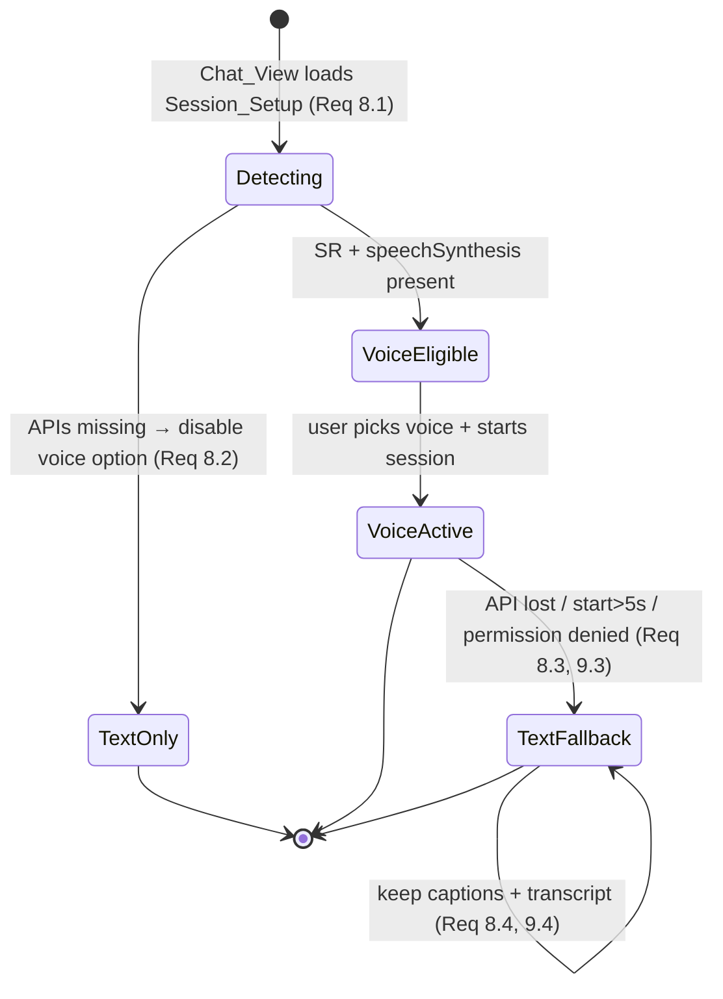

# Design Document

## Overview

This document describes the design for the **Interview Chat & Voice** feature — a **frontend-only** enhancement of the existing **Module 2: Interview**. It reshapes the Custom Interview Simulator into a chat-style conversation with an AI panelist, adds a choice of answering by **typing** or **speaking**, refreshes the Scorecard, Sessions, and STAR Organizer screens into a cohesive layout, and introduces skeleton loading states across the module.

The feature adds **no backend code, no endpoints, no environment variables, no secrets, and no new third-party runtime dependencies** (Requirement 11). It reuses the existing Interview backend lifecycle and `/api/v1/interview/*` endpoints unchanged: a session still progresses `PENDING → ACTIVE → COMPLETED → SCORED`; questions are generated server-side; answers are submitted one-per-question with a client-measured `responseLatencySeconds`; evaluation and the multi-dimensional scorecard are computed by the backend. Questions, evaluation, and the scorecard therefore continue to flow through the already-fixed module-local Gemini wrapper (`interview.aiProvider.service.ts`) on the backend — this feature never touches it directly and never adds an AI key (Requirement 11.1, 11.2).

Voice capability is delivered with **browser-native Web APIs only**:

- **Speech-to-text** via the Web Speech API (`SpeechRecognition` / `webkitSpeechRecognition`).
- **Text-to-speech** via `speechSynthesis`.

All recognition and synthesis run client-side; no candidate audio or text is sent to any external speech service (Requirement 11.1, 11.4). When a browser lacks these APIs, or the user denies microphone permission, the feature degrades gracefully to text mode (Requirements 8, 9).

### Design Principles

The design mirrors the structure, depth, and conventions established by the existing **Interview** and **auth** designs, and honors the platform steering rules:

- **Frontend talks to the backend API only.** All data access continues through `services/interview.service.ts`; the Supabase client is never imported in feature code (it is used for auth/session only, elsewhere).
- **One Zustand store per domain.** The existing `interview.store.ts` remains the single owner of *interview domain data* (sessions, questions, scorecard, STAR). No second interview data store is introduced (see Key Design Decisions §2).
- **Pure, browser-native, accessible UI.** React + TypeScript strict, Tailwind utility classes, named exports, explicit return types, no `any`. Native APIs (`<dialog>`, `popover`, `loading="lazy"`, ARIA live regions) preferred over libraries per `modern-web.md`.
- **Captions always present.** Every question and answer is visible text in the thread; no interview content is conveyed by audio alone (Requirement 10.1).

### Key Design Decisions

1. **The Chat_View replaces the Simulator tab; the other tabs stay.** The `/interview/simulator` route renders the new `InterviewChatPage` instead of `InterviewSimulatorPage`. The Scorecard, Sessions, and STAR tabs keep their routes and gain the layout refresh and skeleton states. No routing structure changes beyond swapping one tab's component.

2. **Voice/chat UI state is hook- and component-local; interview *data* stays in the store.** The store already owns the session, questions, and scorecard and is the only thing that calls the API. The new state introduced here — selected `Interview_Mode`, the live `Transcript`, speech-engine status, per-question presentation timestamps — is **ephemeral view/device state** that must not be persisted and must not compete with the store's domain data. Putting it in the domain store would mix transient device state with server-synced data and violate the "one store per domain" intent. It therefore lives in two reusable hooks (`useSpeechRecognition`, `useSpeechSynthesis`) and in `InterviewChatPage` local state. The Chat_Thread itself is **derived** from store data, not stored (Decision §3).

3. **The Chat_Thread is a pure derivation, never duplicated state.** Rather than maintaining a parallel array of messages that could drift from the session, the thread is computed by a pure function `deriveChatThread(questions, answers)` from the session's questions (ordered by `position`) and their `answerText`. This makes reopen/reconstruct (Requirement 2.8) free — the same derivation runs on fresh load — and makes the core presentation logic property-testable without a DOM.

4. **Latency is measured identically for both modes from a ref-held timestamp map.** Presentation timestamps live in a `Map<questionId, number>` held in a `useRef` (not React state) so a re-render, scroll, or remount never overwrites them (Requirement 6.1). The send path computes `clamp0(round((sentAt - presentedAt)/1000))` identically for text and voice (Requirement 6.2–6.4). This reuses the exact approach already proven in `InterviewSimulatorPage`.

5. **Voice integrates with the *existing* submit path, not a new one.** A voice answer is just text: the reviewed `Transcript` becomes the `answerText` submitted through the store's existing `submitAnswer(sessionId, questionId, { answerText, responseLatencySeconds })`. The completion → `COMPLETED` → `computeScorecard` path is unchanged (Requirements 5.10, 7).

6. **The Web Speech accumulator is modeled as a pure reducer.** Chrome's `SpeechRecognition` quirks (interim vs final results, `onend` auto-restart, losing buffered text) are notoriously hard to get right. The transcript accumulation logic is extracted into a pure reducer `speechReducer(state, event)` so it can be exhaustively property-tested (never lose a finalized segment across `onresult`/`onend`/restart sequences — Requirement 5.5–5.7), while the thin hook only wires DOM events to the reducer and reads `transcriptRef` synchronously at send time (Requirement 5.10).

7. **Skeletons are a single shared presentational primitive.** One `Skeleton` component plus `SkeletonText`/`SkeletonCard`/`SkeletonList` compositions, each conveyed to assistive tech as a busy/loading region and never focusable (Requirement 14.6, 14.7). Each refreshed page swaps skeleton → content → error off the store's `isLoading`/`error` flags.

## Architecture

### System Context

This feature is entirely within the React frontend. The backend, database, and AI provider are untouched.

```mermaid
flowchart LR
    subgraph Frontend [React Frontend — feature scope]
        Chat[InterviewChatPage (Chat_View)]
        Composer[AnswerComposer]
        Thread[ChatThread / ChatMessage]
        Derive[deriveChatThread (pure)]
        STT[useSpeechRecognition + speechReducer]
        TTS[useSpeechSynthesis + chunkForSpeech]
        Skel[Skeleton / SkeletonList / SkeletonCard]
        Pages[Scorecard / Sessions / STAR pages]
        Store[interview.store.ts (Zustand) — UNCHANGED]
        Svc[interview.service.ts — UNCHANGED]
    end

    subgraph Browser [Browser-native Web APIs]
        SR[SpeechRecognition / webkitSpeechRecognition]
        SS[speechSynthesis]
        Mic[(Microphone permission)]
    end

    subgraph Backend [Express API /api/v1/interview/* — UNCHANGED]
        API[sessions / answers / scorecard endpoints]
    end

    Chat --> Derive
    Chat --> Composer
    Chat --> Thread
    Chat --> Skel
    Pages --> Skel
    Composer --> STT
    Chat --> TTS
    STT --> SR
    STT --> Mic
    TTS --> SS
    Chat --> Store
    Pages --> Store
    Store --> Svc
    Svc -->|HTTPS JSON| API
```

### Layering and Data Flow

The feature respects the existing one-directional flow and adds only frontend layers:

1. **Pages** (`pages/Interview/*`) compose presentational components and read/write the store. They never call the service or Supabase directly.
2. **Store** (`stores/interview.store.ts`, reused unchanged) is the only thing that calls the service. It owns `activeSession`, `activeQuestions`, `scorecard`, `sessions`, `stories`, `isLoading`, `error`.
3. **Service** (`services/interview.service.ts`, reused unchanged) is the only place the `{ data, error, meta }` envelope is unwrapped.
4. **Hooks** (`hooks/useSpeechRecognition.ts`, `hooks/useSpeechSynthesis.ts`) wrap the browser-native speech APIs and expose a small, testable surface. They hold device/transcript state and call the browser APIs; they never call the store or the network.
5. **Pure utilities** (`utils/`) — `deriveChatThread`, `speechReducer`, `chunkForSpeech`, `computeResponseLatencySeconds` — contain the input-varying logic and are framework-free so they can be property-tested.

### Voice-Turn Flow (voice mode, one question)

```mermaid
sequenceDiagram
    participant U as User
    participant Chat as InterviewChatPage
    participant TTS as useSpeechSynthesis
    participant STT as useSpeechRecognition
    participant Store as interview.store

    Note over Chat: Current_Question presented → record presentedAt (ref, once)
    Chat->>TTS: speak(question.text)  (chunked ≤200, within 2s — Req 4.1/4.2)
    TTS-->>Chat: isSpeaking true → show Stop; on done show Replay
    U->>STT: tap mic → startListening() (request permission ≤1s — Req 9.1)
    STT-->>Chat: isListening true; transcript updates (≤300ms — Req 5.4)
    Note over STT: onend before stop → auto-restart ≤1000ms, keep transcript (Req 5.7)
    U->>STT: tap mic → stopListening() → flush interim (Req 5.6); no restart (Req 5.8)
    Chat-->>U: editable Transcript shown (Req 5.9)
    U->>Chat: edit text + Send
    Chat->>Chat: read transcriptRef synchronously (Req 5.10); compute latency (Req 6.2)
    Chat->>Store: submitAnswer(sessionId, questionId, { answerText, responseLatencySeconds })
    Store-->>Chat: updated question (answerText set) → thread re-derives, advances
```

### Support Detection & Fallback State Machine



Fallback never discards content: the current question's caption text and any accumulated transcript are preserved (Requirements 8.4, 9.4), and the text composer is always available for the remaining questions (Requirements 8.5, 9.5, 9.6).

## Components and Interfaces

### New / Changed Frontend Files

| File | Kind | Responsibility | Requirements |
|------|------|----------------|--------------|
| `pages/Interview/InterviewChatPage.tsx` | Page (replaces Simulator) | Session_Setup, Chat_Thread, Answer_Composer, progress, completion → scorecard, support detection, fallback orchestration | 1, 2, 4, 7, 8, 9, 10 |
| `components/ChatThread/ChatThread.tsx` | Presentational | Render ordered Chat_Messages, autoscroll, ARIA live region | 2.1, 2.7, 10.1, 10.5 |
| `components/ChatThread/ChatMessage.tsx` | Presentational | Render one assistant/user message as caption text | 2.1, 10.1 |
| `components/AnswerComposer/AnswerComposer.tsx` | Presentational + light logic | Text input + send; voice controls (mic/transcript); validation/disabled states | 3, 5, 9 |
| `components/VoiceControls/VoiceControls.tsx` | Presentational | Mic toggle, replay, stop, live-status; icon-only accessible names | 4.3, 4.4, 5.1, 10.4, 10.6 |
| `components/VoiceOrb/VoiceOrb.tsx` | Presentational (**optional**, Req 12) | Supplementary visualizer; never blocks input; suppressed on failure | 12.1, 12.2 |
| `components/Skeleton/Skeleton.tsx` | Presentational | Base shimmer block + `SkeletonText`/`SkeletonCard`/`SkeletonList`; `role="status"`/`aria-busy`, non-focusable | 14.1–14.3, 14.6, 14.7 |
| `hooks/useSpeechRecognition.ts` | Hook | STT wrapper over Web Speech API; owns transcript + status; encapsulates Chrome quirks | 5, 8.3, 9 |
| `hooks/useSpeechSynthesis.ts` | Hook | TTS wrapper over `speechSynthesis`; chunked, chained playback; cancel/replay | 4 |
| `utils/interview.chat.ts` | Pure | `deriveChatThread`, `computeResponseLatencySeconds` | 2, 6 |
| `utils/interview.speech.ts` | Pure | `speechReducer`, `chunkForSpeech`, `resolveRecognitionLang` | 4.2, 5.2–5.7 |
| `types/interview.types.ts` | Types (extended) | Frontend-local UI types: `InterviewMode`, `ChatMessage`, speech state (see Data Models) | 1, 2, 5 |

Reused **unchanged**: `stores/interview.store.ts`, `services/interview.service.ts`, `components/ScoreDial/`, `components/TierBadge/`. Refreshed (layout + skeletons only, same store calls): `InterviewScorecardPage.tsx`, `InterviewSessionsPage.tsx`, `StarOrganizerPage.tsx`. Routing touched: `App.tsx` (swap Simulator → Chat component), `InterviewPage.tsx` (tab label/route unchanged or renamed "Simulator" → "Interview"/"Chat").

### `useSpeechRecognition` (STT wrapper)

Encapsulates every Chrome quirk called out in the requirements so pages never touch the raw API:

- **Support detection** via `SpeechRecognition ?? webkitSpeechRecognition` (Requirement 8.1).
- **Language**: `resolveRecognitionLang(navigator.language)` → the BCP-47 tag, falling back to `en-US` when empty/undefined (Requirements 5.2, 5.3).
- **Interim + final** results pushed through the pure `speechReducer`; finalized segments appended exactly once (Requirement 5.5).
- **`onend` auto-restart** within ~1000 ms while the user has not stopped, preserving the accumulated transcript via a small (~80 ms) gap before `start()` to avoid Chrome's "already started" race (Requirement 5.7); **no restart** once the user stops (Requirement 5.8).
- **Flush on stop/end**: pending interim text is committed to the finalized transcript (Requirement 5.6).
- **`transcriptRef`**: a ref mirroring the latest transcript so the page can read the exact text **synchronously** at send time, even if a final React state flush has not occurred (Requirement 5.10).
- **Permission**: `start()` triggers the browser permission prompt; `onerror` with `not-allowed`/`service-not-allowed` surfaces a denied state; a start that does not begin within 5 s surfaces a timeout the page maps to fallback (Requirements 9.1–9.3, 8.3).

```typescript
export type SpeechPermission = 'unknown' | 'granted' | 'denied' | 'dismissed';

export interface IUseSpeechRecognition {
  /** Web Speech API present in this browser (Req 8.1). */
  readonly isSupported: boolean;
  /** True while a recognition session is active. */
  readonly isListening: boolean;
  /** Finalized + interim transcript for live captioning (Req 5.4). */
  readonly transcript: string;
  /** Synchronous mirror of `transcript` for read-at-send (Req 5.10). */
  readonly transcriptRef: React.MutableRefObject<string>;
  /** Latest permission state derived from prompt/onerror (Req 9). */
  readonly permission: SpeechPermission;
  /** Non-null when recognition errored or failed to start in time (Req 8.3, 9.3). */
  readonly error: SpeechRecognitionErrorKind | null;
  /** Begin capture; requests mic permission if needed (Req 5.1, 9.1). */
  startListening: () => void;
  /** Stop capture, flush interim, suppress auto-restart (Req 5.6, 5.8). */
  stopListening: () => void;
  /** Reset the accumulated transcript for the next question. */
  clearTranscript: () => void;
}

export interface IUseSpeechRecognitionOptions {
  /** BCP-47 override; defaults to navigator.language → en-US (Req 5.2, 5.3). */
  lang?: string;
  /** Max ms to wait for capture to actually start before erroring (Req 8.3). */
  startTimeoutMs?: number; // default 5000
  /** Gap before auto-restart after onend (Req 5.7). */
  restartGapMs?: number; // default ~80
}

export function useSpeechRecognition(
  options?: IUseSpeechRecognitionOptions,
): IUseSpeechRecognition;
```

### `useSpeechSynthesis` (TTS wrapper)

Reads a question aloud, chunked and chained, with cancel/replay and a speaking lock:

- **Support detection** via `'speechSynthesis' in window` (Requirement 8.1).
- **Chunking**: `chunkForSpeech(text, 200)` splits text > 200 chars on sentence/word boundaries into ordered, ≤200-char chunks covering the input with no loss/duplication (Requirement 4.2).
- **Chaining**: each chunk's `utterance.onend` enqueues the next, so the whole question is spoken in order (Requirement 4.2). Playback begins within 2 s of being requested (Requirement 4.1).
- **Cancel/lock**: `cancel()` calls `speechSynthesis.cancel()` and halts within ~1 s (Requirement 4.4); an internal lock prevents overlapping playback when replay is pressed mid-speech (Requirement 4.3).
- **Failure**: `utterance.onerror` flips `isSpeaking` false and surfaces an error the page renders as "audio playback failed" while keeping the caption visible (Requirement 4.7).

```typescript
export interface IUseSpeechSynthesis {
  /** `speechSynthesis` present in this browser (Req 8.1). */
  readonly isSupported: boolean;
  /** True while any chunk of the current question is being spoken. */
  readonly isSpeaking: boolean;
  /** Non-null when synthesis failed after starting (Req 4.7). */
  readonly error: string | null;
  /** Speak the text (chunked + chained); cancels any in-flight playback (Req 4.1–4.3). */
  speak: (text: string) => void;
  /** Stop playback within ~1s (Req 4.4). */
  cancel: () => void;
}

export function useSpeechSynthesis(): IUseSpeechSynthesis;
```

### `InterviewChatPage` (Chat_View)

Composition and responsibilities (no new domain data; all reads/writes via the store):

- **Session_Setup** (no active session): mode (`text`/`voice`, default `text`), difficulty (default `ENTRY`), question count (default `5`, range 5–15), job description (1–5,000 trimmed), optional resume version reference. Voice option disabled with a message when unsupported (Requirements 1.1, 1.2, 8.2). Create disabled with associated messages for empty/oversized JD and out-of-range count (Requirements 1.5, 1.6, 1.9). On submit → `createSession` then `openSession` then `startSession`; the selected mode is retained in local state for the session (Requirements 1.3, 1.4, 1.7). On failure the setup stays populated and re-enabled (Requirement 1.8).
- **Chat_Thread**: `deriveChatThread(orderedQuestions, answers)` → `ChatMessage[]` plus the `currentQuestion`. Rendered newest-visible with autoscroll and an ARIA live region announcing new messages (Requirements 2.1–2.8, 2.7, 10.5). Reopen reconstructs identically because it is a pure derivation (Requirement 2.8).
- **Answer_Composer**: switches on mode. Text mode → textarea + send. Voice mode → mic toggle, live transcript, editable transcript, send; also allows typing/editing the transcript (Requirements 3, 5.13). Send is disabled while empty/oversized and while a submit is in flight (Requirements 3.3, 3.4, 3.7, 5.11, 5.12).
- **Progress indicator**: answered / total, incremented as answers are accepted (Requirement 2.6).
- **Presentation timestamps**: `useRef<Map<string, number>>` stamped once per question when it first becomes the current assistant message (Requirement 6.1).
- **Completion**: when the last answer is accepted the session reaches `COMPLETED`; the composer is hidden and a "View scorecard" control appears, computing via `computeScorecard` (or showing the existing one when `SCORED`) and rendering dimensions + overall + pass/fail through `ScoreDial`/`TierBadge` (Requirements 7.1–7.6).
- **Fallback orchestration**: watches hook support/error/permission and switches `mode` to `text` with a message, preserving captions and transcript (Requirements 8.3, 8.4, 9.3–9.6).

```typescript
export function InterviewChatPage(): JSX.Element;
```

### `AnswerComposer`

```typescript
export interface IAnswerComposerProps {
  mode: InterviewMode;
  /** Disabled while a submit is in flight (Req 3.7). */
  isSubmitting: boolean;
  /** STT surface for voice mode (Req 5). */
  recognition: IUseSpeechRecognition;
  /** Called with the exact text to submit (read synchronously for voice — Req 5.10). */
  onSend: (answerText: string) => void;
  /** Voice → text fallback notice to render inline, if any (Req 8.3, 9.3). */
  fallbackNotice: string | null;
  /** Max answer length (5,000). */
  maxLength: number;
}

export function AnswerComposer(props: IAnswerComposerProps): JSX.Element;
```

### `ChatThread` / `ChatMessage`

```typescript
export interface IChatThreadProps {
  messages: ReadonlyArray<ChatMessage>;
  /** Announced via aria-live when a new message arrives (Req 10.5). */
  liveRegionLabel?: string;
}
export function ChatThread(props: IChatThreadProps): JSX.Element;

export interface IChatMessageProps {
  message: ChatMessage;
}
export function ChatMessage(props: IChatMessageProps): JSX.Element;
```

### `Skeleton` family

```typescript
export interface ISkeletonProps {
  /** Tailwind sizing utilities for the shimmer block. */
  className?: string;
}
/** Single shimmer block; aria-hidden, never focusable (Req 14.7). */
export function Skeleton(props: ISkeletonProps): JSX.Element;
/** N stacked text-line skeletons. */
export function SkeletonText(props: { lines?: number }): JSX.Element;
/** A panel-shaped skeleton approximating a card. */
export function SkeletonCard(): JSX.Element;
/** A busy/loading region of repeated row skeletons (Req 14.1, 14.3, 14.6). */
export function SkeletonList(props: { rows?: number; label: string }): JSX.Element;
```

The loading region wrapper carries `role="status"` and `aria-busy="true"` and an `aria-label` (e.g. "Loading sessions"); the shimmer shapes themselves are `aria-hidden` and contain no focusable elements (Requirements 14.6, 14.7).

### Layout Refresh of Scorecard / Sessions / STAR (Requirement 13)

These pages keep their store interactions identical and gain only presentation changes:

- **Standard surfaces**: primary content inside `rounded-2xl bg-white p-6 shadow-sm` panels on the `#f7f7f8` canvas, semantic headings, visible focus rings — consistent with the platform conventions in `product.md` (Requirements 13.1, 13.5).
- **Sessions_Page**: list ordered newest-first; each entry shows `Lifecycle_State`, `Difficulty_Tier`, creation date, and — where a scorecard exists — overall score and `TierBadge` pass/fail (Requirement 13.2).
- **Scorecard_Page**: four dimensions + overall via `ScoreDial`, pass/fail via `TierBadge`, in a consistent arrangement (Requirement 13.3).
- **Star_Page**: create form and saved-stories list as two clearly separated sections in the panel layout (Requirement 13.4).
- **Empty states**: explicit empty-state messages within the panel layout (no sessions, no stories, no scorecard yet) rather than blank areas (Requirement 13.6).

### Routing Integration

`InterviewPage.tsx` keeps its in-page tab bar; the first tab now points at the chat experience (label may read "Interview" or "Simulator"). In `App.tsx`, the `/interview/simulator` route element changes from `<InterviewSimulatorPage />` to `<InterviewChatPage />`; `scorecard`, `sessions`, and `stories` routes are unchanged. The default `index` redirect to the first tab is preserved. No guard, sidebar, or top-level routing changes.

## Data Models

### Reused Domain Types (unchanged)

The feature consumes the existing mirrored domain types from `frontend/src/types/interview.types.ts` as-is: `DifficultyTier`, `LifecycleState`, `PassFailTier`, `IInterviewQuestion`, `IInterviewSession`, `IInterviewSessionDetail`, `IInterviewSessionSummary`, `IPerformanceScorecard`, `ICreateSessionInput`, `ISubmitAnswerInput`, and the `{ data, error, meta }` envelope types. No domain type changes; no backend mirror impact.

### New Frontend-Local UI Types

These are **frontend-only UI/device types**. They describe view and browser-device state, never cross the API boundary, and have **no backend counterpart** — the "mirror backend ⇄ frontend types" rule does not apply (there is nothing on the backend to mirror). They are added to `frontend/src/types/interview.types.ts` (UI section) so the Interview module's frontend types stay in one place.

```typescript
/** Answering mode chosen at Session_Setup (Req 1.1, 1.3). */
export type InterviewMode = 'text' | 'voice';

/** Role of a single Chat_Message (Req 2.1). */
export type ChatRole = 'assistant' | 'user';

/**
 * A single entry in the Chat_Thread. Derived from a session's questions and
 * answers — NOT persisted and NOT sent to the backend (Req 2.1).
 */
export interface ChatMessage {
  /** Stable key: `${questionId}:${role}`. */
  id: string;
  role: ChatRole;
  /** Caption text always rendered (Req 10.1). */
  text: string;
  /** 1-based source question position, for ordering/keys (Req 2.2). */
  position: number;
}

/** Result of deriving the thread from session state (Req 2.2–2.8). */
export interface IDerivedThread {
  messages: ChatMessage[];
  /** Lowest-positioned unanswered question, or null when none remain (Req 2.5). */
  currentQuestion: IInterviewQuestion | null;
  answeredCount: number;
  totalCount: number;
}

/** Pure speech-accumulator state for the STT reducer (Req 5.5–5.7). */
export interface ISpeechState {
  /** Committed, finalized transcript segments joined. */
  finalText: string;
  /** Current interim (not yet finalized) text. */
  interimText: string;
  /** True while the user intends capture to continue (drives auto-restart). */
  capturing: boolean;
}

/** Events fed to the pure `speechReducer`. */
export type SpeechEvent =
  | { kind: 'start' }
  | { kind: 'result'; finalChunk: string | null; interim: string }
  | { kind: 'end' } // session ended (may auto-restart if still capturing)
  | { kind: 'stop' }; // user stopped → flush interim, no restart
```

### Pure Utility Signatures

```typescript
// utils/interview.chat.ts
/**
 * Derive the ordered Chat_Thread and Current_Question purely from session data.
 * Questions are sorted by ascending 1-based position; each answered question
 * yields an assistant message followed by its user message; the current
 * question is the lowest-positioned unanswered one (Req 2.2–2.8).
 */
export function deriveChatThread(
  questions: ReadonlyArray<IInterviewQuestion>,
): IDerivedThread;

/**
 * Non-negative, whole-second elapsed time between presentation and send;
 * returns 0 when presentedAt is undefined (Req 6.2, 6.4).
 */
export function computeResponseLatencySeconds(
  presentedAt: number | undefined,
  sentAt: number,
): number;

// utils/interview.speech.ts
/** Pure accumulator: never loses/duplicates a finalized segment (Req 5.5–5.7). */
export function speechReducer(state: ISpeechState, event: SpeechEvent): ISpeechState;

/** Split into ordered ≤limit chunks covering text with no loss/dup (Req 4.2). */
export function chunkForSpeech(text: string, limit: number): string[];

/** navigator.language → BCP-47, else 'en-US' (Req 5.2, 5.3). */
export function resolveRecognitionLang(navigatorLanguage: string | undefined): string;
```

`deriveChatThread` takes only `questions` because `IInterviewQuestion` already carries `answerText` and `position`; the "answers" are the non-null `answerText` values, keeping the function a pure function of a single ordered input.

## Correctness Properties

*A property is a characteristic or behavior that should hold true across all valid executions of a system — essentially, a formal statement about what the system should do. Properties serve as the bridge between human-readable specifications and machine-verifiable correctness guarantees.*

This feature is primarily UI wiring, DOM/permission handling, rendering, routing, and accessibility — those criteria are validated by jsdom + Testing Library example/render and integration tests (the Module-1/Interview/auth convention), not by property tests. However, four pieces of **pure, input-varying logic** are extracted specifically so they can be property-tested: chat-thread derivation, latency computation, the speech accumulator reducer, and TTS chunking. The properties below were consolidated from the prework so each provides unique validation value; per-mode, ordering, current-question, and reconstruction behaviors are folded into single comprehensive properties rather than many overlapping ones.

### Property 1: Chat-thread derivation is a correct pure function of the session's questions

*For any* list of `Interview_Question`s with arbitrary 1-based `position` values (in any input order) and an arbitrary subset marked answered (non-null `answerText`), `deriveChatThread` produces messages ordered strictly by ascending position in which every answered question contributes exactly one `assistant` message immediately followed by its `user` message carrying that question's text and answer text respectively; every still-unanswered question that precedes the current question is absent; the `currentQuestion` is exactly the lowest-positioned unanswered question (or `null` when none remain, in which case no trailing `assistant` message exists); and `answeredCount` equals the number of answered questions while `totalCount` equals the number of questions. Because the derivation depends only on its input, deriving from a freshly reopened session reproduces the identical thread (reconstruction).

**Validates: Requirements 2.1, 2.2, 2.3, 2.4, 2.5, 2.6, 2.8, 10.1**

### Property 2: Response latency is a non-negative, whole-second, mode-independent function

*For any* recorded presentation timestamp and any send timestamp, `computeResponseLatencySeconds(presentedAt, sentAt)` returns a non-negative integer equal to `max(0, round((sentAt - presentedAt) / 1000))`; and *for any* send where no presentation timestamp was recorded (`presentedAt` undefined) it returns `0`. The function takes only timestamps, so the computed latency is identical whether the answer was composed in `text` or `voice` mode.

**Validates: Requirements 6.2, 6.3, 6.4**

### Property 3: The speech accumulator never loses or duplicates a finalized segment

*For any* sequence of speech events — `start`, any number of `result` events each carrying an optional finalized chunk and an arbitrary interim string, interleaved with `end` events (which, while still capturing, represent an auto-restart boundary), terminated by a `stop` event — the `finalText` produced by folding `speechReducer` over the sequence equals the in-order concatenation of every finalized chunk emitted, each included exactly once (no finalized segment is duplicated or lost across `result`/`end`/restart boundaries); any interim text outstanding at `stop` is flushed into `finalText` (so the last spoken words are never lost); the accumulated transcript is preserved across an `end` that occurs before `stop`; and after a `stop` event the state's `capturing` flag is `false`.

**Validates: Requirements 5.5, 5.6, 5.7, 5.8**

### Property 4: Speech chunking covers the text with no loss or duplication and respects the limit

*For any* input string and any positive limit (in particular 200), `chunkForSpeech(text, limit)` returns an ordered list of chunks whose in-order concatenation reconstructs the original text exactly (no omitted or duplicated content), and every returned chunk has length less than or equal to the limit.

**Validates: Requirements 4.2**

### Property 5: Recognition language falls back to en-US only when absent

*For any* `navigator.language` value, `resolveRecognitionLang` returns that value when it is a non-empty string, and returns `'en-US'` when the value is `undefined`, empty, or whitespace-only.

**Validates: Requirements 5.2, 5.3**

## Error Handling

All failures are surfaced to the user without losing entered content, and never crash the interview. The store already normalizes API failures into `IStoreError` (`{ type, message, status? }`) and preserves prior data slices on failure; the feature renders those in accessible alerts and degrades voice to text where the browser or permissions fail.

| Condition | Detection | Handling | Content preserved? | Requirements |
|-----------|-----------|----------|--------------------|--------------|
| Web Speech / `speechSynthesis` unavailable | Support detection at setup | Disable voice option, show "voice unavailable" message, restrict to text | n/a (pre-session) | 8.1, 8.2 |
| Voice API lost mid-session, or capture not started within 5 s | Hook `error` / start timeout | Switch `mode` to `text`, show "switched to text answering" | Caption + accumulated transcript retained | 8.3, 8.4, 8.5 |
| TTS unavailable | `isSupported` false | Render question as caption only, continue turn | Caption shown | 4.6 |
| TTS fails after playback began | `utterance.onerror` | Show "audio playback failed", keep caption, continue turn | Caption shown | 4.7 |
| Mic permission denied | `onerror` `not-allowed`/`service-not-allowed` | Show "voice requires microphone access", fall back to typing; show re-enable instructions if previously denied | Caption + transcript retained, question not re-presented | 9.3, 9.4, 9.6 |
| Mic prompt dismissed | No grant/deny within prompt | Keep mic control available to retry; allow typing meanwhile | Transcript retained | 9.5 |
| Answer submission fails | Store returns `null`, `error` set | Show store error in alert associated with composer; keep send re-enabled | Composed/transcript text preserved (Req 3.6) | 3.6 |
| Create / start session fails | Store `error` set | Keep Session_Setup populated and re-enable create | All setup fields preserved | 1.8 |
| Scorecard computation fails | Store `error` set | Show error, re-enable compute control | n/a | 7.6 |
| List load fails (sessions/STAR/scorecard) | Store `error` set after `isLoading` | Replace skeleton with error message; preserve any previously loaded content | Prior content preserved (store invariant) | 14.5 |
| Optional visualizer fails to init/render | Component error boundary / guarded init | Suppress visualizer; never disable any answer-input control | Interview answerable | 12.1, 12.2 |

Error-handling principles:

- **Voice failures degrade, never block.** Any speech-engine or permission failure routes to the text composer for the current and remaining questions; the interview is always completable by typing (Requirements 8.5, 9.5, 9.6, 12.1, 12.2).
- **No content loss on fallback or retry.** Captions and accumulated transcript survive every fallback path because captions come from store-derived messages and the transcript lives in the hook's preserved state (Requirements 8.4, 9.4); composed text survives submit failures (Requirement 3.6).
- **Messages are programmatically associated** with the control they pertain to via `aria-describedby`, so assistive tech announces validation/errors with that control (Requirement 10.7).
- **Submit-once guard.** The send control is disabled for the duration of an in-flight submission so the same answer is never submitted twice (Requirement 3.7).

## Testing Strategy

The feature uses the established dual approach: **property-based tests** for the extracted pure logic and **example / render / integration tests** for UI wiring, DOM, permissions, routing, and accessibility. All tests run under the existing frontend toolchain — **Vitest** (`vitest run`) with **jsdom** and **@testing-library/react** + **@testing-library/user-event**, and **fast-check** for properties — all already present in `frontend/package.json`. No new dependencies are added (Requirement 11.2). Tests live in co-located `__tests__/` directories per the structure steering.

### Property-Based Testing

- Library: **fast-check** with Vitest. Property tests are not implemented from scratch.
- Each property test runs a **minimum of 100 iterations**.
- Each property test is tagged with a comment referencing this design, in the format:
  `// Feature: interview-chat-voice, Property {number}: {property text}`
- Each correctness property maps to exactly **one** property-based test:
  - **Property 1** (`deriveChatThread`): generator of arbitrary question lists — random unique positions (shuffled), random `answerText` present/absent, arbitrary texts incl. unicode/whitespace. Asserts ordering, assistant/user pairing, current-question selection, counts, and that deriving from a re-shuffled copy yields the same thread (reconstruction). File: `utils/__tests__/interview.chat.test.ts`.
  - **Property 2** (`computeResponseLatencySeconds`): generator of arbitrary `presentedAt`/`sentAt` numbers (including `presentedAt` undefined and `sentAt < presentedAt`). Asserts non-negative integer = `max(0, round(delta/1000))` and `0` for undefined.
  - **Property 3** (`speechReducer`): generator of arbitrary event sequences (`start`, N × `result` with optional final chunk + interim, interleaved `end`, terminal `stop`). Asserts `finalText` = ordered concatenation of all final chunks each once, interim flushed at `stop`, transcript preserved across `end`, `capturing` false after `stop`. File: `utils/__tests__/interview.speech.test.ts`.
  - **Property 4** (`chunkForSpeech`): generator of arbitrary strings (empty, < limit, >> limit, no-whitespace, multi-sentence, unicode) and a limit. Asserts `chunks.join('') === text` and `every(c => c.length <= limit)`.
  - **Property 5** (`resolveRecognitionLang`): generator of strings incl. empty/whitespace plus the `undefined` case. Asserts non-empty → identity, else `'en-US'`.

### Example, Render, and Integration Testing (jsdom + Testing Library)

The Web Speech APIs do not exist in jsdom, so they are **mocked**:

- **`speechSynthesis`** is stubbed via `vi.stubGlobal('speechSynthesis', …)` with `speak`/`cancel` spies and a fake `SpeechSynthesisUtterance` whose `onend`/`onerror` can be invoked to simulate chunk completion and failure; fake timers assert the within-2-s start (4.1) and within-1-s stop (4.4).
- **`SpeechRecognition`/`webkitSpeechRecognition`** is stubbed with a fake constructor exposing `start`/`stop` spies and `onresult`/`onend`/`onerror` hooks so tests emit interim/final results, simulate `onend` auto-restart, and simulate `not-allowed` permission errors. Absence is simulated by deleting the globals to test support detection and fallback.

Coverage by area:

- **Session_Setup** (1.1–1.9, 8.1, 8.2): render/defaults; validation enable/disable with associated messages (edge cases at JD length 0/1/5000/5001 and count 4/5/15/16); create→open→start wiring with a mocked store; failure preserves fields; voice option disabled when unsupported.
- **Chat presentation** (2.7, 6.1, 10.1, 10.5): autoscroll invoked on append; presentation timestamp stamped once across re-render; captions present; new-message ARIA live announcement. (Ordering/pairing/current-question are covered by Property 1.)
- **Text mode** (3.1–3.7): controls present; valid send calls `submitAnswer` with trimmed text and computed latency; whitespace/oversize disable send + message; input cleared on success; text preserved on failure; send disabled in flight.
- **Voice mode** (4.1, 4.3–4.7, 5.1, 5.4, 5.9, 5.10, 5.13): TTS starts within 2 s; replay/stop wiring; caption while speaking; TTS-missing and TTS-failure paths; mic control with accessible name; live interim caption; editable transcript after stop; **synchronous read-at-send submits the exact edited text**; typing while listening.
- **Permissions** (9.1–9.6): prompt initiated on start; auto-begin on grant; denied → message + text fallback retaining content; dismissed → mic still available; previously-denied instructions.
- **Completion & scorecard** (7.1–7.6): composer hidden at `COMPLETED`; compute control enabled; compute wiring + render via `ScoreDial`/`TierBadge`; one-request guard; `SCORED` shows cached without recompute; failure re-enables.
- **Accessibility** (10.2–10.4, 10.6, 10.7, 13.5): Tab/Shift+Tab order and Enter/Space activation via user-event; focus-indicator classes; icon-only accessible names; mic state exposed; messages associated via `aria-describedby`.
- **Layout refresh** (13.1–13.6): panel surfaces, fields, empty states, two-section STAR, score-dial/tier-badge arrangement.
- **Skeletons** (14.1–14.7): skeleton shown while `isLoading`; replaced by content on success and by error on failure (with prior content preserved); `role="status"`/`aria-busy` on the region; no focusable shapes.
- **Browser-native / no-backend constraints** (11.1–11.4): smoke/review tests asserting the voice path uses only Web Speech APIs (no `fetch` in the speech hooks), only `interview.service` is used for answers/eval/scorecard, the submit payload is text-only, and no new runtime dependency or endpoint is introduced.

### Why example/integration over PBT for the UI

DOM rendering, autoscroll, permission prompts, timers, routing, and ARIA wiring do not vary meaningfully across hundreds of generated inputs — 1–3 representative cases give the same coverage as 100 iterations. Following the Module-1/Interview/auth convention, those are example/render/integration tests, while the genuinely input-varying pure logic (Properties 1–5) is property-tested. The reuse of `interview.store.ts` and `interview.service.ts` is unchanged, so their existing store/service tests continue to cover envelope unwrapping and state transitions; this feature adds no new data-access code to test.
