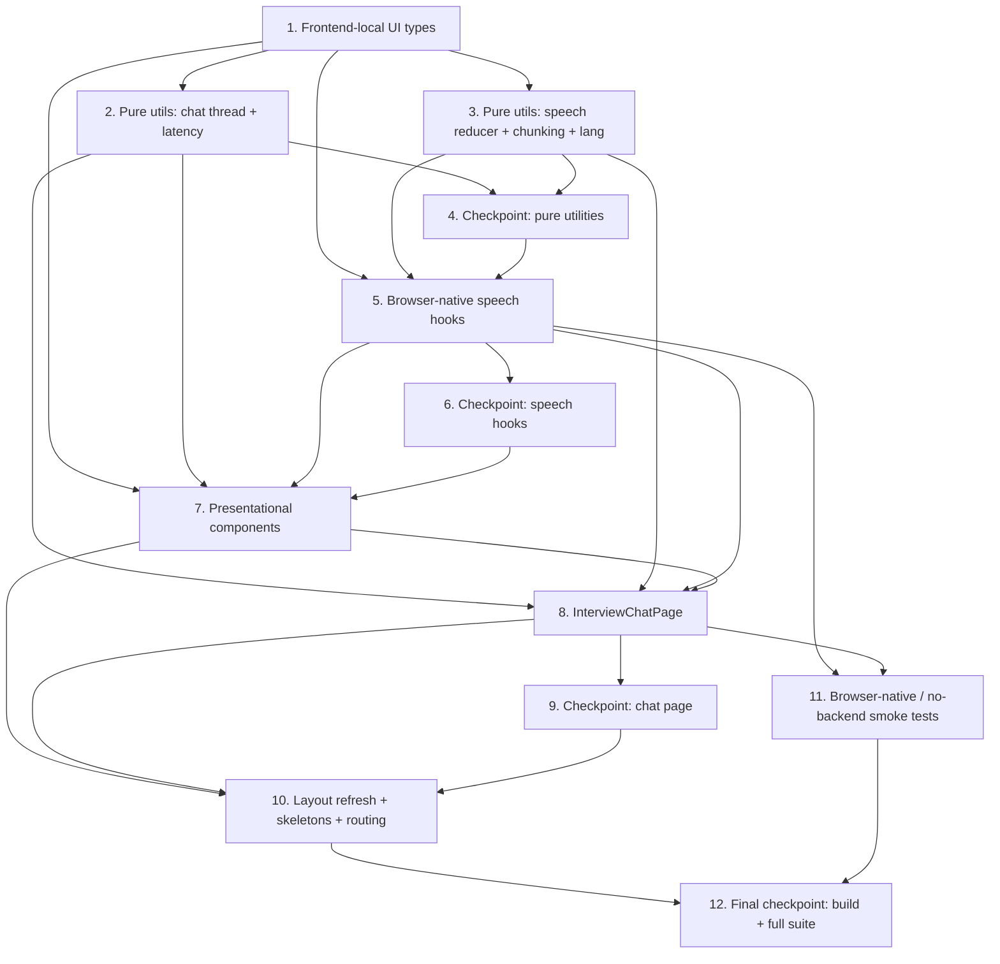

# Implementation Plan: Interview Chat & Voice

## Overview

This plan converts the approved **Interview Chat & Voice** design into incremental, test-driven coding tasks. The feature is **frontend-only**: it adds **no backend code, no endpoints, no environment variables, no secrets, and no new third-party runtime dependencies** (Requirement 11). It reuses `stores/interview.store.ts` and `services/interview.service.ts` **unchanged** — the session lifecycle (`PENDING → ACTIVE → COMPLETED → SCORED`), question generation, one-per-question answer submission with a client-measured `responseLatencySeconds`, evaluation, and the multi-dimensional scorecard all continue to flow through the existing store/service and `/api/v1/interview/*` endpoints. All work happens under `frontend/src/`.

Work proceeds in dependency order so there is no orphaned code — every utility, hook, and component is wired into `InterviewChatPage` and the refreshed pages, and the page is wired into routing, by the end. First the frontend-local UI types, then the four pure utilities (the property-test targets), then the two browser-native speech hooks that wrap the Web Speech APIs, then the presentational components (Skeleton family, ChatThread/ChatMessage, VoiceControls, AnswerComposer, and the optional VoiceOrb), then the `InterviewChatPage` that composes them, then the layout refresh + skeletons for the Scorecard / Sessions / STAR pages plus the routing swap, closed by browser-native/no-backend smoke checks and a final build + full-suite checkpoint.

The design defines exactly **5 correctness properties** (P1–P5), each mapping to exactly one `fast-check` property-based test (minimum **100 iterations**, tagged `// Feature: interview-chat-voice, Property {n}: ...`): P1 → `deriveChatThread`, P2 → `computeResponseLatencySeconds`, P3 → `speechReducer`, P4 → `chunkForSpeech`, P5 → `resolveRecognitionLang`. All other behavior — DOM rendering, autoscroll, ARIA live regions, support detection, permission prompts, timers, routing, accessibility, layout, and skeletons — is validated by example / render / integration tests with the Web Speech APIs **mocked** in jsdom, per the design's Testing Strategy.

The frontend toolchain is already present in `frontend/package.json` — **Vitest** `2.1.8` (`vitest run`), **jsdom** `25.0.1`, **@testing-library/react** `16.1.0` + **@testing-library/user-event** `14.5.2`, and **fast-check** `3.23.2`. **No dependency-add task is needed** (Requirement 11.2). Tests live in co-located `__tests__/` directories per the structure steering.

Conventions enforced throughout (from steering): React + TypeScript strict mode, named exports only, explicit return types on all exported functions, no `any` (prefer `unknown` + type guards), Tailwind utility classes (no inline styles / CSS modules), one Zustand store per domain (the existing `interview.store.ts` stays the sole owner of interview *data*; the new voice/chat state is hook- and component-local), the frontend talks to the backend API only through `interview.service.ts`, and modern-web native APIs (`<dialog>`, `popover`, ARIA live regions, `loading="lazy"`) with full keyboard operability and visible focus indicators.

## Task Dependency Graph



```json
{
  "waves": [
    { "id": 0, "tasks": ["1.1", "7.1"] },
    { "id": 1, "tasks": ["2.1", "3.1", "7.3", "7.2", "10.1", "10.3", "10.5"] },
    { "id": 2, "tasks": ["2.2", "2.3", "3.2", "3.3", "3.4", "5.1", "5.3", "7.4", "10.2", "10.4", "10.6"] },
    { "id": 3, "tasks": ["5.2", "5.4", "7.5", "7.9"] },
    { "id": 4, "tasks": ["7.6", "7.7", "7.10"] },
    { "id": 5, "tasks": ["7.8", "8.1"] },
    { "id": 6, "tasks": ["8.2", "8.3", "8.4", "8.5", "8.6", "8.7", "8.8", "10.7", "11.1"] },
    { "id": 7, "tasks": ["10.8"] }
  ]
}
```

## Tasks

- [x] 1. Define the frontend-local UI types
  - [x] 1.1 Extend `frontend/src/types/interview.types.ts` with the UI section
    - Add the frontend-only UI/device types in a clearly marked "UI types" section, keeping the existing mirrored domain types untouched: `InterviewMode` (`'text' | 'voice'`), `ChatRole` (`'assistant' | 'user'`), `ChatMessage` (`id`, `role`, `text`, `position`), `IDerivedThread` (`messages`, `currentQuestion`, `answeredCount`, `totalCount`), `ISpeechState` (`finalText`, `interimText`, `capturing`), and the `SpeechEvent` union (`start` / `result` / `end` / `stop`)
    - These have no backend counterpart (they never cross the API boundary), so the type-mirroring rule does not apply; named exports, explicit shapes, no `any`
    - _Requirements: 1.1, 1.3, 2.1, 5.5_

- [x] 2. Implement the chat-thread and latency pure utilities (property-test targets)
  - [x] 2.1 Implement `frontend/src/utils/interview.chat.ts`
    - `deriveChatThread(questions: ReadonlyArray<IInterviewQuestion>): IDerivedThread` — sort by ascending 1-based `position`; each question with non-null `answerText` yields an `assistant` message immediately followed by its `user` message; the `currentQuestion` is the lowest-positioned unanswered question (or `null` when none remain, with no trailing `assistant` message); set `answeredCount`/`totalCount`. Pure function of a single ordered input so reopen/reconstruct is free
    - `computeResponseLatencySeconds(presentedAt: number | undefined, sentAt: number): number` — return `max(0, round((sentAt - presentedAt) / 1000))`, and `0` when `presentedAt` is `undefined`; identical for both modes
    - Explicit return types, named exports, no `any`
    - _Requirements: 2.2, 2.3, 2.4, 2.5, 2.6, 2.8, 6.2, 6.3, 6.4_
  - [x] 2.2 Write property test for chat-thread derivation
    - **Property 1: Chat-thread derivation is a correct pure function of the session's questions**
    - Generator of arbitrary question lists: random unique `position` values (shuffled), random `answerText` present/absent, arbitrary texts incl. unicode/whitespace. Assert strict position ordering, assistant→user pairing for answered questions, `currentQuestion` is the lowest-positioned unanswered (or `null`), counts correct, and that deriving from a re-shuffled copy yields the identical thread (reconstruction)
    - fast-check, min 100 iterations, tag `// Feature: interview-chat-voice, Property 1: ...`. File: `frontend/src/utils/__tests__/interview.chat.test.ts`
    - **Validates: Requirements 2.1, 2.2, 2.3, 2.4, 2.5, 2.6, 2.8, 10.1**
  - [x] 2.3 Write property test for response-latency computation
    - **Property 2: Response latency is a non-negative, whole-second, mode-independent function**
    - Generator of arbitrary `presentedAt`/`sentAt` numbers (including `presentedAt` undefined and `sentAt < presentedAt`). Assert the result is a non-negative integer equal to `max(0, round(delta/1000))`, and `0` when `presentedAt` is undefined
    - fast-check, min 100 iterations, tag `// Feature: interview-chat-voice, Property 2: ...`. Same file as 2.2
    - **Validates: Requirements 6.2, 6.3, 6.4**

- [x] 3. Implement the speech pure utilities (property-test targets)
  - [x] 3.1 Implement `frontend/src/utils/interview.speech.ts`
    - `speechReducer(state: ISpeechState, event: SpeechEvent): ISpeechState` — pure accumulator: `start` begins capture; `result` appends any `finalChunk` to `finalText` exactly once and replaces `interimText`; `end` preserves accumulated transcript (auto-restart boundary while capturing); `stop` flushes outstanding `interimText` into `finalText` and sets `capturing` false. Never loses or duplicates a finalized segment
    - `chunkForSpeech(text: string, limit: number): string[]` — split text longer than `limit` on sentence/word boundaries into ordered chunks each `<= limit`, whose in-order concatenation reconstructs the input exactly (no loss/duplication)
    - `resolveRecognitionLang(navigatorLanguage: string | undefined): string` — return the value when a non-empty (non-whitespace) string, else `'en-US'`
    - Explicit return types, named exports, no `any`
    - _Requirements: 4.2, 5.2, 5.3, 5.5, 5.6, 5.7, 5.8_
  - [x] 3.2 Write property test for the speech accumulator
    - **Property 3: The speech accumulator never loses or duplicates a finalized segment**
    - Generator of arbitrary event sequences (`start`, N × `result` with optional final chunk + arbitrary interim, interleaved `end`, terminal `stop`). Assert `finalText` equals the in-order concatenation of every final chunk each included exactly once, interim is flushed at `stop`, the transcript is preserved across an `end` before `stop`, and `capturing` is `false` after `stop`
    - fast-check, min 100 iterations, tag `// Feature: interview-chat-voice, Property 3: ...`. File: `frontend/src/utils/__tests__/interview.speech.test.ts`
    - **Validates: Requirements 5.5, 5.6, 5.7, 5.8**
  - [x] 3.3 Write property test for speech chunking
    - **Property 4: Speech chunking covers the text with no loss or duplication and respects the limit**
    - Generator of arbitrary strings (empty, < limit, >> limit, no-whitespace, multi-sentence, unicode) and a positive limit (incl. 200). Assert `chunks.join('') === text` and `chunks.every(c => c.length <= limit)`
    - fast-check, min 100 iterations, tag `// Feature: interview-chat-voice, Property 4: ...`. Same file as 3.2
    - **Validates: Requirements 4.2**
  - [x] 3.4 Write property test for recognition-language fallback
    - **Property 5: Recognition language falls back to en-US only when absent**
    - Generator of strings incl. empty/whitespace plus the `undefined` case. Assert non-empty → identity, else `'en-US'`
    - fast-check, min 100 iterations, tag `// Feature: interview-chat-voice, Property 5: ...`. Same file as 3.2
    - **Validates: Requirements 5.2, 5.3**

- [x] 4. Checkpoint — pure utilities
  - Ensure all tests pass, ask the user if questions arise.

- [x] 5. Implement the browser-native speech hooks
  - [x] 5.1 Implement `frontend/src/hooks/useSpeechRecognition.ts`
    - STT wrapper over `SpeechRecognition ?? webkitSpeechRecognition` exposing `IUseSpeechRecognition` (`isSupported`, `isListening`, `transcript`, `transcriptRef`, `permission`, `error`, `startListening`, `stopListening`, `clearTranscript`) and accepting `IUseSpeechRecognitionOptions` (`lang`, `startTimeoutMs` default 5000, `restartGapMs` default ~80)
    - Support detection (8.1); language via `resolveRecognitionLang(navigator.language)` (5.2, 5.3); push interim/final results through the pure `speechReducer` so finalized segments append exactly once (5.5); live transcript updates for captioning (5.4); `onend` auto-restart within ~1000 ms while capturing, preserving the transcript with a small gap to avoid Chrome's "already started" race (5.7); no restart after the user stops (5.8); flush interim on stop/end (5.6); `transcriptRef` mirrors the latest transcript for synchronous read-at-send (5.10); `start()` triggers the permission prompt and `onerror` `not-allowed`/`service-not-allowed` surfaces a denied state, while a start that does not begin within `startTimeoutMs` surfaces a timeout (9.1, 9.2, 9.3, 9.5, 8.3)
    - Hook holds device/transcript state only; never calls the store or the network
    - _Requirements: 5.1, 5.2, 5.4, 5.5, 5.6, 5.7, 5.8, 5.10, 8.1, 8.3, 9.1, 9.2, 9.3, 9.5_
  - [x] 5.2 Write unit tests for `useSpeechRecognition` (mocked `SpeechRecognition`)
    - Stub `SpeechRecognition`/`webkitSpeechRecognition` with a fake constructor exposing `start`/`stop` spies and `onresult`/`onend`/`onerror` hooks; assert interim/final captioning, `onend` auto-restart preserves transcript, flush-on-stop, no restart after stop, synchronous `transcriptRef` value, `not-allowed` → denied permission, and start-timeout → error; absence (deleted globals) → `isSupported` false
    - File: `frontend/src/hooks/__tests__/useSpeechRecognition.test.ts`
    - _Requirements: 5.4, 5.6, 5.7, 5.8, 5.10, 8.1, 8.3, 9.1, 9.2, 9.3, 9.5_
  - [x] 5.3 Implement `frontend/src/hooks/useSpeechSynthesis.ts`
    - TTS wrapper over `speechSynthesis` exposing `IUseSpeechSynthesis` (`isSupported`, `isSpeaking`, `error`, `speak`, `cancel`); support detection via `'speechSynthesis' in window` (8.1); `speak(text)` chunks via `chunkForSpeech(text, 200)` and chains each chunk's `utterance.onend` so the whole question is spoken in order, beginning within 2 s (4.1, 4.2); `cancel()` calls `speechSynthesis.cancel()` and halts within ~1 s (4.4); an internal speaking lock prevents overlapping playback when replay is pressed mid-speech (4.3); `utterance.onerror` flips `isSpeaking` false and surfaces an error for the "audio playback failed" path while the caption remains (4.7)
    - Hook holds playback state only; never calls the store or the network
    - _Requirements: 4.1, 4.2, 4.3, 4.4, 4.7, 8.1_
  - [x] 5.4 Write unit tests for `useSpeechSynthesis` (mocked `speechSynthesis`)
    - Stub `speechSynthesis` via `vi.stubGlobal` with `speak`/`cancel` spies and a fake `SpeechSynthesisUtterance` whose `onend`/`onerror` can be invoked; with fake timers assert start within 2 s (4.1), chunk chaining over >200-char text (4.2), stop within 1 s (4.4), replay lock (4.3), and `onerror` → error surfaced + `isSpeaking` false (4.7)
    - File: `frontend/src/hooks/__tests__/useSpeechSynthesis.test.ts`
    - _Requirements: 4.1, 4.2, 4.4, 4.7_

- [x] 6. Checkpoint — speech hooks
  - Ensure all tests pass, ask the user if questions arise.

- [x] 7. Implement the presentational components
  - [x] 7.1 Implement the Skeleton family `frontend/src/components/Skeleton/`
    - `Skeleton.tsx` exporting `Skeleton(props: { className?: string })` (single shimmer block, `aria-hidden`, never focusable), `SkeletonText({ lines? })`, `SkeletonCard()`, and `SkeletonList({ rows?, label })` whose wrapper carries `role="status"` + `aria-busy="true"` + the `aria-label`; add `index.ts` re-exporting all four (folder-per-component + index convention, matching `ScoreDial`). Tailwind utility classes only
    - _Requirements: 14.1, 14.2, 14.3, 14.6, 14.7_
  - [x] 7.2 Write render tests for the Skeleton family
    - Assert the loading region exposes `role="status"`/`aria-busy`/`aria-label`, the shimmer shapes are `aria-hidden` and contain no focusable elements, and `SkeletonList` renders the requested row count
    - File: `frontend/src/components/Skeleton/__tests__/Skeleton.test.tsx`
    - _Requirements: 14.6, 14.7_
  - [x] 7.3 Implement `frontend/src/components/ChatThread/`
    - `ChatMessage.tsx` exporting `ChatMessage(props: { message: ChatMessage })` — render one assistant/user entry as visible caption text with role-distinct styling (10.1); `ChatThread.tsx` exporting `ChatThread(props: { messages: ReadonlyArray<ChatMessage>; liveRegionLabel?: string })` — render the ordered messages, autoscroll so the most recent message is fully visible on append (2.7), and host an ARIA live region announcing new messages (10.5); add `index.ts`. Tailwind utility classes only
    - _Requirements: 2.1, 2.7, 10.1, 10.5_
  - [x] 7.4 Write render tests for `ChatThread` / `ChatMessage`
    - Assert every message renders as visible caption text (10.1), autoscroll is invoked when a new message is appended (2.7), and the live region announces new message content (10.5)
    - File: `frontend/src/components/ChatThread/__tests__/ChatThread.test.tsx`
    - _Requirements: 2.7, 10.1, 10.5_
  - [x] 7.5 Implement `frontend/src/components/VoiceControls/`
    - `VoiceControls.tsx` — mic toggle (start/stop capture), replay, stop, and live-status indicator; every icon-only control has a programmatically determinable accessible name (`aria-label`) (10.4); mic capture state exposed to assistive tech (e.g. `aria-pressed`) (10.6); replay restarts playback from the beginning (4.3) and stop halts within 1 s (4.4); add `index.ts`. Tailwind utility classes, visible focus rings
    - _Requirements: 4.3, 4.4, 5.1, 10.4, 10.6_
  - [x] 7.6 Write render tests for `VoiceControls`
    - Assert icon-only controls expose accessible names (10.4), the mic state is exposed and toggles (10.6), and replay/stop handlers fire (4.3, 4.4)
    - File: `frontend/src/components/VoiceControls/__tests__/VoiceControls.test.tsx`
    - _Requirements: 4.3, 4.4, 10.4, 10.6_
  - [x] 7.7 Implement `frontend/src/components/AnswerComposer/`
    - `AnswerComposer.tsx` exporting `AnswerComposer(props: IAnswerComposerProps)` (`mode`, `isSubmitting`, `recognition`, `onSend`, `fallbackNotice`, `maxLength`); text mode → textarea + send (3.1); voice mode → embed `VoiceControls`, show the live transcript and an editable transcript input after stop, and allow typing/editing the transcript so voice + typing combine (5.1, 5.9, 5.13); disable send while the trimmed value is empty or exceeds `maxLength` (5,000) with an associated message, and while a submit is in flight (3.3, 3.4, 3.7, 5.11, 5.12); on send call `onSend` with the exact current value (the page reads `recognition.transcriptRef` synchronously for voice — 5.10); render `fallbackNotice` inline (8.3, 9.3); associate validation/error messages via `aria-describedby` (10.7); previously-denied instructional text path (9.6); add `index.ts`
    - _Requirements: 3.1, 3.2, 3.3, 3.4, 3.5, 3.6, 3.7, 5.1, 5.9, 5.11, 5.12, 5.13, 9.6, 10.7_
  - [x] 7.8 Write render tests for `AnswerComposer`
    - Text mode: send disabled when empty/whitespace and when over 5,000 with associated message; send fires `onSend` with trimmed text; disabled while submitting (3.3, 3.4, 3.7). Voice mode: editable transcript shown, typing while listening combines (5.9, 5.13); empty/oversized transcript disables send (5.11, 5.12); fallback notice and previously-denied instructions render (8.3, 9.6); messages associated via `aria-describedby` (10.7)
    - File: `frontend/src/components/AnswerComposer/__tests__/AnswerComposer.test.tsx`
    - _Requirements: 3.3, 3.4, 3.7, 5.9, 5.11, 5.12, 5.13, 9.6, 10.7_
  - [x] 7.9 (Optional, Requirement 12) Implement `frontend/src/components/VoiceOrb/`
    - `VoiceOrb.tsx` — supplementary audio-reactive visualizer rendered as a purely decorative overlay; guarded init so a render/init failure suppresses the orb and never blocks or disables any answer-input control; add `index.ts`. This is an optional enhancement and may be skipped for the MVP
    - _Requirements: 12.1, 12.2_
  - [x] 7.10 (Optional, Requirement 12) Write render tests for `VoiceOrb`
    - Assert the orb is supplementary (answer-input controls remain operable while it renders), and that a simulated init/render failure suppresses the orb without disabling any control
    - File: `frontend/src/components/VoiceOrb/__tests__/VoiceOrb.test.tsx`
    - _Requirements: 12.1, 12.2_

- [x] 8. Implement `InterviewChatPage` (Chat_View)
  - [x] 8.1 Implement `frontend/src/pages/Interview/InterviewChatPage.tsx`
    - Compose `ChatThread`, `AnswerComposer`, `VoiceControls`, and `Skeleton`, reading/writing only through the existing `interview.store.ts` (no new domain data, no direct service/Supabase calls):
    - **Session_Setup** (no active session): mode (`text`/`voice`, default `text`), difficulty (default `ENTRY`), question count (default `5`, range 5–15), job description (1–5,000 trimmed), optional resume version reference; run Support_Detection from the hooks' `isSupported` before enabling mode selection and disable the `voice` option with a message when unsupported (1.1, 1.2, 8.1, 8.2); keep create disabled with associated messages for empty/oversized JD and out-of-range count (1.5, 1.6, 1.9); on submit call `createSession` → `openSession` → `startSession`, retaining the selected mode in local state (1.3, 1.4, 1.7); on failure keep the setup populated and re-enabled (1.8)
    - **Chat_Thread**: derive messages + `currentQuestion` via `deriveChatThread`; reopen reconstructs identically because it is a pure derivation (2.1–2.8)
    - **Presentation timestamps**: a `useRef<Map<string, number>>` stamped exactly once when a question first becomes the current assistant message, never overwritten on re-render/scroll/remount (6.1)
    - **Answer submission**: compute latency via `computeResponseLatencySeconds(presentedAt, Date.now())` identically for both modes; for voice read `recognition.transcriptRef` synchronously at send; submit via the store's existing `submitAnswer(sessionId, questionId, { answerText, responseLatencySeconds })` (5.10, 6.2, 6.3, 6.4); progress indicator answered/total incremented as answers are accepted (2.6)
    - **Voice playback**: when the current question is first presented in voice mode, call `useSpeechSynthesis.speak(question.text)`; render replay/stop and the TTS-missing (caption-only) and TTS-failure ("audio playback failed") paths while keeping the caption (4.1, 4.5, 4.6, 4.7)
    - **Completion**: when the last answer is accepted the session reaches `COMPLETED`; hide the composer, show an enabled "View scorecard" control that calls `computeScorecard` (or shows the existing scorecard when `SCORED` without recompute), rendering dimensions + overall + pass/fail via `ScoreDial`/`TierBadge`, with a one-request guard and re-enable on failure (7.1–7.6)
    - **Fallback orchestration**: watch hook support/error/permission and switch `mode` to `text` with a message on API-lost / start-timeout / permission-denied, preserving the current caption and any accumulated transcript and keeping the text composer for all remaining questions (8.3, 8.4, 8.5, 9.3, 9.4, 9.5, 9.6)
    - Full keyboard operability, visible focus indicators, and ARIA wiring throughout (10.2, 10.3, 10.7); export `InterviewChatPage(): JSX.Element`
    - _Requirements: 1.1, 1.2, 1.3, 1.4, 1.5, 1.6, 1.7, 1.8, 1.9, 2.1, 2.2, 2.3, 2.4, 2.5, 2.6, 2.7, 2.8, 4.1, 4.5, 4.6, 4.7, 6.1, 6.2, 6.3, 6.4, 7.1, 7.2, 7.3, 7.4, 7.5, 7.6, 8.2, 8.3, 8.4, 8.5, 9.3, 9.4, 9.5, 9.6, 10.2, 10.3, 10.7_
  - [x] 8.2 Write Session_Setup tests
    - Render/defaults (mode `text`, tier `ENTRY`, count `5`); validation enable/disable with associated messages at JD length 0/1/5000/5001 and count 4/5/15/16; create→open→start wiring with a mocked store; failure preserves fields and re-enables; voice option disabled with message when unsupported (deleted speech globals)
    - File: `frontend/src/pages/Interview/__tests__/InterviewChatPage.setup.test.tsx`
    - _Requirements: 1.1, 1.2, 1.3, 1.4, 1.5, 1.6, 1.7, 1.8, 1.9, 8.1, 8.2_
  - [x] 8.3 Write chat-presentation tests
    - Autoscroll invoked on append; presentation timestamp stamped once across a re-render; captions present for every message; new-message ARIA live announcement (ordering/pairing/current-question are covered by Property 1)
    - File: `frontend/src/pages/Interview/__tests__/InterviewChatPage.presentation.test.tsx`
    - _Requirements: 2.7, 6.1, 10.1, 10.5_
  - [x] 8.4 Write text-mode answering tests
    - Controls present; valid send calls `submitAnswer` with trimmed text + computed latency; whitespace/oversize disable send + message; input cleared on success; text preserved on failure; send disabled in flight (submit-once)
    - File: `frontend/src/pages/Interview/__tests__/InterviewChatPage.text.test.tsx`
    - _Requirements: 3.1, 3.2, 3.3, 3.4, 3.5, 3.6, 3.7_
  - [x] 8.5 Write voice-mode tests (mocked Web Speech APIs)
    - With mocked `SpeechRecognition`/`speechSynthesis`: TTS starts within 2 s; replay/stop wiring; caption shown while speaking; TTS-missing and TTS-failure paths; mic control accessible name; live interim caption within ~300 ms; editable transcript after stop; **synchronous read-at-send submits the exact edited text**; typing while listening combines
    - File: `frontend/src/pages/Interview/__tests__/InterviewChatPage.voice.test.tsx`
    - _Requirements: 4.1, 4.3, 4.4, 4.5, 4.6, 4.7, 5.1, 5.4, 5.9, 5.10, 5.13_
  - [x] 8.6 Write microphone-permission tests
    - Prompt initiated on start (≤1 s); auto-begin capture on grant without a second start; denied → message + text fallback retaining caption + transcript without re-presenting the question; dismissed → mic still available to retry, typing allowed meanwhile; previously-denied → instructional re-enable text + text input
    - File: `frontend/src/pages/Interview/__tests__/InterviewChatPage.permissions.test.tsx`
    - _Requirements: 9.1, 9.2, 9.3, 9.4, 9.5, 9.6_
  - [x] 8.7 Write completion & scorecard tests
    - Composer hidden at `COMPLETED`; compute control enabled; compute wiring + render via `ScoreDial`/`TierBadge`; one-request guard (no double compute); `SCORED` shows the cached scorecard without recompute; failure re-enables the compute control
    - File: `frontend/src/pages/Interview/__tests__/InterviewChatPage.completion.test.tsx`
    - _Requirements: 7.1, 7.2, 7.3, 7.4, 7.5, 7.6_
  - [x] 8.8 Write accessibility & keyboard-operability tests
    - Tab/Shift+Tab focus order and Enter/Space activation via user-event across setup inputs, send, mic, replay, stop, and scorecard controls; visible focus-indicator classes; icon-only accessible names; mic state exposed; validation/error messages associated via `aria-describedby`
    - File: `frontend/src/pages/Interview/__tests__/InterviewChatPage.a11y.test.tsx`
    - _Requirements: 10.2, 10.3, 10.4, 10.6, 10.7_

- [x] 9. Checkpoint — chat page
  - Ensure all tests pass, ask the user if questions arise.

- [x] 10. Layout refresh, skeletons, and routing
  - [x] 10.1 Refresh `frontend/src/pages/Interview/InterviewScorecardPage.tsx`
    - Presentation only (same store calls): primary content in `rounded-2xl bg-white p-6 shadow-sm` panels on the `#f7f7f8` canvas; four dimensions + overall via `ScoreDial` and pass/fail via `TierBadge` in a consistent arrangement; semantic headings and visible focus rings; show `SkeletonCard`/`SkeletonList` while computing/fetching and replace with content on success or the store's error on failure (preserving prior content); explicit "no scorecard yet" empty state within the panel
    - _Requirements: 13.1, 13.3, 13.5, 13.6, 14.2, 14.4, 14.5_
  - [x] 10.2 Write tests for the Scorecard page
    - Panel surfaces + `ScoreDial`/`TierBadge` arrangement; skeleton shown while loading then replaced by content; error replaces skeleton while prior content is preserved; empty state rendered
    - File: `frontend/src/pages/Interview/__tests__/InterviewScorecardPage.test.tsx`
    - _Requirements: 13.3, 14.2, 14.4, 14.5_
  - [x] 10.3 Refresh `frontend/src/pages/Interview/InterviewSessionsPage.tsx`
    - Presentation only (same store calls): panel layout; list ordered newest-first; each entry shows `Lifecycle_State`, `Difficulty_Tier`, creation date, and — where a scorecard exists — overall score + `TierBadge` pass/fail; semantic headings + visible focus rings; `SkeletonList` while loading, replaced by content on success or the store's error on failure (preserving prior content); explicit "no sessions" empty state
    - _Requirements: 13.1, 13.2, 13.5, 13.6, 14.1, 14.4, 14.5_
  - [x] 10.4 Write tests for the Sessions page
    - Newest-first ordering with state/tier/date/overall+tier where present; `SkeletonList` while loading then content; error preserves prior content; empty state rendered
    - File: `frontend/src/pages/Interview/__tests__/InterviewSessionsPage.test.tsx`
    - _Requirements: 13.2, 14.1, 14.5_
  - [x] 10.5 Refresh `frontend/src/pages/Interview/StarOrganizerPage.tsx`
    - Presentation only (same store calls): panel layout with the STAR create form and saved-stories list as two clearly separated sections; semantic headings + visible focus rings; `SkeletonList` while loading the stories, replaced by content on success or the store's error on failure (preserving prior content); explicit "no stories" empty state
    - _Requirements: 13.1, 13.4, 13.5, 13.6, 14.3, 14.4, 14.5_
  - [x] 10.6 Write tests for the STAR page
    - Two clearly separated sections; `SkeletonList` while loading then content; empty state rendered; error preserves prior content
    - File: `frontend/src/pages/Interview/__tests__/StarOrganizerPage.test.tsx`
    - _Requirements: 13.4, 14.3, 14.5_
  - [x] 10.7 Swap routing to `InterviewChatPage` and retire the old simulator
    - In `frontend/src/App.tsx` change the `/interview/simulator` route element from `<InterviewSimulatorPage />` to `<InterviewChatPage />` (and update the import); keep the `index` redirect and the `scorecard`/`sessions`/`stories` routes unchanged; keep the in-page tab bar in `frontend/src/pages/Interview/InterviewPage.tsx` (the first tab label may read "Interview" or "Simulator"). Since `InterviewSimulatorPage` is cleanly replaced, remove `frontend/src/pages/Interview/InterviewSimulatorPage.tsx`, its references, and any of its tests; if any reference cannot be cleanly removed, leave it unused and add a code comment noting it is superseded by `InterviewChatPage`
    - _Requirements: 1.1, 2.1, 11.3_
  - [x] 10.8 Write routing / integration test
    - Navigating to `/interview/simulator` renders `InterviewChatPage` (Session_Setup) within the Interview tab shell; the other tab routes still resolve; no dangling import/reference to `InterviewSimulatorPage` remains
    - File: `frontend/src/pages/Interview/__tests__/InterviewPage.routing.test.tsx`
    - _Requirements: 1.1, 2.1_

- [x] 11. Browser-native / no-backend constraint checks
  - [x] 11.1 Write browser-native / no-backend smoke tests
    - Assert the speech hooks contain no `fetch`/network call (recognition + synthesis run client-side only); answers, evaluation, and the scorecard are requested only through `interview.service.ts` (no other backend/external endpoint); the submit payload is text-only (no raw audio); and no new runtime dependency or backend endpoint/env var is introduced by the feature
    - File: `frontend/src/pages/Interview/__tests__/interview-chat-voice.constraints.test.ts`
    - _Requirements: 11.1, 11.2, 11.3, 11.4_

- [x] 12. Final checkpoint — full feature
  - Run the frontend production build (`npm run build`) and the full frontend test suite (`vitest run`, single run — not watch mode); ensure all tests pass, ask the user if questions arise.

## Notes

- Tasks marked with `*` are optional sub-tasks and can be skipped for a faster MVP; core implementation tasks are never optional and top-level tasks are never marked optional. The optional `VoiceOrb` enhancement (tasks 7.9, 7.10) is marked optional per Requirement 12 — the interview is fully completable without it.
- The design defines exactly **5** correctness properties, each mapping to exactly one `fast-check` property-based test (≥100 iterations, tagged `// Feature: interview-chat-voice, Property {n}: ...`): P1 → `deriveChatThread` (2.2), P2 → `computeResponseLatencySeconds` (2.3), P3 → `speechReducer` (3.2), P4 → `chunkForSpeech` (3.3), P5 → `resolveRecognitionLang` (3.4). Property tests target the four extracted pure utilities only.
- DOM rendering, autoscroll, ARIA live regions, support detection, permission prompts, timers, routing, accessibility, layout, and skeletons are validated by example / render / integration tests, not property tests, because they test wiring/mechanics rather than input-varying pure logic — 1–3 representative cases give the same coverage as 100 iterations. The Web Speech APIs do not exist in jsdom, so `SpeechRecognition`/`webkitSpeechRecognition` and `speechSynthesis` are **mocked** (fake constructors/utterances with `onresult`/`onend`/`onerror` hooks and `speak`/`cancel` spies) and absence is simulated by deleting the globals.
- **Frontend-only, no backend changes.** `stores/interview.store.ts` and `services/interview.service.ts` are reused **unchanged**; their existing tests continue to cover envelope unwrapping and state transitions. This feature adds no new data-access code. New voice/chat state lives in the two hooks and `InterviewChatPage` local state — the Chat_Thread is *derived* from store data, never duplicated.
- **No new dependencies.** Vitest, jsdom, Testing Library, and fast-check are already in `frontend/package.json` (confirmed) — there is no dependency-add task (Requirement 11.2). No new backend endpoint, environment variable, secret, API key, or third-party voice service is introduced (Requirement 11).
- Conventions: React + TypeScript strict mode, named exports, explicit return types, no `any` (prefer `unknown` + type guards), Tailwind utility classes, one Zustand store per domain (the existing interview store), frontend → backend API only via `interview.service.ts`, and modern-web native APIs (`popover`, ARIA live regions, `loading="lazy"`) with full keyboard operability and visible focus indicators.
- Each task references the specific requirement IDs and/or design properties it implements for traceability, and every utility, hook, and component is wired into `InterviewChatPage` and the refreshed pages — and the page into routing (task 10.7) — by the end, so no code is orphaned.
```
