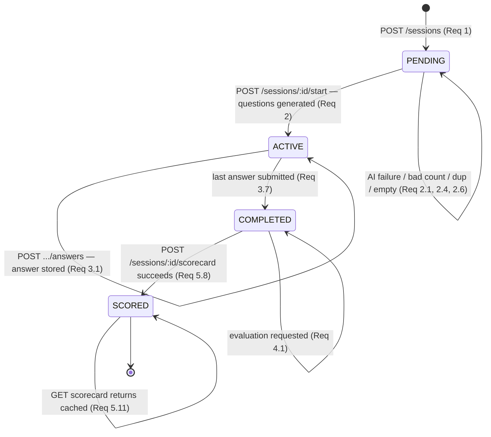

# Design Document

## Overview

This document describes the design for **Module 2: Interview** of the StayQualifAI platform. The module delivers three connected capabilities — a Custom Interview Simulator, an Interview Performance Scorecard, and a STAR Story Organizer — behind a single Express.js + TypeScript backend exposed under `/api/v1/interview/*`, a React + TypeScript frontend that talks only to that backend, and PostgreSQL storage via Supabase with Row Level Security on every table.

The design mirrors the structure, depth, and conventions established by the Module 1 (Resume) design and honors the platform steering rules:

- **Backend** follows a strict Route → Controller → Service → Supabase client flow with centralized typed error middleware, input validation middleware, explicit return types, and named exports.
- **Frontend** uses React with a single Zustand store (`interview.store.ts`), Tailwind, presentational components in `components/`, pages in `pages/Interview/`, and a single data-access service file (`frontend/src/services/interview.service.ts`) that never imports the Supabase client.
- **Database** uses Supabase PostgreSQL with all DDL applied through `mcp_supabase_apply_migration`, RLS on every table, `interview_`-prefixed tables, and `snake_case` columns scoped per user via `user_id = auth.uid()`.
- **AI** uses Google Gemini (free tier), accessed only from backend services through a module-local AI_Provider wrapper.
- **Types** are mirrored between `backend/src/types/interview.types.ts` and `frontend/src/types/interview.types.ts`.
- Every endpoint returns the `{ data, error, meta }` envelope.

### Module Isolation

Per the steering "domain isolation" principle, the Interview module owns its own routes, controller, services, types, pages, store, and database tables, and performs **no cross-module imports**. Although Module 1 already ships an `aiProvider.service.ts`, the Interview module does **not** import it. Instead it defines its own module-local AI wrapper (`services/interview.aiProvider.service.ts`) that reuses the *same pattern* (lazy Gemini client, JSON-mode generation, Zod validation, `AbortController` timeout, failure → `AiProviderError`). The shared typed error hierarchy in `utils/errors.ts` is platform-wide infrastructure (not a module), so reusing `AuthError`, `NotFoundError`, `ValidationError`, and `AiProviderError` from it is consistent with the steering rules; this module adds one new platform error, `ConflictError`.

### Key Design Decisions

1. **Deterministic vs AI-driven scoring is split cleanly.** Answer_Quality_Score, Grammar_Score, Latency_Score, and Overall_Score are computed by pure, deterministic functions in the Scorecard_Engine. Only the Pressure_Score requires a Gemini call. This keeps most of the scoring logic unit/property-testable without the network and minimizes free-tier quota usage.

2. **Session lifecycle is an explicit state machine** (`PENDING → ACTIVE → COMPLETED → SCORED`) enforced in the service layer. Every state-sensitive operation validates the current `Lifecycle_State` before acting and rejects out-of-state requests with a typed error that names the current state (Requirements 2.5, 3.5, 4.4, 5.9).

3. **AI operations are all-or-nothing.** Question generation, per-question evaluation, and Pressure_Score computation never persist partial results. A failure leaves the session in its prior state and surfaces an `AiProviderError` (Requirements 2.4, 4.5, 5.12).

4. **STAR round-trip integrity is guaranteed by storing the five text fields verbatim** in dedicated `text` columns — no trimming, encoding mutation, or truncation between submission and retrieval (Requirement 11).

5. **Ownership failures surface as 404, never 403**, so the API never reveals that another user's resource exists. RLS yields "no rows", which the service maps to `NotFoundError` (Requirements 6.3, 12.4).

6. **Duplicate STAR titles are a conflict (409)**, enforced both in application logic and by a per-user unique index on `(user_id, title)` (Requirement 7.5).

## Architecture

### System Context

```mermaid
flowchart LR
    subgraph Frontend [React Frontend]
        Pages[pages/Interview/*]
        Store[interview.store.ts (Zustand)]
        Svc[services/interview.service.ts]
    end

    subgraph Backend [Express API /api/v1/interview/*]
        Routes[routes/interview.ts]
        Ctrl[interview.controller.ts]
        Mw[middleware: auth / validate / error]
        Facade[services/interview.service.ts]
        QGen[Question_Generator]
        AEval[Answer_Evaluator]
        SCard[Scorecard_Engine]
        STAR[STAR_Organizer]
        AIWrap[interview.aiProvider.service.ts]
    end

    subgraph External
        Supabase[(Supabase Postgres + Auth)]
        Gemini[Google Gemini API]
    end

    Pages --> Store --> Svc
    Svc -->|HTTPS JSON| Routes
    Routes --> Mw --> Ctrl --> Facade
    Facade --> QGen
    Facade --> AEval
    Facade --> SCard
    Facade --> STAR
    Facade -->|@supabase/supabase-js| Supabase
    QGen --> AIWrap
    AEval --> AIWrap
    SCard --> AIWrap
    AIWrap --> Gemini
```

### Request Flow

Every request passes through the same ordered pipeline (Requirements 12.3, 12.5, 13.1):

1. **Route** (`backend/src/routes/interview.ts`) — declares method and path, attaches middleware, delegates to a controller handler. No business logic.
2. **Auth middleware** (`backend/src/middleware/auth.ts`, reused) — verifies the Supabase JWT, attaches `req.user` and a per-request RLS-scoped `req.supabase` client. Rejects unauthenticated requests with `AuthError` (Requirement 12.3).
3. **Validation middleware** (`backend/src/middleware/validate.ts`, reused) — validates body, params, and query against a Zod schema. Rejects with `ValidationError` (Requirements 12.5, 12.6).
4. **Controller** (`backend/src/controllers/interview.controller.ts`) — translates the validated request into facade calls and shapes the `{ data, error, meta }` envelope. No direct Supabase or Gemini access.
5. **Service facade** (`backend/src/services/interview.service.ts`) — owns business logic, orchestrates the sub-components, calls Supabase and the AI wrapper, throws typed errors on failure.
6. **Error middleware** (`backend/src/middleware/error.ts`, reused) — catches thrown typed errors and serializes them into `{ data: null, error, meta }` with the correct HTTP status (Requirements 13.3, 13.4).

### Authentication and Tenancy

The backend builds a per-request Supabase client from the caller's JWT so **Row Level Security is the source of truth** for ownership (Requirements 12.1, 12.2). Because RLS scopes every query to `auth.uid()`, a query for a row owned by another user returns no rows, which the service maps to `NotFoundError` (Requirements 6.3, 12.4) — never leaking the existence of other users' data.

### Session Lifecycle State Machine



Allowed transitions are the only transitions the service performs. Every operation guarded by lifecycle state verifies the current state first:

| Operation | Required state | On wrong state | Requirement |
|-----------|----------------|----------------|-------------|
| Start / generate questions | `PENDING` | reject, name current state | 2.5 |
| Submit answer | `ACTIVE` | reject, name current state | 3.5 |
| Evaluate answer | `COMPLETED` or `SCORED` | reject (must be completed) | 4.4 |
| Compute scorecard | `COMPLETED` or `SCORED` | reject (must be completed) | 5.9 |

## Components and Interfaces

### Backend Components

| Component | File | Responsibility | Requirements |
|-----------|------|----------------|--------------|
| Interview routes | `routes/interview.ts` | Endpoint declarations, middleware wiring | 12.3, 12.5, 13.1 |
| Interview schemas | `routes/interview.schemas.ts` | Zod schemas for body/params/query | 1.x, 3.x, 7.x, 9.x, 12.6 |
| Interview controller | `controllers/interview.controller.ts` | Request orchestration, envelope shaping | 13.1–13.4 |
| Interview service (facade) | `services/interview.service.ts` | Business logic, lifecycle, Supabase + AI orchestration | all |
| Question_Generator | `services/interview.questionGenerator.service.ts` | Generate questions via AI; count/dup/empty validation | 2.x |
| Answer_Evaluator | `services/interview.answerEvaluator.service.ts` | Per-answer Quality/Grammar/feedback via AI | 4.x |
| Scorecard_Engine | `services/interview.scorecard.service.ts` | Deterministic dimension scoring + Pressure via AI | 5.x |
| STAR_Organizer | `services/interview.starOrganizer.service.ts` | STAR CRUD + serialize/deserialize | 7.x–11.x |
| Interview serializer | `utils/interview.starSerializer.ts` | STAR_Story ⇄ stored representation | 11.1–11.3 |
| Scoring utils | `utils/interview.scoring.ts` | Pure Latency/mean/overall/tier functions | 5.2–5.7 |
| AI wrapper | `services/interview.aiProvider.service.ts` | Module-local Gemini wrapper, normalizes failures | 2.4, 4.5, 5.12 |
| Auth middleware | `middleware/auth.ts` (reused) | JWT verification, RLS client | 12.3 |
| Validation middleware | `middleware/validate.ts` (reused) | Zod request validation | 12.5, 12.6 |
| Error middleware | `middleware/error.ts` (reused) | Typed error → envelope + status | 13.3, 13.4 |

### Frontend Components

| Component | File | Responsibility |
|-----------|------|----------------|
| Interview service | `services/interview.service.ts` | All HTTP calls to `/api/v1/interview/*`; unwraps envelope | 
| Interview store | `stores/interview.store.ts` | Zustand: active session, sessions list, scorecard, STAR list, `isLoading`, `error` |
| Simulator page | `pages/Interview/InterviewSimulatorPage.tsx` | Create session, answer questions |
| Scorecard page | `pages/Interview/InterviewScorecardPage.tsx` | Render the four dimensions + overall + tier |
| Sessions page | `pages/Interview/InterviewSessionsPage.tsx` | List/review past sessions |
| STAR page | `pages/Interview/StarOrganizerPage.tsx` | STAR CRUD scratchpad |
| Score dial | `components/ScoreDial/` | Render a 0–100 dimension score |
| Tier badge | `components/TierBadge/` | PASS/FAIL pill |

The frontend service is the only place HTTP envelopes are unwrapped: on success it returns `data` (and `meta` where needed); on failure it throws a typed client error carrying `error`, so the store and components work with plain domain objects (Requirement 14.2).

### Backend Service Interface (representative signatures)

```typescript
// services/interview.service.ts — explicit return types, named exports
export async function createSession(sb: SupabaseClient, userId: string, input: ICreateSessionInput): Promise<IInterviewSession>;
export async function startSession(sb: SupabaseClient, userId: string, sessionId: string): Promise<IInterviewQuestion[]>;
export async function submitAnswer(sb: SupabaseClient, userId: string, sessionId: string, questionId: string, input: ISubmitAnswerInput): Promise<IInterviewQuestion>;
export async function evaluateAnswer(sb: SupabaseClient, userId: string, sessionId: string, questionId: string): Promise<IAnswerEvaluation>;
export async function computeScorecard(sb: SupabaseClient, userId: string, sessionId: string): Promise<IPerformanceScorecard>;
export async function listSessions(sb: SupabaseClient, userId: string): Promise<IInterviewSessionSummary[]>;
export async function getSession(sb: SupabaseClient, userId: string, sessionId: string): Promise<IInterviewSessionDetail>;

export async function createStory(sb: SupabaseClient, userId: string, input: ICreateStarInput): Promise<IStarStory>;
export async function listStories(sb: SupabaseClient, userId: string): Promise<IStarStory[]>;
export async function getStory(sb: SupabaseClient, userId: string, id: string): Promise<IStarStory>;
export async function updateStory(sb: SupabaseClient, userId: string, id: string, input: IUpdateStarInput): Promise<IStarStory>;
export async function deleteStory(sb: SupabaseClient, userId: string, id: string): Promise<void>;
```

## Data Models

### TypeScript Types (mirrored backend ⇄ frontend)

These are duplicated in `backend/src/types/interview.types.ts` and `frontend/src/types/interview.types.ts`.

```typescript
export type DifficultyTier = 'ENTRY' | 'MID' | 'SENIOR' | 'LEAD';
export type LifecycleState = 'PENDING' | 'ACTIVE' | 'COMPLETED' | 'SCORED';
export type PassFailTier = 'PASS' | 'FAIL';

export interface IAnswerEvaluation {
  qualityScore: number;   // integer 0..100
  grammarScore: number;   // integer 0..100
  feedbackComment: string; // 1..2000 chars, non-empty
}

export interface IInterviewQuestion {
  id: string;
  sessionId: string;
  position: number;        // 1-based index, unique within session
  text: string;            // non-empty, unique within session
  answerText: string | null;
  responseLatencySeconds: number | null; // >= 0
  evaluation: IAnswerEvaluation | null;
}

export interface IInterviewSession {
  id: string;
  userId: string;
  state: LifecycleState;
  difficultyTier: DifficultyTier;
  jobDescription: string;  // 1..5000 chars
  questionCount: number;   // 5..15 inclusive
  resumeVersionId: string | null; // reference into resume module data
  createdAt: string;
}

export interface IInterviewSessionDetail extends IInterviewSession {
  questions: IInterviewQuestion[];          // ordered by position
  scorecard: IPerformanceScorecard | null;
}

export interface IInterviewSessionSummary {
  id: string;
  state: LifecycleState;
  difficultyTier: DifficultyTier;
  createdAt: string;
  overallScore: number | null;   // from scorecard if present
  passFailTier: PassFailTier | null;
}

export interface IPerformanceScorecard {
  sessionId: string;
  answerQualityScore: number; // integer 0..100
  grammarScore: number;       // integer 0..100
  latencyScore: number;       // integer 0..100
  pressureScore: number;      // integer 0..100
  overallScore: number;       // integer 0..100
  passFailTier: PassFailTier; // PASS if overall >= 70 else FAIL
  createdAt: string;
}

export interface IStarStory {
  id: string;
  title: string;       // 1..200 chars
  situation: string;   // 1..2000 chars
  task: string;        // 1..2000 chars
  action: string;      // 1..2000 chars
  result: string;      // 1..2000 chars
  createdAt: string;
}

// API envelope
export interface IApiResponse<T> {
  data: T | null;
  error: IApiError | null;
  meta: IApiMeta | null;
}

// Single-resource responses set meta to null; list responses carry { total }.
export type IApiMeta = ({ requestId: string; timestamp: string } & { total?: number }) | null;

export interface IApiError { code: string; message: string; details?: unknown }
```

### Database Schema (Supabase PostgreSQL)

All DDL is applied via `mcp_supabase_apply_migration` during the implementation phase — **no migrations are applied at design time**. Tables are `interview_`-prefixed with `snake_case` columns and RLS enabled on every table keyed on `user_id`.

#### Table: `interview_sessions`

| Column | Type | Notes |
|--------|------|-------|
| `id` | `uuid` | PK, `default gen_random_uuid()` |
| `user_id` | `uuid` | FK → `auth.users(id)`, not null |
| `state` | `text` | not null, `check (state in ('PENDING','ACTIVE','COMPLETED','SCORED'))`, default `'PENDING'` |
| `difficulty_tier` | `text` | not null, `check (difficulty_tier in ('ENTRY','MID','SENIOR','LEAD'))` |
| `job_description` | `text` | not null, `check (char_length(job_description) between 1 and 5000)` |
| `question_count` | `int` | not null, `check (question_count between 5 and 15)` |
| `resume_version_id` | `uuid` | nullable — reference to a resume module row owned by the same user |
| `created_at` | `timestamptz` | not null, default `now()` |

Indexes: `create index on interview_sessions (user_id, created_at desc);` (supports Requirement 6.1 ordering).

#### Table: `interview_questions`

Per-question record holding the question text, the candidate answer, latency, and the **embedded** evaluation (one evaluation per question, overwritten on re-evaluation — Requirement 4.2). Embedding the evaluation columns keeps the one-to-one relationship simple and the overwrite atomic.

| Column | Type | Notes |
|--------|------|-------|
| `id` | `uuid` | PK, `default gen_random_uuid()` |
| `user_id` | `uuid` | not null — denormalized owner for RLS |
| `session_id` | `uuid` | FK → `interview_sessions(id) on delete cascade`, not null |
| `position` | `int` | not null, 1-based; `unique (session_id, position)` |
| `text` | `text` | not null, `check (char_length(btrim(text)) > 0)` |
| `answer_text` | `text` | nullable, `check (answer_text is null or char_length(answer_text) between 1 and 5000)` |
| `response_latency_seconds` | `numeric` | nullable, `check (response_latency_seconds is null or response_latency_seconds >= 0)` |
| `quality_score` | `int` | nullable, `check (quality_score is null or quality_score between 0 and 100)` |
| `grammar_score` | `int` | nullable, `check (grammar_score is null or grammar_score between 0 and 100)` |
| `feedback_comment` | `text` | nullable, `check (feedback_comment is null or char_length(feedback_comment) between 1 and 2000)` |
| `created_at` | `timestamptz` | not null, default `now()` |

Constraints/indexes: `unique (session_id, text)` enforces the no-duplicate-question-text invariant at the DB layer (Requirement 2.6); `create index on interview_questions (session_id, position);`.

#### Table: `interview_scorecards`

One scorecard per session, written only when computation fully succeeds (Requirements 5.8, 5.12, 5.13).

| Column | Type | Notes |
|--------|------|-------|
| `id` | `uuid` | PK, `default gen_random_uuid()` |
| `user_id` | `uuid` | not null — owner for RLS |
| `session_id` | `uuid` | FK → `interview_sessions(id) on delete cascade`, not null, `unique` |
| `answer_quality_score` | `int` | not null, `check (… between 0 and 100)` |
| `grammar_score` | `int` | not null, `check (… between 0 and 100)` |
| `latency_score` | `int` | not null, `check (… between 0 and 100)` |
| `pressure_score` | `int` | not null, `check (… between 0 and 100)` |
| `overall_score` | `int` | not null, `check (… between 0 and 100)` |
| `pass_fail_tier` | `text` | not null, `check (pass_fail_tier in ('PASS','FAIL'))` |
| `created_at` | `timestamptz` | not null, default `now()` |

#### Table: `interview_star_stories`

| Column | Type | Notes |
|--------|------|-------|
| `id` | `uuid` | PK, `default gen_random_uuid()` |
| `user_id` | `uuid` | FK → `auth.users(id)`, not null |
| `title` | `text` | not null, `check (char_length(title) between 1 and 200)` |
| `situation` | `text` | not null, `check (char_length(situation) between 1 and 2000)` |
| `task` | `text` | not null, `check (char_length(task) between 1 and 2000)` |
| `action` | `text` | not null, `check (char_length(action) between 1 and 2000)` |
| `result` | `text` | not null, `check (char_length(result) between 1 and 2000)` |
| `created_at` | `timestamptz` | not null, default `now()` |

Constraints/indexes: `unique (user_id, title)` enforces the per-user duplicate-title conflict (Requirement 7.5); `create index on interview_star_stories (user_id, created_at desc);` (Requirement 8.1 ordering). The five content columns are plain `text`, stored verbatim, guaranteeing round-trip integrity (Requirement 11).

### RLS Policy Intent

Every `interview_` table has RLS enabled with all four policies keyed on `auth.uid() = user_id` (Requirements 12.1, 12.2):
- `select`: `using (auth.uid() = user_id)`
- `insert`: `with check (auth.uid() = user_id)`
- `update`: `using (auth.uid() = user_id) with check (auth.uid() = user_id)`
- `delete`: `using (auth.uid() = user_id)`

A query executed under a different user's JWT returns zero rows for any row owned by a different user, which the service maps to `NotFoundError` (Requirements 12.2, 12.4).

## API Endpoint Catalog

All endpoints are under `/api/v1/interview`, require authentication (Requirement 12.3), run validation middleware (Requirements 12.5, 12.6), and return the `{ data, error, meta }` envelope (Requirement 13.1). List responses set `meta.total`; single-resource responses set `meta` to null per Requirement 13.1.

| Method | Path | Purpose | Request | Success `data` | Status | Requirements |
|--------|------|---------|---------|----------------|--------|--------------|
| POST | `/sessions` | Create an interview session | `{ difficultyTier, jobDescription, questionCount, resumeVersionId? }` | `IInterviewSession` | 201 | 1.1–1.9 |
| POST | `/sessions/:id/start` | Generate questions, activate session | — | `IInterviewQuestion[]` | 200 | 2.1–2.6 |
| GET | `/sessions` | List the user's sessions (newest first) | — | `IInterviewSessionSummary[]` | 200 | 6.1 |
| GET | `/sessions/:id` | Retrieve a full session | — | `IInterviewSessionDetail` | 200 | 6.2, 6.3 |
| POST | `/sessions/:id/questions/:qid/answers` | Submit a candidate answer | `{ answerText, responseLatencySeconds }` | `IInterviewQuestion` | 200 | 3.1–3.7 |
| POST | `/sessions/:id/questions/:qid/evaluation` | Evaluate one answer | — | `IAnswerEvaluation` | 200 | 4.1–4.6 |
| POST | `/sessions/:id/scorecard` | Compute + persist scorecard | — | `IPerformanceScorecard` | 200 | 5.1–5.13 |
| GET | `/sessions/:id/scorecard` | Retrieve existing scorecard | — | `IPerformanceScorecard` | 200 | 5.11 |
| POST | `/stories` | Create a STAR story | `{ title, situation, task, action, result }` | `IStarStory` | 201 | 7.1–7.5 |
| GET | `/stories` | List the user's STAR stories | — | `IStarStory[]` | 200 | 8.1 |
| GET | `/stories/:id` | Retrieve a STAR story | — | `IStarStory` | 200 | 8.2, 8.3 |
| PATCH | `/stories/:id` | Update supplied STAR fields | `{ title?, situation?, task?, action?, result? }` | `IStarStory` | 200 | 9.1–9.6 |
| DELETE | `/stories/:id` | Delete a STAR story | — | `null` | 200 | 10.1–10.3 |

RESTful naming notes: `sessions` and `stories` are the primary resources; `start`, `evaluation`, and `scorecard` are action/processing sub-resources on a session; `answers` is a sub-resource on a question. The compute (`POST /sessions/:id/scorecard`) and retrieve (`GET /sessions/:id/scorecard`) paths are distinguished by HTTP method so a `SCORED` session returns its cached scorecard without recomputation (Requirement 5.11).

## AI Integration Approach

### AI Wrapper (module-local)

`services/interview.aiProvider.service.ts` is the single point of contact with Gemini for this module. It reuses the Module 1 pattern exactly (it does **not** import Module 1 code):
- Reads the API key from an environment variable (never hardcoded); lazily initializes the client.
- Sends a structured prompt and requests JSON-shaped output (`responseMimeType: 'application/json'`).
- Validates and parses the response with a caller-supplied Zod schema.
- Enforces a **30-second timeout** via `AbortController` (Requirements 2.4, default for all calls).
- Translates any network error, timeout, quota error, empty response, invalid JSON, or schema-validation failure into a typed `AiProviderError`, preserving the cause in `details`.

```typescript
export interface IGenerateJsonParams<T> {
  prompt: string;
  schema: ZodType<T>;
  systemInstruction?: string;
  timeoutMs?: number; // defaults to 30_000
}
export async function generateJson<T>(params: IGenerateJsonParams<T>): Promise<T>;
```

### Question_Generator (Requirement 2)

Input: `Job_Description`, `Difficulty_Tier`, `Question_Count`, and (where present) the referenced `Structured_Resume` content. The system instruction tailors question depth to the tier (ENTRY → foundational, MID → applied problem-solving, SENIOR → systems design and leadership, LEAD → strategic/cross-functional). The expected response schema:

```typescript
const questionsSchema = z.object({
  questions: z.array(z.object({ text: z.string().min(1) })),
});
```

After Zod validation the generator applies **post-generation invariants** before any persistence (Requirements 2.1, 2.6):
1. The number of questions **equals** the requested `Question_Count`.
2. Every question text is non-empty after trimming.
3. No two question texts are identical within the session.

If any invariant fails, the response is treated as an `AiProviderError`: nothing is persisted, the session stays `PENDING` (Requirements 2.1, 2.4, 2.6). Only on success are all questions inserted (ordered by 1-based position) and the session transitioned to `ACTIVE` in a single transaction (Requirement 2.2). Starting a non-`PENDING` session is rejected with a state error (Requirement 2.5).

### Answer_Evaluator (Requirement 4)

Input: a question's `text` and its stored `Candidate_Answer`. Expected schema:

```typescript
const evaluationSchema = z.object({
  qualityScore: z.number().int().min(0).max(100),
  grammarScore: z.number().int().min(0).max(100),
  feedbackComment: z.string().min(1).max(2000),
});
```

The evaluator only runs when the session is `COMPLETED` or `SCORED` (Requirement 4.4) and the question has a stored answer (Requirement 4.3); answers over 5 000 chars are rejected before the AI call (Requirement 4.6, though storage already caps at 5 000). A valid evaluation overwrites any prior evaluation for that question (Requirement 4.2). Any AI failure persists nothing and surfaces `AiProviderError` (Requirement 4.5).

### Scorecard_Engine (Requirement 5)

Computation order, all deterministic except Pressure_Score:

1. Ensure every question has an evaluation; evaluate any missing ones first. If any evaluation fails, return an error naming the failed question indices and persist nothing (Requirement 5.10).
2. **Answer_Quality_Score** = round(mean of all `qualityScore`) (5.2).
3. **Grammar_Score** = round(mean of all `grammarScore`) (5.3).
4. **Latency_Score** — per-question deterministic interpolation, then mean, then round (5.4; formula below).
5. **Pressure_Score** — single AI call over the ordered per-question `(qualityScore, grammarScore)` sequence; the returned integer is clamped to `[0, 100]` (5.5).
6. **Overall_Score** = round(mean of the four dimension scores) (5.6).
7. **Pass_Fail_Tier** = `PASS` if `Overall_Score ≥ 70` else `FAIL` (5.7).
8. Persist the scorecard and transition the session to `SCORED` only if all steps succeed and `Overall_Score ∈ [0, 100]`; otherwise persist nothing and surface an error (5.8, 5.12, 5.13).

#### Deterministic Latency_Score formula (Requirement 5.4)

For a per-question latency `t` seconds:

```
perQuestionLatencyScore(t):
  if t <= 60:        100
  else if t >= 180:  0
  else:              round(100 * (180 - t) / 120)   // linear 100→0 across (60,180)

sessionLatencyScore = round(mean(perQuestionLatencyScore(t_i) for all questions i))
```

This is a pure function (`utils/interview.scoring.ts`), unit- and property-testable without the network. At `t = 60` it yields 100; at `t = 120` it yields 50; at `t = 180` it yields 0.

#### Pressure_Score prompt contract (Requirement 5.5)

```typescript
const pressureSchema = z.object({ pressureScore: z.number() });
// input: ordered array [{ position, qualityScore, grammarScore }, ...]
// instruction: 100 = performance fully sustained/improved across the session,
//              0 = consistently declined, intermediate linearly interpolated.
// engine clamps Math.round(pressureScore) into [0, 100].
```

### Cost / Quota Discipline

Only Question_Generator, Answer_Evaluator, and Pressure_Score call Gemini. The four arithmetic scoring dimensions (quality mean, grammar mean, latency, overall) and all STAR operations are pure or pure-DB, keeping the platform within free-tier limits and making most scoring logic testable without the network.

## Correctness Properties

*A property is a characteristic or behavior that should hold true across all valid executions of a system — essentially, a formal statement about what the system should do. Properties serve as the bridge between human-readable specifications and machine-verifiable correctness guarantees.*

The following properties were derived from the acceptance-criteria prework. Redundant criteria were consolidated so each property provides unique validation value. AI-dependent properties (P6, P7) use a mocked `AI_Provider` so the property exercises our clamping/validation/post-generation logic, not Gemini itself. Per the Module 1 convention, RLS, persistence, and per-user isolation are validated by integration tests rather than property tests, because their behavior does not vary meaningfully with input (see Testing Strategy).

### Property 1: STAR story serialization round-trip

*For any* well-formed `STAR_Story`, serializing it to its stored representation and then deserializing it produces a `STAR_Story` whose five fields (`title`, `situation`, `task`, `action`, `result`) are character-for-character identical to the original, with no trimming, encoding mutation, or truncation applied to any field.

**Validates: Requirements 11.1, 11.2, 11.3**

### Property 2: Latency score is a bounded integer and follows the deterministic formula

*For any* non-negative latency `t` (seconds), the per-question latency score equals `100` when `t ≤ 60`, equals `0` when `t ≥ 180`, and otherwise equals `round(100 * (180 - t) / 120)`; and *for any* list of non-negative per-question latencies, the session `Latency_Score` (the rounded mean of the per-question scores) is an integer in the inclusive range 0 to 100.

**Validates: Requirements 5.4**

### Property 3: Answer-quality and grammar means are bounded integers

*For any* non-empty list of per-question `Quality_Scores` (each an integer 0–100) and *for any* non-empty list of per-question `Grammar_Scores` (each an integer 0–100), the computed `Answer_Quality_Score` and `Grammar_Score` (the rounded arithmetic means) are each an integer in the inclusive range 0 to 100.

**Validates: Requirements 5.2, 5.3**

### Property 4: Overall score is the bounded mean of the four dimensions and determines the pass/fail tier

*For any* four dimension scores `Answer_Quality_Score`, `Grammar_Score`, `Latency_Score`, and `Pressure_Score` (each an integer 0–100), the `Overall_Score` is the rounded arithmetic mean of the four and is an integer in the inclusive range 0 to 100, and the `Pass_Fail_Tier` is `PASS` if and only if `Overall_Score ≥ 70` (otherwise `FAIL`).

**Validates: Requirements 5.6, 5.7**

### Property 5: Pressure score is clamped regardless of AI output

*For any* mocked `AI_Provider` response (including negative, greater-than-100, or fractional numeric values), the `Pressure_Score` returned by the `Scorecard_Engine` is an integer in the inclusive range 0 to 100.

**Validates: Requirements 5.5**

### Property 6: Question generation satisfies its post-invariants

*For any* requested `Question_Count` in 5–15 and any mocked `AI_Provider` question set, when generation is accepted the persisted question list contains exactly `Question_Count` questions, every question text is non-empty after trimming, and no two questions in the session have identical text; if any of these invariants fails the session remains `PENDING` and no questions are persisted.

**Validates: Requirements 2.1, 2.6**

### Property 7: Session lifecycle honors the state machine

*For any* current `Lifecycle_State` and any state-guarded operation (start, submit answer, evaluate, compute scorecard), the operation succeeds and transitions only when the current state is one the transition table allows; for every disallowed `(state, operation)` pair the operation is rejected with a typed error naming the current state and the session is left unmodified.

**Validates: Requirements 2.5, 3.5, 4.4, 5.9**

### Property 8: All responses conform to the API envelope

*For any* request outcome, the response is an `API_Response` of shape `{ data, error, meta }` where exactly one of `data` or `error` is non-null — on success `data` is populated and `error` is null, and on failure `error` is a typed error and `data` is null.

**Validates: Requirements 13.1, 13.2, 13.3**

### Property 9: Duplicate STAR titles per user yield a conflict

*For any* `Authenticated_User` who already owns a `STAR_Story` with a given `title`, a subsequent creation request with the same `title` (exact character match) is rejected with a conflict error and no second story is persisted.

**Validates: Requirements 7.5**

## Error Handling

### Typed Error Hierarchy

The Interview module reuses the platform-wide typed error hierarchy in `utils/errors.ts` (`AuthError`, `NotFoundError`, `ValidationError`, `AiProviderError`, and the base `AppError` with its `isAppError` guard and `toApiError()` serializer) and adds one new platform error, `ConflictError`, for duplicate STAR titles. Services throw typed errors; the centralized error middleware maps each to an envelope response and HTTP status code (Requirements 13.3, 13.4).

| Error type | HTTP status | Raised when | Requirements |
|------------|-------------|-------------|--------------|
| `ValidationError` | 400 | Body/param/query fails Zod schema; missing/empty/oversized fields; out-of-range `Question_Count` or `Difficulty_Tier`; answer constraints; no updatable field supplied | 1.3–1.8, 2.6, 3.3, 4.6, 7.2–7.4, 9.2–9.4, 9.6, 12.5, 12.6 |
| `AuthError` | 401 | Missing/invalid Supabase JWT on any `/api/v1/interview/*` endpoint | 12.3 |
| `NotFoundError` | 404 | Session, question, scorecard, STAR story, or referenced resume absent or not owned by the caller | 1.9, 3.6, 6.3, 8.3, 9.5, 10.3, 12.4 |
| `ConflictError` | 409 | A STAR story with the same `title` already exists for the user; an answer is submitted to an already-answered question | 3.4, 7.5 |
| `AiProviderError` | 500 | Gemini unavailable, errors, times out (30 s), returns malformed/empty output, or violates a generation post-invariant (bad count / empty / duplicate questions); also covers state-guard rejections that surface as failed operations | 2.1, 2.4, 2.6, 4.5, 5.10, 5.12 |
| `InternalError` | 500 | Unexpected failure, including a failed lifecycle state transition (fallback) | 3.7, 5.13 |

**Status mapping note (Requirement 13.4):** the Interview error middleware maps `AiProviderError` to **500** (AI_Provider failures are reported as server errors per Requirement 13.4), even though the shared `AiProviderError` class declares a default `httpStatus` of 502 for the Resume module. The Interview module's centralized middleware applies the 13.4 status map (400/401/404/409/500) when serializing the envelope.

### Error Handling Principles

- **Ownership errors return 404, never 403** (Requirements 6.3, 12.4) so the API never reveals that another user's resource exists. RLS yields "no rows", which the service maps to `NotFoundError`. Cross-user read, write, and delete attempts all leave the target resource unmodified.
- **Validation runs before business logic** (and before any AI call) so malformed requests never reach services, the AI provider, or the database (Requirements 4.6, 12.5, 12.6).
- **AI operations are all-or-nothing.** Question generation, per-question evaluation, and Pressure_Score computation never persist partial results: a failure leaves the session in its prior `Lifecycle_State` and surfaces an `AiProviderError`, preserving the cause in `details` (Requirements 2.4, 4.5, 5.10, 5.12). Scorecards are written only when every step succeeds and `Overall_Score ∈ [0, 100]` (Requirements 5.8, 5.13).
- **The envelope uses a `code` discriminator.** Per Requirement 13.3 the serialized `error` carries a `code` string (error category) and a `message` string; the centralized middleware produces `{ data: null, error, meta: null }` for every failure path (Requirements 13.1, 13.3).
- **Lifecycle guards name the current state.** Out-of-state operations are rejected with a typed error that states the session's current `Lifecycle_State` (Requirements 2.5, 3.5, 4.4, 5.9).

## Testing Strategy

The module uses a dual approach mirroring Module 1: **property-based tests** for universal correctness and **example/unit/integration tests** for concrete behavior, edge cases, and infrastructure.

### Property-Based Testing

- Library: **fast-check** (with Vitest) on the backend — the project's TypeScript test runner. Property tests are not implemented from scratch.
- Each property test runs a **minimum of 100 iterations**.
- Each property test is tagged with a comment referencing this design, in the format:
  `// Feature: interview, Property {number}: {property text}`
- Generators: an `arbStarStory` generator (arbitrary unicode/whitespace/max-length fields) drives P1 and P9; a non-negative latency generator drives P2; integer-array (0–100) generators drive P3 and P4; a numeric/garbage generator with a mocked `AI_Provider` drives P5; a `Question_Count` (5–15) + unique-text generator with a mocked `AI_Provider` drives P6; a `(state, operation)` pair generator over the transition table drives P7; a handler-outcome generator drives P8.
- Properties P1–P9 each map to exactly one property-based test.

### Unit and Integration Testing

- **Unit / example tests** cover the deterministic scoring utilities in `utils/interview.scoring.ts` (latency interpolation anchors at 60/120/180, mean rounding, overall + tier boundary at 70) and the AI failure mapping with a **mocked Gemini** client: question-generation failure leaves the session `PENDING` and persists nothing (2.4), post-invariant violations map to `AiProviderError` (2.1, 2.6), evaluation failure persists nothing (4.5), and Pressure_Score failure aborts scorecard persistence (5.12). Auth rejection on a missing/invalid JWT is an example test (12.3).
- **Edge-case tests** cover: empty/whitespace/oversized STAR fields (7.2–7.4), oversized or empty answers (3.3, 4.6), out-of-range `Question_Count` and invalid `Difficulty_Tier` (1.6, 1.7), update with no supplied fields (9.6), and re-answering an already-answered question (3.4).
- **Integration tests** (against a Supabase test project / branch) cover: RLS per-user isolation and ownership → not-found semantics (12.1, 12.2, 12.4, 6.3, 8.3, 9.5, 10.3), scorecard and question persistence and the `SCORED`/`COMPLETED` transitions (3.7, 5.8), the full lifecycle transition sequence end-to-end (2.2, 2.5, 3.5, 4.4, 5.9), and the per-user duplicate-title conflict enforced by the `unique (user_id, title)` index (7.5). These run with 1–3 representative cases — RLS and persistence behavior do not vary meaningfully with input volume.
- **Frontend tests** cover the `interview.service.ts` envelope unwrapping (success returns `data`, failure throws a typed client error) and `interview.store.ts` state transitions (`isLoading`/`error` set before the call, state slice updated on success, prior data preserved on failure — Requirement 14.4); presentational components (Score dial, Tier badge) use example-based render tests.

### Why integration over PBT for data access

Per-user listing, RLS enforcement, persistence durability, and the duplicate-title unique constraint test Supabase configuration and policy wiring, not input-varying logic. Running them 100 times adds no coverage over 1–3 representative cases, so they are integration tests rather than property tests — the same convention applied in Module 1.
