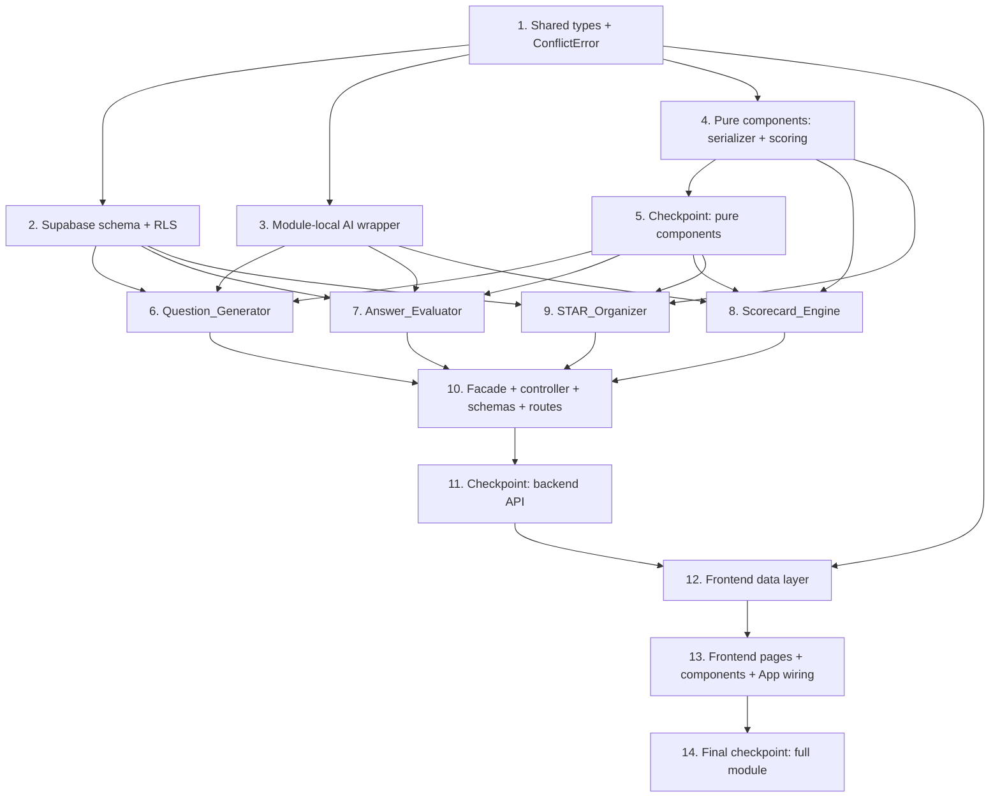

# Implementation Plan: Module 2 — Interview

## Overview

This plan converts the approved Interview module design into incremental, test-driven coding tasks. The backend (`backend/`) and frontend (`frontend/`) packages, their tooling, and the shared platform middleware (`auth`, `validate`, `error`) and typed error hierarchy (`utils/errors.ts`) already exist from Module 1 (Resume). Therefore this module **adds files** rather than scaffolding new packages: it introduces its own routes, controller, services, types, utilities, store, pages, presentational components, and `interview_`-prefixed database tables, and performs **no cross-module imports**.

Work proceeds in dependency order: shared types and the one new platform error (`ConflictError`) first, then the Supabase schema, then the module-local AI wrapper, then the pure/in-process components (STAR serializer and deterministic scoring utilities), then the AI-backed and persistence components (Question_Generator, Answer_Evaluator, Scorecard_Engine, STAR_Organizer), then the service facade / controller / Zod schemas / routes wiring, and finally the frontend data layer and UI. Each component is implemented before the layer that consumes it, so there is no orphaned code — every component is wired into the request pipeline (and the Interview routes into `App.tsx`) by the end.

All 9 correctness properties (P1–P9) from the design map to exactly one `fast-check` property-based test (minimum 100 iterations, tagged `// Feature: interview, Property {n}: ...`). RLS, persistence, lifecycle, and the duplicate-title conflict are validated by integration tests, not property tests, per the design's testing strategy.

Conventions enforced throughout (from steering): Express + TypeScript strict, Route → Controller → Service → Supabase flow, `{ data, error, meta }` envelope, named exports, explicit return types, no `any` (prefer `unknown` + narrowing), ESLint + Prettier, all DDL via `mcp_supabase_apply_migration`, RLS on every table, types mirrored between `backend/src/types/` and `frontend/src/types/`, and no cross-module imports.

## Task Dependency Graph



```json
{
  "waves": [
    { "wave": 1, "tasks": ["1"] },
    { "wave": 2, "tasks": ["2", "3", "4"] },
    { "wave": 3, "tasks": ["5"] },
    { "wave": 4, "tasks": ["6", "7", "8", "9"] },
    { "wave": 5, "tasks": ["10"] },
    { "wave": 6, "tasks": ["11"] },
    { "wave": 7, "tasks": ["12"] },
    { "wave": 8, "tasks": ["13"] },
    { "wave": 9, "tasks": ["14"] }
  ]
}
```

## Tasks

- [x] 1. Define shared types and the new platform error
  - [x] 1.1 Author `backend/src/types/interview.types.ts`
    - Define `DifficultyTier`, `LifecycleState`, `PassFailTier`, `IAnswerEvaluation`, `IInterviewQuestion`, `IInterviewSession`, `IInterviewSessionDetail`, `IInterviewSessionSummary`, `IPerformanceScorecard`, `IStarStory`, and the input types `ICreateSessionInput`, `ISubmitAnswerInput`, `ICreateStarInput`, `IUpdateStarInput`
    - Reuse the platform `IApiResponse<T>`, `IApiError`, `IApiMeta` envelope shape; explicit exported types, named exports only
    - _Requirements: 13.1, 13.2, 13.3_
  - [x] 1.2 Mirror types to `frontend/src/types/interview.types.ts`
    - Duplicate (not symlink) the same definitions to keep backend/frontend in sync
    - _Requirements: 13.1_
  - [x] 1.3 Add `ConflictError` to `backend/src/utils/errors.ts`
    - Extend the existing `AppError` base with a `ConflictError` (HTTP 409, `code` discriminator) for duplicate STAR titles and already-answered questions; keep `isAppError`/`toApiError()` behavior intact
    - _Requirements: 3.4, 7.5, 13.3_
  - [x] 1.4 Write unit test for `ConflictError` serialization
    - Assert `toApiError()` produces a `{ code, message }` shape and the middleware maps it to 409
    - _Requirements: 7.5, 13.3_

- [x] 2. Apply Supabase schema and RLS (DDL via `mcp_supabase_apply_migration` at execution time)
  - [x] 2.1 Create `interview_sessions` table migration
    - Columns per design: `id`, `user_id`, `state` (check in PENDING/ACTIVE/COMPLETED/SCORED, default PENDING), `difficulty_tier` (check in ENTRY/MID/SENIOR/LEAD), `job_description` (check length 1–5000), `question_count` (check between 5 and 15), `resume_version_id` (nullable), `created_at`
    - Add `index on (user_id, created_at desc)`; enable RLS; add select/insert/update/delete policies keyed on `auth.uid() = user_id`
    - _Requirements: 1.1, 1.2, 6.1, 12.1, 12.2_
  - [x] 2.2 Create `interview_questions` table migration
    - Columns: `id`, `user_id` (denormalized owner for RLS), `session_id` (FK → `interview_sessions` on delete cascade), `position` (1-based), `text` (check non-empty after btrim), `answer_text` (nullable, check length 1–5000), `response_latency_seconds` (nullable, check ≥ 0), embedded `quality_score`/`grammar_score` (nullable, check 0–100), `feedback_comment` (nullable, check length 1–2000), `created_at`
    - Add `unique (session_id, position)` and `unique (session_id, text)` (enforces no-duplicate-question-text, Req 2.6); `index on (session_id, position)`; enable RLS with the four `auth.uid() = user_id` policies
    - _Requirements: 2.2, 2.6, 3.1, 4.2, 12.1, 12.2_
  - [x] 2.3 Create `interview_scorecards` table migration
    - Columns: `id`, `user_id`, `session_id` (FK on delete cascade, `unique`), `answer_quality_score`, `grammar_score`, `latency_score`, `pressure_score`, `overall_score` (all not null, check 0–100), `pass_fail_tier` (check in PASS/FAIL), `created_at`
    - Enable RLS with the four `auth.uid() = user_id` policies
    - _Requirements: 5.8, 12.1, 12.2_
  - [x] 2.4 Create `interview_star_stories` table migration
    - Columns: `id`, `user_id`, `title` (check length 1–200), `situation`/`task`/`action`/`result` (each not null `text`, check length 1–2000, stored verbatim), `created_at`
    - Add `unique (user_id, title)` (enforces per-user duplicate-title conflict, Req 7.5); `index on (user_id, created_at desc)` (Req 8.1 ordering); enable RLS with the four `auth.uid() = user_id` policies
    - _Requirements: 7.1, 7.5, 8.1, 11.1, 12.1, 12.2_
  - [x] 2.5 Write integration tests for RLS isolation and persistence
    - Per-user listing returns only the caller's rows; cross-user read/write/delete yields not-found (zero rows); the `unique (user_id, title)` index rejects a duplicate title; question/scorecard rows persist and round-trip
    - Use a Supabase test branch/project with 1–3 representative cases
    - _Requirements: 6.3, 7.5, 8.3, 9.5, 10.3, 12.1, 12.2, 12.4_

- [x] 3. Implement the module-local AI wrapper
  - [x] 3.1 Implement `backend/src/services/interview.aiProvider.service.ts`
    - Single Gemini contact point for this module (does NOT import Module 1's `aiProvider.service.ts`); read API key from env; lazily init the client; request JSON output (`responseMimeType: 'application/json'`); validate with a caller-supplied Zod schema; enforce a 30-second `AbortController` timeout; map any network/timeout/quota/empty/invalid-JSON/schema failure to `AiProviderError` preserving the cause in `details`
    - Export `generateJson<T>(params: IGenerateJsonParams<T>): Promise<T>` with explicit return type
    - _Requirements: 2.4, 4.5, 5.12_
  - [x] 3.2 Write unit tests for AI failure mapping (mocked Gemini)
    - Network error, timeout, empty response, invalid JSON, and schema-validation failure each map to `AiProviderError`
    - _Requirements: 2.4, 4.5, 5.12_

- [x] 4. Implement the pure/in-process components
  - [x] 4.1 Implement the STAR serializer `backend/src/utils/interview.starSerializer.ts`
    - Serialize `IStarStory` → stored representation and deserialize back; preserve all five text fields character-for-character (no trimming/encoding mutation/truncation); throw `DeserializationError` on malformed input
    - _Requirements: 11.1, 11.2, 11.3_
  - [x] 4.2 Write property test for STAR serialization round-trip
    - **Property 1: STAR story serialization round-trip**
    - Build an `arbStarStory` generator (arbitrary unicode/whitespace/max-length fields); assert deserialize(serialize(x)) is character-for-character identical to x
    - fast-check, min 100 iterations, tag `// Feature: interview, Property 1: ...`
    - **Validates: Requirements 11.1, 11.2, 11.3**
  - [x] 4.3 Write edge test for malformed stored representation
    - A malformed blob yields `DeserializationError`
    - _Requirements: 11.3_
  - [x] 4.4 Implement the scoring utilities `backend/src/utils/interview.scoring.ts`
    - Pure functions: `perQuestionLatencyScore(t)` (100 if t ≤ 60, 0 if t ≥ 180, else `round(100 * (180 - t) / 120)`); `sessionLatencyScore(latencies)` (rounded mean); `meanScore(scores)` (rounded mean for quality/grammar); `overallScore(four)` (rounded mean of the four dimensions); `passFailTier(overall)` (PASS iff overall ≥ 70); clamp helper for integer range [0, 100]
    - _Requirements: 5.2, 5.3, 5.4, 5.6, 5.7_
  - [x] 4.5 Write property test for the latency score
    - **Property 2: Latency score is a bounded integer and follows the deterministic formula**
    - Non-negative latency generator; assert anchors (100 at ≤60, 0 at ≥180, interpolation between) and that the session latency score is an integer in [0, 100]
    - fast-check, min 100 iterations, tag `// Feature: interview, Property 2: ...`
    - **Validates: Requirements 5.4**
  - [x] 4.6 Write property test for quality/grammar means
    - **Property 3: Answer-quality and grammar means are bounded integers**
    - Non-empty integer-array (0–100) generators; assert both rounded means are integers in [0, 100]
    - fast-check, min 100 iterations, tag `// Feature: interview, Property 3: ...`
    - **Validates: Requirements 5.2, 5.3**
  - [x] 4.7 Write property test for overall score and pass/fail tier
    - **Property 4: Overall score is the bounded mean of the four dimensions and determines the pass/fail tier**
    - Four integer (0–100) generators; assert overall is the rounded mean in [0, 100] and tier is PASS iff overall ≥ 70
    - fast-check, min 100 iterations, tag `// Feature: interview, Property 4: ...`
    - **Validates: Requirements 5.6, 5.7**
  - [x] 4.8 Write unit tests for scoring anchors and boundaries
    - Latency anchors at t = 60/120/180; mean rounding; overall + tier boundary exactly at 70
    - _Requirements: 5.2, 5.3, 5.4, 5.6, 5.7_

- [x] 5. Checkpoint — pure/in-process components
  - Ensure all tests pass, ask the user if questions arise.

- [x] 6. Implement the Question_Generator
  - [x] 6.1 Implement `backend/src/services/interview.questionGenerator.service.ts`
    - Call the AI wrapper with Job_Description, Difficulty_Tier, Question_Count, and (where present) the referenced Structured_Resume content; tier-tailored system instruction (ENTRY→foundational, MID→applied, SENIOR→systems/leadership, LEAD→strategic/cross-functional); validate the response with `questionsSchema`
    - Apply post-generation invariants before any persistence: count equals requested Question_Count, every text non-empty after trim, no two texts identical; on any failure treat as `AiProviderError`, persist nothing, leave session `PENDING`
    - _Requirements: 2.1, 2.3, 2.4, 2.6_
  - [x] 6.2 Write property test for question-generation post-invariants
    - **Property 6: Question generation satisfies its post-invariants**
    - `Question_Count` (5–15) + question-set generator with a mocked AI_Provider; assert accepted sets have exactly Question_Count non-empty unique texts, and any violating set leaves session `PENDING` with nothing persisted
    - fast-check, min 100 iterations, tag `// Feature: interview, Property 6: ...`
    - **Validates: Requirements 2.1, 2.6**
  - [x] 6.3 Write unit tests for generation failure handling (mocked Gemini)
    - AI failure/timeout leaves session `PENDING` and persists nothing (2.4); wrong count / empty / duplicate text maps to `AiProviderError` (2.1, 2.6)
    - _Requirements: 2.1, 2.4, 2.6_

- [x] 7. Implement the Answer_Evaluator
  - [x] 7.1 Implement `backend/src/services/interview.answerEvaluator.service.ts`
    - Call the AI wrapper with the question text and stored Candidate_Answer; validate with `evaluationSchema` (qualityScore/grammarScore integers 0–100, feedbackComment 1–2000 non-empty); store the evaluation, overwriting any prior evaluation for that question; on AI failure persist nothing and surface `AiProviderError`
    - Guard: only runs for `COMPLETED`/`SCORED` sessions (4.4) and questions with a stored answer (4.3); reject answers over 5000 chars before the AI call (4.6)
    - _Requirements: 4.1, 4.2, 4.3, 4.4, 4.5, 4.6_
  - [x] 7.2 Write unit tests for evaluation guards and failure (mocked Gemini)
    - No-answer question rejected (4.3); wrong-state session rejected (4.4); AI failure persists nothing (4.5); valid evaluation overwrites prior (4.2)
    - _Requirements: 4.2, 4.3, 4.4, 4.5_

- [x] 8. Implement the Scorecard_Engine
  - [x] 8.1 Implement `backend/src/services/interview.scorecard.service.ts`
    - Ensure every question has an evaluation (evaluate missing ones first; on any failure return an error naming the failed question indices and persist nothing — 5.10); compute Answer_Quality/Grammar/Latency/Overall via `utils/interview.scoring.ts`; compute Pressure_Score via a single AI call over the ordered `(position, qualityScore, grammarScore)` sequence and clamp `Math.round` into [0, 100]; set Pass_Fail_Tier; persist scorecard and transition session to `SCORED` only when all steps succeed and Overall ∈ [0, 100]; return cached scorecard for an already-`SCORED` session without recomputation
    - _Requirements: 5.1, 5.5, 5.8, 5.10, 5.11, 5.12, 5.13_
  - [x] 8.2 Write property test for pressure-score clamping
    - **Property 5: Pressure score is clamped regardless of AI output**
    - Numeric/garbage generator (negative, >100, fractional) with a mocked AI_Provider; assert the returned Pressure_Score is an integer in [0, 100]
    - fast-check, min 100 iterations, tag `// Feature: interview, Property 5: ...`
    - **Validates: Requirements 5.5**
  - [x] 8.3 Write unit tests for scorecard persistence and failure (mocked Gemini)
    - Pressure AI failure aborts persistence (5.12); cached scorecard returned for `SCORED` session (5.11); failed/out-of-range overall persists nothing (5.13); missing-evaluation path names failed indices (5.10)
    - _Requirements: 5.10, 5.11, 5.12, 5.13_

- [x] 9. Implement the STAR_Organizer
  - [x] 9.1 Implement `backend/src/services/interview.starOrganizer.service.ts`
    - Implement create / list / get / update / delete using the serializer (4.1); enforce per-user duplicate-title conflict via `ConflictError` (application-level check plus the `unique (user_id, title)` index); update mutates only supplied fields and preserves the rest; map RLS no-rows to `NotFoundError`; delete returns void and a subsequent get yields not-found
    - _Requirements: 7.1, 7.5, 8.1, 8.2, 8.3, 9.1, 9.5, 10.1, 10.2, 10.3, 11.1, 11.2_
  - [x] 9.2 Write property test for duplicate STAR titles
    - **Property 9: Duplicate STAR titles per user yield a conflict**
    - `arbStarStory` generator; for a user who already owns a story with a title, a second create with the same exact title is rejected with a conflict error and no second story persists
    - fast-check, min 100 iterations, tag `// Feature: interview, Property 9: ...`
    - **Validates: Requirements 7.5**
  - [x] 9.3 Write edge tests for STAR validation
    - Missing/blank required fields identified (7.2); title > 200 stops validation first (7.3); STAR field > 2000 identified (7.4); update with no supplied fields rejected (9.6); blank supplied update field rejected (9.2)
    - _Requirements: 7.2, 7.3, 7.4, 9.2, 9.6_

- [x] 10. Implement the service facade, controller, Zod schemas, and routes
  - [x] 10.1 Implement `backend/src/services/interview.service.ts` facade
    - Expose the design signatures (`createSession`, `startSession`, `submitAnswer`, `evaluateAnswer`, `computeScorecard`, `listSessions`, `getSession`, `createStory`, `listStories`, `getStory`, `updateStory`, `deleteStory`), delegating to the sub-components; enforce the lifecycle state machine (PENDING→ACTIVE→COMPLETED→SCORED), validating current state before each guarded operation and rejecting out-of-state requests with a typed error naming the current state; transition to `COMPLETED` when the last answer is submitted; map RLS no-rows to `NotFoundError`; throw typed errors
    - _Requirements: 1.1, 2.2, 2.5, 3.1, 3.5, 3.7, 4.4, 5.9, 6.1, 6.2, 6.3_
  - [x] 10.2 Write property test for the session lifecycle state machine
    - **Property 7: Session lifecycle honors the state machine**
    - `(state, operation)` pair generator over the transition table; assert allowed pairs transition correctly and every disallowed pair is rejected with a typed error naming the current state, leaving the session unmodified
    - fast-check, min 100 iterations, tag `// Feature: interview, Property 7: ...`
    - **Validates: Requirements 2.5, 3.5, 4.4, 5.9**
  - [x] 10.3 Implement `backend/src/controllers/interview.controller.ts`
    - Translate validated requests into facade calls; shape every result into the `{ data, error, meta }` envelope (data populated/error null on success; data null/typed error on failure); set `meta.total` on list responses and `meta` to null on single-resource responses; no direct Supabase or Gemini access
    - _Requirements: 13.1, 13.2, 13.3, 13.4_
  - [x] 10.4 Implement `backend/src/routes/interview.schemas.ts` and `backend/src/routes/interview.ts`; mount under `/api/v1/interview`
    - Author Zod schemas for body/params/query of every endpoint (session-create constraints, answer constraints, STAR create/update constraints); wire endpoints `POST /sessions`, `POST /sessions/:id/start`, `GET /sessions`, `GET /sessions/:id`, `POST /sessions/:id/questions/:qid/answers`, `POST /sessions/:id/questions/:qid/evaluation`, `POST /sessions/:id/scorecard`, `GET /sessions/:id/scorecard`, `POST /stories`, `GET /stories`, `GET /stories/:id`, `PATCH /stories/:id`, `DELETE /stories/:id`; attach auth → validation → controller per route; mount the interview router in `backend/src/index.ts` with the shared error middleware registered last
    - _Requirements: 1.3, 1.4, 1.5, 1.6, 1.7, 1.8, 3.3, 4.6, 7.2, 9.6, 12.3, 12.5, 12.6_
  - [x] 10.5 Write property test for the API envelope
    - **Property 8: All responses conform to the API envelope**
    - Handler-outcome generator (success + each failure type); assert the `{ data, error, meta }` invariant (exactly one of data/error non-null)
    - fast-check, min 100 iterations, tag `// Feature: interview, Property 8: ...`
    - **Validates: Requirements 13.1, 13.2, 13.3**
  - [x] 10.6 Write edge/validation tests per route
    - Missing/empty/oversized job description and out-of-range question count / invalid tier (1.4–1.8); oversized/empty answer (3.3); re-answering an already-answered question yields conflict (3.4); unauthenticated request yields auth error (12.3)
    - _Requirements: 1.4, 1.5, 1.6, 1.7, 1.8, 3.3, 3.4, 12.3_
  - [x] 10.7 Write integration tests for lifecycle and conflict end-to-end
    - Full lifecycle sequence PENDING→ACTIVE→COMPLETED→SCORED end-to-end (2.2, 2.5, 3.5, 3.7, 4.4, 5.8, 5.9); per-user duplicate-title conflict via the unique index (7.5); ownership → not-found semantics (6.3, 12.4)
    - Use a Supabase test branch/project with 1–3 representative cases
    - _Requirements: 2.2, 2.5, 3.5, 3.7, 4.4, 5.8, 5.9, 6.3, 7.5, 12.4_

- [x] 11. Checkpoint — backend API complete
  - Ensure all tests pass, ask the user if questions arise.

- [x] 12. Implement the frontend data layer
  - [x] 12.1 Implement `frontend/src/services/interview.service.ts`
    - HTTP calls to every `/api/v1/interview/*` endpoint; unwrap the envelope (return `data` on success, throw a typed client error carrying `error` on failure); never import the Supabase client
    - _Requirements: 13.1, 13.2, 13.3_
  - [x] 12.2 Write unit tests for envelope unwrapping
    - Success returns `data`; failure throws a typed client error carrying `error`
    - _Requirements: 13.2, 13.3_
  - [x] 12.3 Implement `frontend/src/stores/interview.store.ts`
    - Zustand store (one per domain): active session, sessions list, scorecard, STAR list, plus `isLoading` and `error`; actions call `interview.service.ts`, set `isLoading`/`error` before the call, update the relevant slice on success, and preserve prior data on failure
    - _Requirements: 6.1, 6.2_
  - [x] 12.4 Write unit tests for store state transitions
    - `isLoading`/`error` set before the call; slice updated on success; prior data preserved on failure
    - _Requirements: 6.1, 6.2_

- [x] 13. Implement frontend pages, presentational components, and route wiring
  - [x] 13.1 Implement presentational components
    - `components/ScoreDial/` (0–100 dimension score dial) and `components/TierBadge/` (PASS/FAIL pill); semantic HTML, accessible labels, Tailwind utility classes and the brand palette
    - _Requirements: 5.6, 5.7_
  - [x] 13.2 Implement `pages/Interview/InterviewSimulatorPage.tsx`
    - Create session (tier, JD, question count, optional resume reference), start to generate questions, answer questions with response latency; wired to the store
    - _Requirements: 1.1, 2.2, 3.1_
  - [x] 13.3 Implement `pages/Interview/InterviewScorecardPage.tsx`
    - Render the four dimensions via `ScoreDial`, the overall score, and the `TierBadge`; trigger compute/retrieve scorecard
    - _Requirements: 5.1, 5.6, 5.7_
  - [x] 13.4 Implement `pages/Interview/InterviewSessionsPage.tsx`
    - List past sessions (newest first) with state, tier, overall score, and tier; open a session detail
    - _Requirements: 6.1, 6.2_
  - [x] 13.5 Implement `pages/Interview/StarOrganizerPage.tsx`
    - STAR CRUD scratchpad (create/list/view/update/delete) wired to the store
    - _Requirements: 7.1, 8.1, 8.2, 9.1, 10.1_
  - [x] 13.6 Wire Interview routes into `frontend/src/App.tsx`
    - Replace the `/interview` `ComingSoonPage` placeholder with in-page tab navigation across the Simulator / Scorecard / Sessions / STAR pages; keep the fixed sidebar module link
    - _Requirements: 6.1_
  - [x] 13.7 Write component render tests
    - Example-based render tests for `ScoreDial` and `TierBadge`
    - _Requirements: 5.6, 5.7_

- [x] 14. Final checkpoint — full module
  - Ensure all backend and frontend tests pass, ask the user if questions arise.

## Notes

- Tasks marked with `*` are optional test sub-tasks and can be skipped for a faster MVP; core implementation tasks are never optional and top-level tasks are never marked optional.
- Properties P1–P9 each map to exactly one `fast-check` property-based test (≥100 iterations, tagged `// Feature: interview, Property {n}: ...`): P1 → STAR serializer (4.2), P2/P3/P4 → scoring utils (4.5/4.6/4.7), P5 → Scorecard_Engine pressure clamp (8.2), P6 → Question_Generator post-invariants (6.2), P7 → service facade lifecycle (10.2), P8 → controller/routes envelope (10.5), P9 → STAR_Organizer duplicate title (9.2).
- RLS, persistence, the session lifecycle end-to-end, and the per-user duplicate-title conflict are covered by integration tests (tasks 2.5 and 10.7), not property tests, because their behavior tests Supabase configuration and policy wiring rather than input-varying logic — running them 100 times adds no coverage over 1–3 representative cases. This mirrors the Module 1 convention.
- Domain isolation: the Interview module owns its own routes, controller, services, types, utils, store, pages, and `interview_`-prefixed tables, and performs no cross-module imports. It does not import Module 1's `aiProvider.service.ts`; it defines a module-local AI wrapper that reuses the same pattern. The shared typed error hierarchy in `utils/errors.ts` is platform-wide infrastructure (not a module), so reusing it and adding the new platform `ConflictError` is consistent with the steering rules.
- All DDL is applied through `mcp_supabase_apply_migration` during execution of tasks 2.1–2.4 — no migrations are applied during planning. RLS is enabled on every `interview_` table with the four `auth.uid() = user_id` policies.
- Each task references the specific requirement IDs and/or design properties it implements for traceability.
