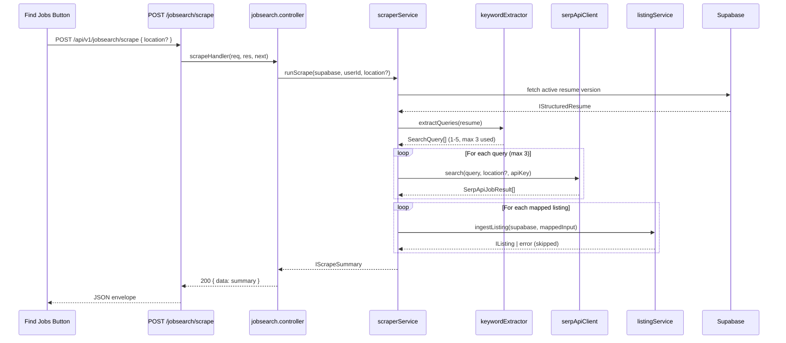

# Design Document: Job Scraper

## Overview

The Job Scraper feature adds resume-matched job discovery to the existing Job Search module. When a user clicks "Find Jobs" on the Listings tab, the system reads their active resume, extracts relevant search terms, queries SerpAPI's Google Jobs endpoint, maps results to the existing listing schema, and ingests them via the existing deduplication pipeline.

The design follows the established architecture: Route → Controller → Service → Supabase, with a new `Scraper_Service` sub-service under the Job Search module facade. The SerpAPI HTTP client and keyword extractor are internal components of `Scraper_Service` — not shared across modules.

Key design goals:
- Minimize SerpAPI calls (max 3 per scrape, 60-minute cooldown)
- Reuse the existing `Listing_Service.ingestListing` for storage and dedup
- Graceful degradation (partial results on partial failures)
- No AI provider needed — keyword extraction is deterministic/heuristic

## Architecture



## Components and Interfaces

### New Files

| File | Purpose |
|------|---------|
| `backend/src/services/jobsearchScraper.service.ts` | Orchestrates the scrape pipeline: cooldown check → resume fetch → keyword extraction → SerpAPI calls → mapping → ingestion → summary |
| `backend/src/utils/jobsearchKeywordExtractor.ts` | Pure function: `IStructuredResume` → `SearchQuery[]` (1-5 ranked, deduplicated queries) |
| `backend/src/utils/jobsearchSerpApiClient.ts` | HTTP client wrapper for SerpAPI Google Jobs endpoint with timeout, error handling, sequential execution |
| `backend/src/utils/jobsearchScrapeMapper.ts` | Pure function: maps SerpAPI raw results to `IListingIngestInput[]` (workMode detection, datePosted parsing, description truncation) |
| `backend/src/routes/jobsearch.schemas.ts` | Extended with `scrapeBodySchema` (optional location field) |
| `frontend/src/components/FindJobsButton/FindJobsButton.tsx` | Button component with loading state, conditional rendering |

### Modified Files

| File | Change |
|------|--------|
| `backend/src/controllers/jobsearch.controller.ts` | Add `scrapeHandler` |
| `backend/src/services/jobsearch.service.ts` | Add `runScrape` delegation to scraper service |
| `backend/src/routes/jobsearch.ts` | Add `POST /scrape` route |
| `backend/.env.example` | Add `SERPAPI_API_KEY=your_serpapi_key_here` |
| `frontend/src/pages/JobSearch/ListingsTab.tsx` | Add `FindJobsButton` above filter bar |

### Interface Definitions

```typescript
// --- backend/src/utils/jobsearchKeywordExtractor.ts ---

/**
 * A single search query derived from the user's resume.
 */
export interface ISearchQuery {
  text: string;       // 2-100 characters
  source: 'title' | 'skill' | 'experience' | 'summary';
  score: number;      // relevance score for ranking
}

/**
 * Extracts ranked, deduplicated search queries from a structured resume.
 * Returns 1-5 queries. Throws ValidationError if resume lacks extractable content.
 */
export function extractSearchQueries(resume: IStructuredResume): ISearchQuery[];
```

```typescript
// --- backend/src/utils/jobsearchSerpApiClient.ts ---

export interface ISerpApiJobResult {
  title: string;
  company_name: string;
  location?: string;
  description?: string;
  detected_extensions?: {
    posted_at?: string;
  };
  apply_options?: Array<{ link: string }>;
  share_link?: string;
}

export interface ISerpApiSearchResult {
  query: string;
  jobs: ISerpApiJobResult[];
  success: boolean;
  error?: string;
}

/**
 * Searches SerpAPI Google Jobs for a single query.
 * - 10-second timeout per call
 * - Returns empty jobs array on non-429 failure
 * - Throws RateLimitError on HTTP 429
 */
export async function searchGoogleJobs(
  query: string,
  apiKey: string,
  location?: string
): Promise<ISerpApiSearchResult>;
```

```typescript
// --- backend/src/utils/jobsearchScrapeMapper.ts ---

/**
 * Maps a SerpAPI job result to the existing IListingIngestInput schema.
 * - Detects workMode from location text
 * - Parses datePosted from detected_extensions.posted_at
 * - Truncates description to 5000 chars
 * - Defaults missing location to "Not specified"
 */
export function mapSerpResultToListing(result: ISerpApiJobResult): IListingIngestInput;

/**
 * Determines work mode from location text.
 * "remote" (case-insensitive) → Remote
 * "hybrid" (case-insensitive) → Hybrid
 * otherwise → Onsite
 */
export function detectWorkMode(location: string): WorkMode;

/**
 * Parses a relative time expression (e.g., "3 days ago") or absolute date
 * into an ISO 8601 timestamp. Returns current UTC time if unparseable.
 */
export function parseDatePosted(postedAt: string | undefined): string;
```

```typescript
// --- backend/src/services/jobsearchScraper.service.ts ---

export interface IScrapeSummary {
  totalResults: number;
  newListings: number;
  duplicatesMerged: number;
  skipped: number;
  warnings?: string[];
}

/**
 * Orchestrates the full scrape pipeline for a user.
 * - Enforces 60-minute cooldown
 * - Enforces single-scrape-per-user concurrency
 * - Caps SerpAPI calls at 3
 * - Returns partial results on partial failures
 */
export async function runScrape(
  supabase: SupabaseClient,
  userId: string,
  location?: string
): Promise<IScrapeSummary>;
```

### Error Types (reusing existing hierarchy)

| Scenario | Error Class | HTTP Status |
|----------|-------------|-------------|
| No resume uploaded | `ValidationError` | 400 |
| Resume lacks content | `ValidationError` | 400 |
| Invalid location param | `ValidationError` | 400 |
| Missing SERPAPI_API_KEY | `InternalError` | 500 |
| SerpAPI rate limited (429) | `AiProviderError` | 502 |
| All queries failed | `AiProviderError` | 502 |
| Scrape already in progress | `ConflictError` | 409 |
| Cooldown active | Custom 429 response (not a typed error — returned directly by controller) | 429 |

**Design Decision — Cooldown 429 Response**: The 60-minute cooldown returns HTTP 429 with a `Retry-After` header and cooldown expiry in the error body. This is handled directly in the controller rather than through the error hierarchy, since 429 is not a typed application error but an HTTP rate-limiting signal. The response body follows the standard envelope: `{ data: null, error: { type: 'RateLimitError', message: '...', details: { cooldownExpiresAt: '...' } }, meta }`.

## Data Models

### In-Memory State (no new DB tables)

The scraper does not introduce new database tables. It reuses:
- `resume_versions` (read) — fetch the user's active resume
- `jobsearch_listings` (write) — ingest scraped listings via existing `ingestListing`

### Cooldown Tracking

Cooldown state is tracked in-memory using a `Map<string, number>` (userId → last scrape timestamp in ms). This is acceptable because:
- The backend is a single-process Express server
- Cooldown is a rate-limiting optimization, not a critical invariant
- On server restart, cooldown resets (acceptable for free-tier usage)

```typescript
// In-memory cooldown store (module-level in jobsearchScraper.service.ts)
const lastScrapeTimestamps = new Map<string, number>();
const COOLDOWN_MS = 60 * 60 * 1000; // 60 minutes

// In-memory concurrency lock
const activeScrapes = new Set<string>(); // userId set
```

### SerpAPI Response Shape (external)

The SerpAPI Google Jobs endpoint returns:
```json
{
  "jobs_results": [
    {
      "title": "Software Engineer",
      "company_name": "Acme Corp",
      "location": "San Francisco, CA",
      "description": "...",
      "detected_extensions": { "posted_at": "3 days ago" },
      "apply_options": [{ "link": "https://..." }],
      "share_link": "https://..."
    }
  ]
}
```

## Correctness Properties

*A property is a characteristic or behavior that should hold true across all valid executions of a system — essentially, a formal statement about what the system should do. Properties serve as the bridge between human-readable specifications and machine-verifiable correctness guarantees.*

### Property 1: Resume Version Selection

*For any* set of resume versions belonging to a user (with varying `isActive` flags and `createdAt` timestamps), the keyword extractor SHALL select exactly the version where `isActive` is true and `createdAt` is the most recent among all active versions.

**Validates: Requirements 1.1, 1.7**

### Property 2: Keyword Extraction Source Coverage

*For any* valid `IStructuredResume` with non-empty content, the extracted search queries SHALL only contain terms that originate from one of the following sources: skills array entries, experience section headings, experience section item text, or the summary field — and no other fields.

**Validates: Requirements 1.2**

### Property 3: Query Output Constraints and Ranking

*For any* valid `IStructuredResume` with extractable content, the `extractSearchQueries` function SHALL produce between 1 and 5 distinct queries where each query is between 2 and 100 characters in length, multi-word phrases and named technologies rank higher than single generic terms, and the ordering follows the priority: title terms > skill terms > experience item terms > summary terms.

**Validates: Requirements 1.3, 5.2**

### Property 4: Query Deduplication Invariant

*For any* list of candidate search terms, after deduplication, no two queries in the output SHALL be equal under case-insensitive comparison, and no query in the output SHALL be a substring of another query in the output.

**Validates: Requirements 1.4**

### Property 5: SerpAPI Result Mapping Correctness

*For any* valid SerpAPI job result object, the mapping function SHALL produce an `IListingIngestInput` where: the `title` equals the SerpAPI `title`, `company` equals `company_name`, `location` equals the SerpAPI `location` (or "Not specified" if absent), `description` is at most 5000 characters (truncated from the original if longer), and `sourceUrl` is the first apply link (or `share_link` as fallback).

**Validates: Requirements 3.1, 3.2, 3.5**

### Property 6: WorkMode Classification

*For any* location string, `detectWorkMode` SHALL return "Remote" if the string contains "remote" (case-insensitive), "Hybrid" if it does not contain "remote" but contains "hybrid" (case-insensitive), and "Onsite" otherwise.

**Validates: Requirements 3.3**

### Property 7: datePosted Parsing

*For any* string that is a valid relative time expression (e.g., "N days ago", "N hours ago") or a parseable absolute date, `parseDatePosted` SHALL return a valid ISO 8601 timestamp. *For any* string that is not parseable, it SHALL return the current UTC timestamp.

**Validates: Requirements 3.4**

### Property 8: Summary Count Consistency

*For any* scrape execution, the returned summary SHALL satisfy: `totalResults >= newListings + duplicatesMerged + skipped` (where skipped accounts for ingestion errors), and `newListings + duplicatesMerged + skipped` equals the total number of listings that were attempted to be ingested.

**Validates: Requirements 3.8**

### Property 9: Maximum SerpAPI Calls Per Scrape

*For any* scrape invocation, regardless of the number of search queries extracted (1-5), the total number of SerpAPI HTTP calls made SHALL never exceed 3.

**Validates: Requirements 5.1**

### Property 10: Location Validation

*For any* string input as the `location` field, the validation SHALL accept it if and only if: after trimming, it is between 1 and 100 characters in length and is not composed entirely of whitespace.

**Validates: Requirements 4.2, 4.3**

## Error Handling

### Error Flow

All errors follow the existing centralized error middleware pattern:
1. Service throws a typed `AppError` subclass
2. Controller's `asyncHandler` wrapper catches via `.catch(next)`
3. Error middleware maps to `{ data: null, error: { type, message, details? }, meta }` envelope

### Graceful Degradation Strategy

The scraper is designed for partial success:

| Failure | Behavior |
|---------|----------|
| One SerpAPI query returns non-429 error | Skip that query, continue with remaining |
| One SerpAPI query times out | Skip that query, continue with remaining |
| One listing fails ingestion (validation/DB) | Skip that listing, continue with remaining |
| All queries fail | Return 502 with descriptive error |
| SerpAPI returns 429 | Stop immediately, return quota-exceeded error |
| Pipeline exceeds 30s total | Abort remaining calls, return partial results collected so far |

### Cooldown Handling (HTTP 429)

The 60-minute cooldown is not a traditional error — it's an intentional rate limit. The controller returns:
```json
{
  "data": null,
  "error": {
    "type": "RateLimitError",
    "message": "Please wait before searching again. Cooldown expires in 45 minutes.",
    "details": { "cooldownExpiresAt": "2025-01-20T15:30:00.000Z", "remainingMinutes": 45 }
  },
  "meta": { "requestId": "...", "timestamp": "..." }
}
```

### Concurrency Lock

The in-memory `activeScrapes` set prevents multiple simultaneous scrapes per user. The lock is always released in a `finally` block to prevent deadlocks on unexpected errors.

```typescript
try {
  activeScrapes.add(userId);
  // ... scrape pipeline ...
} finally {
  activeScrapes.delete(userId);
}
```

## Testing Strategy

### Property-Based Tests (fast-check)

The project already uses `fast-check` (v3.23.2) with `vitest`. Property tests validate universal invariants across many generated inputs (minimum 100 iterations each).

**Test file**: `backend/tests/jobscraper.property.test.ts`

Properties to test:
1. **Keyword extraction constraints** — generate random `IStructuredResume` objects, verify output query count (1-5), character length (2-100), distinctness, and ranking order
2. **Query deduplication** — generate random candidate term lists with duplicates/substrings, verify the invariant holds
3. **SerpAPI result mapping** — generate random job result objects, verify field mapping, truncation, and defaults
4. **WorkMode classification** — generate random location strings, verify deterministic classification
5. **datePosted parsing** — generate random relative time expressions, verify ISO output or fallback
6. **Summary count consistency** — generate random ingestion outcomes, verify arithmetic invariant
7. **Max 3 calls invariant** — generate random query counts, verify the cap
8. **Location validation** — generate random strings, verify accept/reject boundary

Each test tagged: `// Feature: job-scraper, Property N: {property_text}`

### Unit Tests (example-based)

**Test file**: `backend/tests/jobscraper.unit.test.ts`

- Resume version selection with edge cases (no versions, one active, multiple active)
- Empty resume content → ValidationError
- Missing SERPAPI_API_KEY → InternalError
- SerpAPI 429 → processing stops
- All queries fail → 502 error
- Cooldown enforcement (mock timestamps)
- Concurrency lock (409 on concurrent scrape)
- Location filter passed to SerpAPI

### Integration Tests

**Test file**: `backend/tests/jobscraper.integration.test.ts`

- Full pipeline with mocked SerpAPI (happy path)
- Partial failure scenario (2/3 queries succeed)
- Verify listings appear in DB after scrape
- 30-second timeout scenario

### Frontend Tests

- `FindJobsButton` renders correctly in each state (idle, loading, no-resume)
- Click triggers POST to correct endpoint
- Success re-fetches listings
- Error displays notification

### Test Configuration

```typescript
// Property test example structure
import { fc } from 'fast-check';
import { describe, it, expect } from 'vitest';

describe('job-scraper properties', () => {
  it('Property 6: WorkMode classification', () => {
    // Feature: job-scraper, Property 6: WorkMode Classification
    fc.assert(
      fc.property(fc.string(), (location) => {
        const result = detectWorkMode(location);
        if (location.toLowerCase().includes('remote')) {
          expect(result).toBe('Remote');
        } else if (location.toLowerCase().includes('hybrid')) {
          expect(result).toBe('Hybrid');
        } else {
          expect(result).toBe('Onsite');
        }
      }),
      { numRuns: 100 }
    );
  });
});
```
