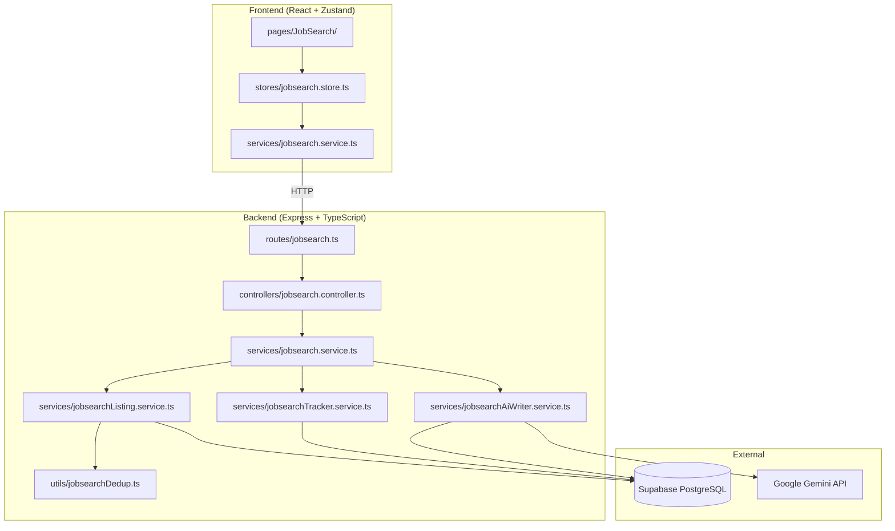

# Design Document — Job Search Module

## Overview

The Job Search module (Module 3) provides a unified job discovery and application management experience within StayQualifAI. It comprises three sub-features:

1. **Job Listings Feed** — a paginated, filterable feed of scraped job listings with deduplication and direct-apply links
2. **Visual Application Tracker** — a Kanban board that tracks applications across five lifecycle stages (Wishlist → Applied → Interviewing → Offer → Rejected)
3. **AI Application & Email Writer** — Google Gemini–powered generation of cover letters, LinkedIn outreach messages, and follow-up emails

The module follows the established architecture: Route → Controller → Service → Supabase. A single controller (`jobsearch.controller.ts`), single service facade (`jobsearch.service.ts`), and single route file (`jobsearch.ts`) own all endpoints under `/api/v1/jobsearch/*`. The frontend exposes the module in `pages/JobSearch/` with a tab-based layout (Listings | Tracker | AI Writer) and a Zustand store for client-side state.

### Key Design Decisions

| Decision | Rationale |
|----------|-----------|
| Single service facade delegating to focused sub-services | Mirrors the resume module pattern; keeps the controller thin and domain logic testable in isolation |
| Deduplication on ingest (not on read) | Avoids duplicate storage and keeps query-time filtering simple |
| Kanban stage transitions are atomic DB updates | Prevents partial state; the frontend optimistically moves the card then reverts on failure |
| AI generation endpoints return the generated text directly | Keeps the API stateless — content is not persisted server-side; the user copies what they need |
| Whitespace-normalization as a pure utility function | Enables property-based testing of the deduplication matching logic |

---

## Architecture



### Request Flow

All requests follow the layered architecture:

1. **Route** — authenticates (`requireAuth`), validates (Zod schemas), routes to controller
2. **Controller** — narrows auth context, invokes the service facade, shapes the `{ data, error, meta }` envelope
3. **Service Facade** — delegates to the focused sub-service for the operation
4. **Sub-Service** — executes business logic, queries Supabase or calls Gemini
5. **Error Propagation** — typed `AppError` subclasses bubble to the centralized error middleware

---

## Components and Interfaces

### Backend

#### API Endpoints

| Method | Path | Description | Req |
|--------|------|-------------|-----|
| GET | `/api/v1/jobsearch/listings` | Paginated, filtered listings | 1, 2 |
| POST | `/api/v1/jobsearch/listings` | Ingest a new listing (with dedup) | 3 |
| GET | `/api/v1/jobsearch/applications` | List user's applications | 4 |
| POST | `/api/v1/jobsearch/applications` | Add listing to tracker | 4 |
| PATCH | `/api/v1/jobsearch/applications/:id/stage` | Move application to new stage | 4 |
| GET | `/api/v1/jobsearch/applications/:id` | Get application detail + history | 5 |
| PATCH | `/api/v1/jobsearch/applications/:id/notes` | Update application notes | 5 |
| DELETE | `/api/v1/jobsearch/applications/:id` | Delete an application | 9 |
| POST | `/api/v1/jobsearch/ai/cover-letter` | Generate cover letter | 6 |
| POST | `/api/v1/jobsearch/ai/linkedin-outreach` | Generate LinkedIn message | 7 |
| POST | `/api/v1/jobsearch/ai/follow-up-email` | Generate follow-up email | 8 |

#### Sub-Service Interfaces

```typescript
// jobsearchListing.service.ts
export interface IListingFilters {
  workMode?: WorkMode;
  location?: string;
  keyword?: string;
  company?: string;
}

export interface IPaginationParams {
  page: number;    // >= 1
  pageSize: number; // 1..100, default 20
}

export interface IPaginatedResult<T> {
  items: T[];
  meta: {
    totalCount: number;
    currentPage: number;
    totalPages: number;
    hasNextPage: boolean;
  };
}

export async function getListings(
  supabase: SupabaseClient,
  filters: IListingFilters,
  pagination: IPaginationParams
): Promise<IPaginatedResult<IListing>>;

export async function ingestListing(
  supabase: SupabaseClient,
  input: IListingIngestInput
): Promise<IListing>;
```

```typescript
// jobsearchTracker.service.ts
export async function listApplications(
  supabase: SupabaseClient,
  userId: string
): Promise<IApplication[]>;

export async function addApplication(
  supabase: SupabaseClient,
  userId: string,
  listingId: string
): Promise<IApplication>;

export async function updateStage(
  supabase: SupabaseClient,
  userId: string,
  applicationId: string,
  newStage: Stage
): Promise<IApplication>;

export async function getApplicationDetail(
  supabase: SupabaseClient,
  userId: string,
  applicationId: string
): Promise<IApplicationDetail>;

export async function updateNotes(
  supabase: SupabaseClient,
  userId: string,
  applicationId: string,
  notes: string
): Promise<IApplication>;

export async function deleteApplication(
  supabase: SupabaseClient,
  userId: string,
  applicationId: string
): Promise<void>;
```

```typescript
// jobsearchAiWriter.service.ts
export async function generateCoverLetter(
  supabase: SupabaseClient,
  userId: string,
  applicationId: string
): Promise<string>;

export async function generateLinkedInOutreach(
  supabase: SupabaseClient,
  userId: string,
  applicationId: string,
  recipientName?: string,
  recipientRole?: string
): Promise<string>;

export async function generateFollowUpEmail(
  supabase: SupabaseClient,
  userId: string,
  applicationId: string
): Promise<string>;
```

#### Deduplication Utility

```typescript
// utils/jobsearchDedup.ts
export function normalizeForComparison(value: string): string;
export function isListingDuplicate(
  existing: Pick<IListing, 'company' | 'title' | 'location'>,
  incoming: Pick<IListing, 'company' | 'title' | 'location'>
): boolean;
export function mergeDuplicateListings(
  existing: IListing,
  incoming: IListingIngestInput
): IListing;
```

### Frontend

#### Pages

| File | Description |
|------|-------------|
| `pages/JobSearch/JobSearchPage.tsx` | Root page with tab navigation |
| `pages/JobSearch/ListingsTab.tsx` | Listings feed with filters |
| `pages/JobSearch/TrackerTab.tsx` | Kanban board |
| `pages/JobSearch/AiWriterTab.tsx` | AI content generation interface |

#### Components

| Component | Description |
|-----------|-------------|
| `components/JobSearch/ListingCard.tsx` | Single listing in the feed |
| `components/JobSearch/FilterBar.tsx` | Work mode, location, keyword, company filters |
| `components/JobSearch/KanbanColumn.tsx` | Single stage column |
| `components/JobSearch/ApplicationCard.tsx` | Draggable application card |
| `components/JobSearch/ApplicationDetailDialog.tsx` | Full detail in native `<dialog>` |
| `components/JobSearch/AiOutputPanel.tsx` | Generated text display with copy button |

#### Store

```typescript
// stores/jobsearch.store.ts
export interface IJobSearchState {
  listings: IListing[];
  listingsMeta: IPaginationMeta | null;
  filters: IListingFilters;
  applications: IApplication[];
  selectedApplication: IApplicationDetail | null;
  generatedContent: string | null;
  activeTab: 'listings' | 'tracker' | 'ai-writer';
  status: 'idle' | 'loading' | 'error';
  error: IStoreError | null;
}
```

---

## Data Models

### Database Tables

#### `jobsearch_listings`

| Column | Type | Constraints | Notes |
|--------|------|-------------|-------|
| `id` | `uuid` | PK, default `gen_random_uuid()` | |
| `title` | `varchar(255)` | NOT NULL | |
| `company` | `varchar(255)` | NOT NULL | |
| `location` | `varchar(255)` | NOT NULL | |
| `work_mode` | `text` | NOT NULL, CHECK IN ('Remote','Hybrid','Onsite') | |
| `description` | `varchar(5000)` | | |
| `source_urls` | `text[]` | NOT NULL, default `'{}'` | Array to support multi-source dedup |
| `salary_min` | `numeric` | CHECK >= 0 AND <= 999999999 | Optional |
| `salary_max` | `numeric` | CHECK >= 0 AND <= 999999999 | Optional |
| `date_posted` | `timestamptz` | NOT NULL | |
| `date_scraped` | `timestamptz` | NOT NULL, default `now()` | |
| `created_at` | `timestamptz` | NOT NULL, default `now()` | |

**Indexes:**
- `idx_listings_company_title_location` — composite for deduplication lookups
- `idx_listings_work_mode` — filter queries
- `idx_listings_date_posted_desc` — default sort

**RLS:** Read access for all authenticated users. Write access for service-role (ingestion).

#### `jobsearch_applications`

| Column | Type | Constraints | Notes |
|--------|------|-------------|-------|
| `id` | `uuid` | PK, default `gen_random_uuid()` | |
| `user_id` | `uuid` | NOT NULL, FK → `auth.users(id)` | |
| `listing_id` | `uuid` | NOT NULL, FK → `jobsearch_listings(id)` | |
| `stage` | `text` | NOT NULL, CHECK IN ('Wishlist','Applied','Interviewing','Offer','Rejected'), default 'Wishlist' | |
| `notes` | `varchar(2000)` | | Optional |
| `date_added` | `timestamptz` | NOT NULL, default `now()` | |
| `date_stage_changed` | `timestamptz` | NOT NULL, default `now()` | |
| `created_at` | `timestamptz` | NOT NULL, default `now()` | |

**Constraints:**
- UNIQUE(`user_id`, `listing_id`) — prevent duplicate tracking

**Indexes:**
- `idx_applications_user_stage` — Kanban column queries
- `idx_applications_date_stage_changed_desc` — sort within columns

**RLS:** Users can only read/write their own applications.

#### `jobsearch_stage_history`

| Column | Type | Constraints | Notes |
|--------|------|-------------|-------|
| `id` | `uuid` | PK, default `gen_random_uuid()` | |
| `application_id` | `uuid` | NOT NULL, FK → `jobsearch_applications(id)` ON DELETE CASCADE | |
| `stage` | `text` | NOT NULL, CHECK IN ('Wishlist','Applied','Interviewing','Offer','Rejected') | |
| `changed_at` | `timestamptz` | NOT NULL, default `now()` | |

**RLS:** Accessible only through the parent application's user ownership.

### TypeScript Types (mirrored backend/frontend)

```typescript
// types/jobsearch.types.ts

export type WorkMode = 'Remote' | 'Hybrid' | 'Onsite';
export type Stage = 'Wishlist' | 'Applied' | 'Interviewing' | 'Offer' | 'Rejected';

export interface IListing {
  id: string;
  title: string;
  company: string;
  location: string;
  workMode: WorkMode;
  description: string;
  sourceUrls: string[];
  salaryMin: number | null;
  salaryMax: number | null;
  datePosted: string;
  dateScraped: string;
}

export interface IApplication {
  id: string;
  listingId: string;
  stage: Stage;
  notes: string | null;
  dateAdded: string;
  dateStageChanged: string;
  // Denormalized listing fields for card display
  listingTitle: string;
  listingCompany: string;
}

export interface IApplicationDetail {
  application: IApplication;
  listing: IListing;
  stageHistory: IStageTransition[];
}

export interface IStageTransition {
  stage: Stage;
  changedAt: string;
}

export interface IListingIngestInput {
  title: string;
  company: string;
  location: string;
  workMode: WorkMode;
  description: string;
  sourceUrl: string;
  salaryMin?: number;
  salaryMax?: number;
  datePosted: string;
}

export interface IPaginationMeta {
  totalCount: number;
  currentPage: number;
  totalPages: number;
  hasNextPage: boolean;
}

export interface IListingFilters {
  workMode?: WorkMode;
  location?: string;
  keyword?: string;
  company?: string;
}

// AI Writer types
export interface ICoverLetterRequest {
  applicationId: string;
}

export interface ILinkedInOutreachRequest {
  applicationId: string;
  recipientName?: string;
  recipientRole?: string;
}

export interface IFollowUpEmailRequest {
  applicationId: string;
}

export interface IAiWriterResponse {
  generatedText: string;
}
```


---

## Correctness Properties

*A property is a characteristic or behavior that should hold true across all valid executions of a system — essentially, a formal statement about what the system should do. Properties serve as the bridge between human-readable specifications and machine-verifiable correctness guarantees.*

### Property 1: Normalization is idempotent and case/whitespace invariant

*For any* string, applying `normalizeForComparison` twice produces the same result as applying it once (idempotence: `f(f(x)) === f(x)`). Additionally, *for any* two strings that differ only in letter casing, leading/trailing whitespace, or consecutive internal whitespace, `normalizeForComparison` produces identical output.

**Validates: Requirements 3.3, 3.4, 3.5**

### Property 2: Duplicate detection is symmetric and consistent

*For any* two listing records A and B, `isListingDuplicate(A, B)` returns `true` if and only if `normalizeForComparison(A.company) === normalizeForComparison(B.company)` AND `normalizeForComparison(A.title) === normalizeForComparison(B.title)` AND `normalizeForComparison(A.location) === normalizeForComparison(B.location)`. The function is symmetric: `isListingDuplicate(A, B) === isListingDuplicate(B, A)`.

**Validates: Requirements 3.1, 3.3, 3.4, 3.5**

### Property 3: Duplicate merge preserves earliest date and appends URL

*For any* existing listing and incoming listing that are duplicates, `mergeDuplicateListings(existing, incoming)` produces a merged listing where: (a) the `datePosted` equals the minimum of the two `datePosted` values, (b) the `sourceUrls` array contains all URLs from both records, (c) the `description` and salary values come from whichever record has the more recent `dateScraped`.

**Validates: Requirements 3.2**

### Property 4: Pagination metadata is mathematically consistent

*For any* set of N listings and valid pagination parameters (page ∈ [1, ∞), pageSize ∈ [1, 100]), the response satisfies: `totalCount === N`, `totalPages === Math.ceil(N / pageSize)`, `hasNextPage === (page < totalPages)`, and `items.length <= pageSize`. When page > totalPages, items is empty.

**Validates: Requirements 1.2, 1.3**

### Property 5: Invalid pagination parameters are rejected

*For any* page size value < 1 or > 100, or page number < 1, the service returns a validation error with a message identifying the invalid parameter and its accepted range.

**Validates: Requirements 1.5**

### Property 6: Work mode filter returns only matching listings

*For any* set of listings with mixed work modes and *for any* selected work mode filter value, every listing in the filtered result has a `workMode` field equal to the selected filter value.

**Validates: Requirements 2.1**

### Property 7: Substring filters are case-insensitive and complete

*For any* set of listings and *for any* non-empty filter string (1–100 characters): (a) location filter — every result's `location` contains the filter string case-insensitively; (b) keyword filter — every result's `title` or `description` contains the filter string case-insensitively; (c) company filter — every result's `company` contains the filter string case-insensitively. No listing satisfying the condition is excluded from results.

**Validates: Requirements 2.2, 2.3, 2.4**

### Property 8: Combined filters are conjunctive

*For any* set of listings and *for any* combination of simultaneously active filters, every listing in the result satisfies ALL active filter conditions. The result set is equivalent to the intersection of each individual filter's result set.

**Validates: Requirements 2.5**

### Property 9: Invalid filter values are rejected

*For any* filter value that is empty, composed entirely of whitespace characters, or exceeds 100 characters in length, the service rejects the request with a validation error.

**Validates: Requirements 2.7**

### Property 10: New applications always start in Wishlist stage

*For any* valid listing added to the tracker by any user, the resulting application's `stage` field is `'Wishlist'` and the `dateAdded` and `dateStageChanged` are set to the current timestamp.

**Validates: Requirements 4.3**

### Property 11: Duplicate application tracking is prevented

*For any* user and listing pair where an application already exists, attempting to add the same listing again results in a rejection error indicating the listing is already tracked.

**Validates: Requirements 4.4**

### Property 12: Stage transitions update the timestamp

*For any* application and *for any* valid stage transition, after the update completes the application's `dateStageChanged` is greater than or equal to its previous value, and the new `stage` matches the requested target stage.

**Validates: Requirements 4.5**

### Property 13: Column counts equal actual application counts

*For any* set of applications belonging to a user, the count reported for each stage column equals the number of applications whose `stage` matches that column name. The sum of all column counts equals the total number of applications.

**Validates: Requirements 4.7, 9.5**

### Property 14: Applications within a stage are ordered by date_stage_changed descending

*For any* stage column containing multiple applications, the applications are sorted such that for every consecutive pair (a, b), `a.dateStageChanged >= b.dateStageChanged`.

**Validates: Requirements 4.9**

### Property 15: Stage history is in reverse chronological order

*For any* application with multiple stage transitions, the returned `stageHistory` array is sorted such that for every consecutive pair (a, b), `a.changedAt >= b.changedAt`.

**Validates: Requirements 5.5**

### Property 16: Notes are constrained to 2000 characters

*For any* string exceeding 2000 characters submitted as application notes, the system rejects the update or truncates at the boundary. Notes of 2000 characters or fewer are accepted unchanged.

**Validates: Requirements 5.3**

### Property 17: Follow-up emails are restricted to Applied and Interviewing stages

*For any* application whose current stage is not `'Applied'` or `'Interviewing'`, requesting a follow-up email returns a validation error. *For any* application in `'Applied'` or `'Interviewing'` stage (with valid data), the request is accepted.

**Validates: Requirements 8.5**

### Property 18: Listing field validation enforces constraints

*For any* listing ingest input, the system accepts the listing only when: title length ∈ [1, 255], company length ∈ [1, 255], location length ∈ [1, 255], description length ∈ [0, 5000], workMode ∈ {'Remote', 'Hybrid', 'Onsite'}, and salary values (when present) are in [0, 999_999_999]. Inputs violating any constraint are rejected with a validation error.

**Validates: Requirements 1.1**

---

## Error Handling

### Error Types

The module extends the existing `AppError` hierarchy defined in `utils/errors.ts`:

| Error Class | HTTP Status | Trigger |
|-------------|-------------|---------|
| `ValidationError` | 400 | Invalid filter values, pagination params, notes exceeding limit, missing resume for cover letter, empty listing description, invalid stage for follow-up |
| `NotFoundError` | 404 | Application or listing not found, or not owned by caller |
| `ConflictError` | 409 | Duplicate application tracking attempt |
| `AiProviderError` | 502 | Gemini API failure, timeout, or malformed response |
| `InternalError` | 500 | Database errors during dedup check, unexpected failures |

### New Error: `ConflictError`

```typescript
export class ConflictError extends AppError {
  public readonly type = 'ConflictError';
  public readonly httpStatus = 409;
}
```

### Error Handling Strategy

1. **Validation errors** — Caught at the route validation layer (Zod schemas) or thrown by services for business rule violations
2. **Not-found / ownership** — Services query with the user's RLS-scoped client; missing results surface as `NotFoundError`
3. **Duplicate tracking** — Service checks the UNIQUE constraint violation from Postgres and throws `ConflictError`
4. **AI failures** — The AI writer service wraps Gemini calls in try/catch, mapping timeouts and API errors to `AiProviderError` with a descriptive message
5. **Database errors during dedup** — Caught in the listing service, surfaced as `InternalError` with a message indicating dedup failure
6. **Optimistic UI revert** — Frontend catches stage-update failures and reverts the card position, displaying a toast error

### Timeouts

- AI generation endpoints enforce a 15-second timeout on Gemini API calls
- If the timeout is exceeded, an `AiProviderError` is thrown with message indicating timeout

---

## Testing Strategy

### Property-Based Tests (Vitest + fast-check)

The project already uses `fast-check` (v3.23.2) and `vitest` (v2.1.8). Each correctness property maps to a dedicated property-based test with minimum 100 iterations.

**Test file:** `backend/tests/jobsearch.property.test.ts`

| Property | Test Target | Generator Strategy |
|----------|------------|-------------------|
| P1: Normalization idempotence | `normalizeForComparison` | Arbitrary strings with mixed case, whitespace, Unicode |
| P2: Duplicate detection symmetry | `isListingDuplicate` | Pairs of listing-like objects with random fields |
| P3: Merge preserves invariants | `mergeDuplicateListings` | Pairs of duplicate listings with random dates/URLs |
| P4: Pagination consistency | Pagination computation logic | Random N (0..200), page (1..20), pageSize (1..100) |
| P5: Invalid pagination rejected | Validation schemas | Random integers outside [1,100] for pageSize, < 1 for page |
| P6: Work mode filter | Filter logic | Random listing arrays + random WorkMode selection |
| P7: Substring filter | Filter logic | Random listing arrays + random filter strings |
| P8: Combined filters conjunctive | Filter logic | Random listings + random filter combinations |
| P9: Invalid filter values rejected | Validation schemas | Whitespace strings, empty strings, strings > 100 chars |
| P10: Default Wishlist stage | Application creation logic | Random listing IDs |
| P11: Duplicate tracking rejected | Application uniqueness check | Random user+listing pairs |
| P12: Stage transition timestamps | Stage update logic | Random applications + random target stages |
| P13: Column counts | Count derivation | Random application arrays across stages |
| P14: Card ordering | Sort logic | Random applications with random dates |
| P15: Stage history ordering | Sort logic | Random stage transition arrays |
| P16: Notes character limit | Validation | Random strings of varying lengths |
| P17: Follow-up stage validation | Stage check logic | Random stages |
| P18: Listing field validation | Validation schemas | Random strings at boundary lengths |

**Configuration:**
- Minimum 100 iterations per property (`numRuns: 100`)
- Each test tagged with: `// Feature: job-search, Property N: <title>`

### Unit Tests (Example-Based)

**Test file:** `backend/tests/jobsearch.unit.test.ts`

- Default pagination returns max 20 (1.2)
- Source URL is included in listing response (1.4)
- Kanban columns render in correct order (4.1)
- Application card displays title, company, date (4.8)
- Notes auto-save debounce behavior (5.2)
- Notes save failure retains content (5.4)
- AI generation error handling (6.4, 7.4, 8.6)
- No resume → validation error (6.6)
- Empty description → validation error (6.7)
- Deletion confirmation flow (9.1, 9.2, 9.3)
- Tab navigation defaults and switching (10.1–10.5)

### Integration Tests

**Test file:** `backend/tests/jobsearch.integration.test.ts`

- Full listing ingest with deduplication against real Supabase
- AI generation endpoints return within timeout (6.3, 7.1, 8.1)
- LinkedIn message respects 300-char limit (7.2)
- Cover letter word count 250–500 (6.1)
- Database error during dedup rejects ingestion (3.6)
- Stage update failure with mocked DB error (4.6)

### Frontend Tests

**Test file:** `frontend/src/pages/JobSearch/__tests__/`

- Tab rendering and navigation
- Kanban drag-and-drop with optimistic update and rollback
- Filter bar interactions
- Clipboard copy functionality
- Accessibility: keyboard navigation, focus indicators
