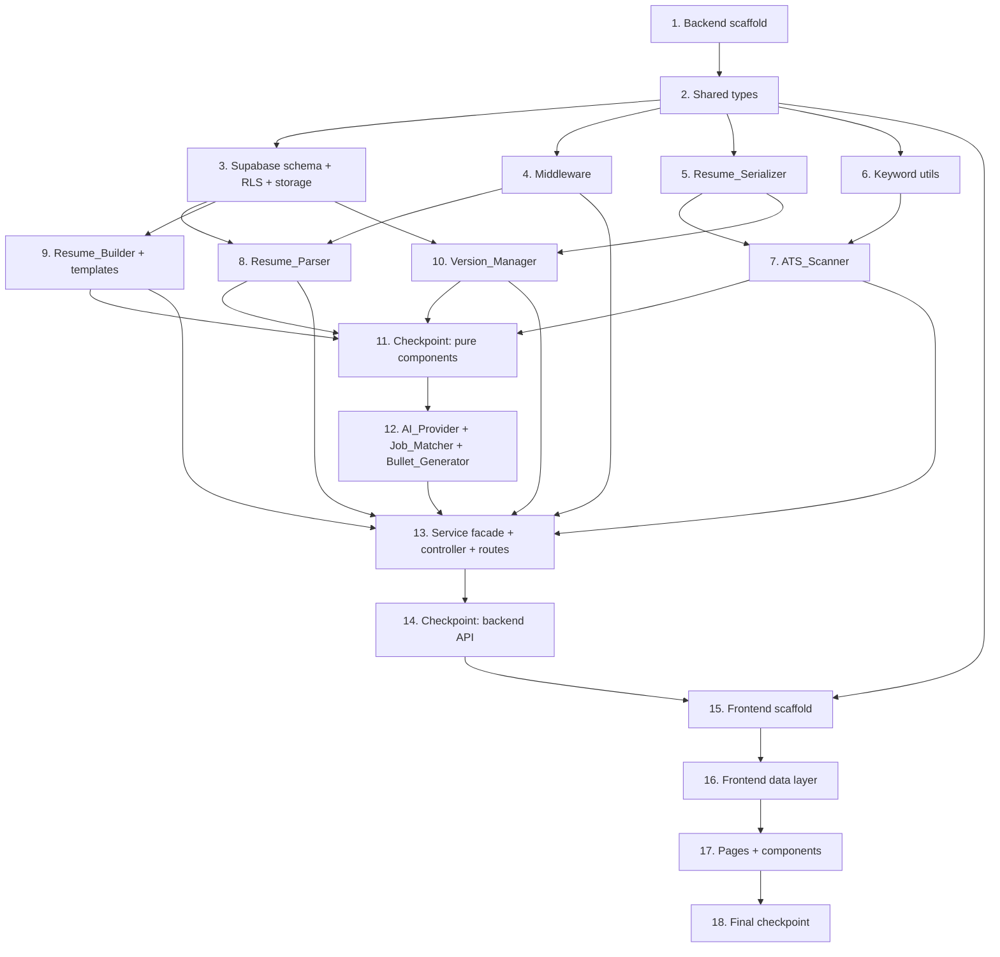

# Implementation Plan: Module 1 — Resume

## Overview

This plan converts the approved Resume module design into incremental, test-driven coding tasks. Work proceeds in dependency order: backend scaffolding and shared types first, then the Supabase schema, then middleware, then the pure/in-process components (serializer, keyword utils, ATS scanner, parser, builder, version manager), then the AI-backed components, then the controller/routes wiring, and finally the frontend. Each component is implemented before the layer that consumes it so there is no orphaned code — everything is wired into the request pipeline by the end.

All 10 correctness properties from the design map to a `fast-check` property-based test (minimum 100 iterations, tagged `// Feature: resume, Property {n}: ...`). RLS/persistence items are integration tests, not property tests, per the design's testing strategy.

Conventions enforced throughout (from steering): Express + TypeScript strict, Route → Controller → Service → Supabase flow, `{ data, error, meta }` envelope, named exports, explicit return types, no `any`, ESLint + Prettier, all DDL via `mcp_supabase_apply_migration`, RLS on every table, types mirrored between `backend/src/types/` and `frontend/src/types/`.

## Task Dependency Graph



```json
{
  "waves": [
    { "wave": 1, "tasks": ["1"] },
    { "wave": 2, "tasks": ["2"] },
    { "wave": 3, "tasks": ["3", "4", "5", "6"] },
    { "wave": 4, "tasks": ["7", "8", "9", "10"] },
    { "wave": 5, "tasks": ["11"] },
    { "wave": 6, "tasks": ["12"] },
    { "wave": 7, "tasks": ["13"] },
    { "wave": 8, "tasks": ["14"] },
    { "wave": 9, "tasks": ["15"] },
    { "wave": 10, "tasks": ["16"] },
    { "wave": 11, "tasks": ["17"] },
    { "wave": 12, "tasks": ["18"] }
  ]
}
```

## Tasks

- [x] 1. Scaffold the backend package and tooling
  - Create `backend/package.json` with Express, `@supabase/supabase-js`, `zod`, and dev deps (`typescript`, `vitest`, `fast-check`, `eslint`, `prettier`, `@types/*`)
  - Create `backend/tsconfig.json` with `"strict": true`, explicit module/target, and `outDir`
  - Add ESLint + Prettier config enforcing named exports and no-`any`; add `vitest.config.ts`
  - Add `npm` scripts: `dev`, `build`, `test`
  - Create `backend/src/index.ts` Express app skeleton (JSON parsing, base router mount, health check), with no business routes yet
  - _Requirements: 12.1_

- [x] 2. Define shared types and the API envelope
  - [x] 2.1 Author `backend/src/types/resume.types.ts`
    - Define `ResumeSectionType`, `IResumeSection`, `IStructuredResume`, `IResumeVersion`, `IAtsScanResult`, `IScoreFactor`, `IKeywordSuggestion`, `IMatchResult`, `XyzBullet`, `IResumeTemplate`, `IApiResponse<T>`, `IApiError`
    - Use explicit exported types, named exports only
    - _Requirements: 12.1, 12.2, 12.3_
  - [x] 2.2 Mirror types to `frontend/src/types/resume.types.ts`
    - Duplicate (not symlink) the same definitions to keep backend/frontend in sync
    - _Requirements: 12.1_

- [x] 3. Apply Supabase schema, RLS, and storage (DDL via `mcp_supabase_apply_migration` at execution time)
  - [x] 3.1 Create `resume_versions` table migration
    - Columns per design: `id`, `user_id`, `name` (check non-empty), `is_active`, `content` jsonb, `source_version_id`, `created_at`, `updated_at`
    - Add `index on (user_id)` and the partial unique index `resume_versions_one_active_per_user on (user_id) where is_active`
    - Enable RLS; add select/insert/update/delete policies keyed on `auth.uid() = user_id`
    - _Requirements: 5.3, 8.x, 9.x, 10.1, 10.3, 11.1, 11.3_
  - [x] 3.2 Create `resume_templates` table migration + seed
    - Columns: `id`, `name`, `sections` jsonb, `is_active`
    - Enable RLS; select policy `using (is_active = true)`; no client write policies
    - Seed a small set of ATS-parseable templates
    - _Requirements: 5.1_
  - [x] 3.3 Create `resume-uploads` storage bucket + RLS path scoping
    - Bucket with policies restricting object paths to those beginning with the caller's `auth.uid()`
    - _Requirements: 1.1, 11.1_
  - [ ]* 3.4 Write integration tests for persistence and RLS isolation
    - Save persists a version; per-user listing returns only the caller's versions; cross-user access yields not-found; partial unique index rejects a second active row
    - Use a Supabase test branch/project with 1–3 representative cases
    - _Requirements: 5.3, 10.1, 11.1, 11.3_

- [x] 4. Implement core middleware
  - [x] 4.1 Implement typed error hierarchy and error middleware
    - Define `ValidationError`, `UnsupportedFileTypeError`, `FileTooLargeError`, `ParseError`, `DeserializationError`, `AuthError`, `NotFoundError`, `AiProviderError`, `InternalError` with HTTP status mapping
    - `middleware/error.ts` serializes any thrown typed error to `{ data: null, error, meta }`
    - _Requirements: 12.1, 12.3_
  - [x] 4.2 Implement auth middleware
    - `middleware/auth.ts` verifies Supabase JWT, attaches `req.user`, builds a per-request Supabase client from the caller's token; rejects missing/invalid tokens with `AuthError`
    - _Requirements: 11.2_
  - [x] 4.3 Implement validation middleware
    - `middleware/validate.ts` validates body/params/query against a Zod schema; throws `ValidationError`
    - _Requirements: 11.4_
  - [x] 4.4 Implement upload middleware
    - `middleware/upload.ts` parses multipart, enforces 5 MB limit (`FileTooLargeError`) and `.pdf`/`.docx` extension guard (`UnsupportedFileTypeError`)
    - _Requirements: 1.2, 1.3_
  - [ ]* 4.5 Write unit/edge tests for middleware
    - Auth rejection (11.2); invalid extension (1.2); size boundary at exactly 5 MB (1.3); validation rejection of a malformed body
    - _Requirements: 1.2, 1.3, 11.2, 11.4_

- [x] 5. Implement the Resume_Serializer
  - [x] 5.1 Implement `utils/resumeSerializer.ts`
    - Serialize `IStructuredResume` → stored jsonb representation and deserialize back; throw `DeserializationError` on malformed input
    - _Requirements: 2.1, 2.2, 2.4_
  - [ ]* 5.2 Write property test for serialization round-trip
    - **Property 1: Structured resume serialization round-trip**
    - Build an `arbStructuredResume` generator; assert deserialize(serialize(x)) ≡ x
    - fast-check, min 100 iterations, tag `// Feature: resume, Property 1: ...`
    - **Validates: Requirements 2.1, 2.2, 2.3**
  - [ ]* 5.3 Write edge test for malformed stored representation
    - Malformed blob yields `DeserializationError`
    - _Requirements: 2.4_

- [x] 6. Implement keyword utilities
  - [x] 6.1 Implement `utils/keywords.ts`
    - Normalize (lowercase, strip punctuation), tokenize, remove stopwords, Porter-stem; expose stem-set and JD-minus-resume difference helpers
    - _Requirements: 4.1, 4.2, 4.3_
  - [ ]* 6.2 Write property test for keyword set difference
    - **Property 3: Keyword suggestions equal the JD-minus-resume term difference**
    - Token-set generators; assert every suggestion stem is in JD stems and not in resume stems; empty list when resume covers all significant JD stems
    - fast-check, min 100 iterations, tag `// Feature: resume, Property 3: ...`
    - **Validates: Requirements 4.1, 4.2, 4.3**

- [x] 7. Implement the ATS_Scanner
  - [x] 7.1 Implement `services/atsScanner.service.ts`
    - Compute integer `Compatibility_Score` in [0,100] from formatting/parseability factors; relative to JD when provided, formatting-only otherwise; return contributing factors; consume `utils/keywords.ts` for suggestions
    - Empty/whitespace extractable content returns score 0 + explanatory factor
    - _Requirements: 3.1, 3.2, 3.3, 3.5, 4.1_
  - [ ]* 7.2 Write property test for score bounds
    - **Property 2: ATS compatibility score is bounded**
    - `arbStructuredResume` + optional JD; assert score is an integer in [0,100]
    - fast-check, min 100 iterations, tag `// Feature: resume, Property 2: ...`
    - **Validates: Requirements 3.1**
  - [ ]* 7.3 Write property test for empty-content scoring
    - **Property 9: Empty-content resume scores zero**
    - Generate resumes with empty/whitespace-only content; assert score 0 and an explanatory factor present
    - fast-check, min 100 iterations, tag `// Feature: resume, Property 9: ...`
    - **Validates: Requirements 3.5**
  - [ ]* 7.4 Write unit tests for scan modes
    - With-JD vs no-JD scoring paths and contributing-factor output
    - _Requirements: 3.2, 3.3, 3.4_

- [x] 8. Implement the Resume_Parser
  - [x] 8.1 Implement `services/resumeParser.service.ts`
    - Extract `IStructuredResume` from `.pdf`/`.docx` (read from `resume-uploads`); throw `ParseError` when a file cannot be parsed
    - _Requirements: 1.1, 1.4_
  - [ ]* 8.2 Write unit tests over real fixtures
    - Parse representative `.pdf` and `.docx` fixtures (1.1, 1.5); corrupt file yields `ParseError` (1.4)
    - _Requirements: 1.1, 1.4, 1.5_

- [x] 9. Implement the Resume_Builder and templates
  - [x] 9.1 Implement template listing and `buildFromTemplate`
    - List ATS-parseable templates from `resume_templates`; build a `Structured_Resume` whose section types exactly match the selected template
    - _Requirements: 5.1, 5.2_
  - [ ]* 9.2 Write property test for template section structure
    - **Property 4: Built resume matches its template's section structure**
    - Iterate templates; assert built resume contains exactly the template's declared section types
    - fast-check, min 100 iterations, tag `// Feature: resume, Property 4: ...`
    - **Validates: Requirements 5.2**

- [x] 10. Implement the Version_Manager
  - [x] 10.1 Implement clone / rename / list / save / activate
    - `cloneVersion` (new id, equivalent content, source untouched, `source_version_id` set); `renameVersion` (update name, preserve content); `listVersions` (RLS-scoped); `saveVersion` (persist, reject empty required section); `setActiveVersion` (single active per user, most-recent wins); map RLS no-rows to `NotFoundError`
    - _Requirements: 5.3, 5.4, 8.1, 8.2, 8.3, 9.1, 9.3, 10.1, 10.2, 10.3, 10.4_
  - [ ]* 10.2 Write property test for cloning
    - **Property 5: Cloning preserves content, assigns a new identity, and leaves the source unchanged**
    - Version generators; assert clone content ≡ source, ids differ, source content+name unchanged
    - fast-check, min 100 iterations, tag `// Feature: resume, Property 5: ...`
    - **Validates: Requirements 8.1, 8.2**
  - [ ]* 10.3 Write property test for single active version
    - **Property 7: At most one active resume version per user**
    - Generate a set of versions + a sequence of activations; assert ≤1 active and active == most recently activated
    - fast-check, min 100 iterations, tag `// Feature: resume, Property 7: ...`
    - **Validates: Requirements 10.2, 10.3**
  - [ ]* 10.4 Write property test for renaming
    - **Property 10: Renaming preserves content**
    - Generate version + non-empty name; assert name updated and content unchanged
    - fast-check, min 100 iterations, tag `// Feature: resume, Property 10: ...`
    - **Validates: Requirements 9.1**
  - [ ]* 10.5 Write edge test for empty required section on save
    - Saving with an empty required section yields `ValidationError` identifying the section
    - _Requirements: 5.4_

- [x] 11. Checkpoint — pure/in-process components
  - Ensure all tests pass, ask the user if questions arise.

- [x] 12. Implement the AI_Provider wrapper and AI-backed components
  - [x] 12.1 Implement `services/aiProvider.service.ts`
    - Single Gemini contact point; read key from env; request JSON output; validate with Zod; map any network/timeout/quota/schema failure to `AiProviderError`
    - _Requirements: 6.4, 7.4_
  - [x] 12.2 Implement `services/jobMatcher.service.ts`
    - Compute `Match_Score` via AI_Provider; clamp score to integer [0,100]; return matched/missing concepts
    - _Requirements: 6.1, 6.2_
  - [ ]* 12.3 Write property test for match score bounds (mocked AI)
    - **Property 6: Match score is bounded**
    - Mock AI_Provider with numeric/garbage/out-of-range responses; assert returned score is an integer in [0,100]
    - fast-check, min 100 iterations, tag `// Feature: resume, Property 6: ...`
    - **Validates: Requirements 6.1**
  - [x] 12.4 Implement `services/bulletGenerator.service.ts`
    - Generate one or more X-Y-Z bullets via AI_Provider; post-validate each bullet non-empty; surface `AiProviderError`
    - _Requirements: 7.1, 7.2, 7.4_
  - [ ]* 12.5 Write unit tests for AI failure mapping and bullet/match envelopes (mocked Gemini)
    - AI failure → `AiProviderError` (6.4, 7.4); bullet format checks (7.1, 7.2); match concept output (6.2)
    - _Requirements: 6.2, 6.4, 7.1, 7.2, 7.4_

- [x] 13. Implement the resume service facade, controller, and routes
  - [x] 13.1 Implement `services/resume.service.ts` facade
    - Expose the representative signatures from the design, delegating to parser/serializer/scanner/matcher/bullets/version-manager; throw typed errors
    - _Requirements: 1.1, 2.x, 3.x, 4.x, 5.x, 6.x, 7.x, 8.x, 9.x, 10.x_
  - [x] 13.2 Implement `controllers/resume.controller.ts`
    - Translate validated requests to service calls; shape every result into the `{ data, error, meta }` envelope (data populated/error null on success; data null/typed error on failure)
    - _Requirements: 1.5, 3.4, 6.2, 12.1, 12.2, 12.3_
  - [x] 13.3 Implement `routes/resume.ts` and Zod schemas; mount under `/api/v1/resume`
    - Wire endpoints: `POST /uploads`, `POST /scans`, `POST /keyword-suggestions` (reject missing JD), `GET /templates`, `POST /versions`, `GET /versions`, `POST /versions/:id/clone`, `PATCH /versions/:id` (reject empty name), `POST /versions/:id/activate`, `POST /match` (reject missing JD), `POST /bullets` (reject empty experience); attach auth → validation → controller; register error middleware last in `index.ts`
    - _Requirements: 4.4, 5.1, 6.3, 7.3, 9.2, 11.2, 11.4, 12.1_
  - [ ]* 13.4 Write property test for the API envelope
    - **Property 8: All responses conform to the API envelope**
    - Handler-outcome generator (success + each failure type); assert envelope invariant
    - fast-check, min 100 iterations, tag `// Feature: resume, Property 8: ...`
    - **Validates: Requirements 12.1, 12.2, 12.3**
  - [ ]* 13.5 Write edge/validation tests per route
    - Missing JD on keyword-suggestions/match (4.4, 6.3); empty name (9.2); whitespace experience (7.3)
    - _Requirements: 4.4, 6.3, 7.3, 9.2_

- [x] 14. Checkpoint — backend API complete
  - Ensure all tests pass, ask the user if questions arise.

- [x] 15. Scaffold the frontend package
  - Create `frontend/package.json` (React, TypeScript, Zustand, Tailwind, Vitest + Testing Library) and `tsconfig.json` with `"strict": true`
  - Configure Tailwind with the brand palette; add ESLint + Prettier and `dev`/`build`/`test` scripts
  - Create `frontend/src/App.tsx` shell with routing for the Resume pages
  - _Requirements: 12.1_

- [x] 16. Implement the frontend data layer
  - [x] 16.1 Implement `frontend/src/services/resume.service.ts`
    - HTTP calls to every `/api/v1/resume/*` endpoint; unwrap the envelope (return `data` on success, throw a typed client error carrying `error` on failure); never import the Supabase client
    - _Requirements: 12.1, 12.2, 12.3_
  - [ ]* 16.2 Write unit tests for envelope unwrapping
    - Success returns `data`; failure throws typed client error
    - _Requirements: 12.2, 12.3_
  - [x] 16.3 Implement `frontend/src/stores/resume.store.ts`
    - Zustand store: versions, active version, scan/match results, async status; actions call `resume.service.ts`
    - _Requirements: 10.1, 10.2_
  - [ ]* 16.4 Write unit tests for store state transitions
    - List/activate/scan flows update state correctly
    - _Requirements: 10.1, 10.2_

- [x] 17. Implement frontend pages and presentational components
  - [x] 17.1 Implement presentational components
    - `components/ScoreGauge/` (0–100 gauge), `components/KeywordList/`, `components/MatchPanel/`; semantic HTML, accessible labels, Tailwind utility classes
    - _Requirements: 3.4, 4.1, 6.2_
  - [x] 17.2 Implement `pages/Resume/ResumeUploadPage.tsx`
    - Upload + scan workflow wired to the store; render `ScoreGauge` + `KeywordList`
    - _Requirements: 1.1, 1.5, 3.4, 4.1_
  - [x] 17.3 Implement `pages/Resume/ResumeBuilderPage.tsx`
    - Template selection + section editing + save; render `MatchPanel` and bullet generation
    - _Requirements: 5.1, 5.2, 5.3, 6.2, 7.1_
  - [x] 17.4 Implement `pages/Resume/ResumeVersionsPage.tsx`
    - List / clone / rename / switch wired to the store
    - _Requirements: 8.1, 9.1, 10.1, 10.2_
  - [ ]* 17.5 Write component render tests
    - Example-based render tests for `ScoreGauge`, `KeywordList`, `MatchPanel`
    - _Requirements: 3.4, 4.1, 6.2_

- [x] 18. Final checkpoint — full module
  - Ensure all backend and frontend tests pass, ask the user if questions arise.

## Notes

- Tasks marked with `*` are optional test sub-tasks and can be skipped for a faster MVP; core implementation tasks are never optional.
- Properties P1–P10 each map to exactly one `fast-check` property-based test (≥100 iterations, tagged `// Feature: resume, Property {n}: ...`).
- RLS, persistence, and per-user isolation are covered by integration tests (task 3.4), not property tests, per the design's testing strategy.
- All DDL is applied through `mcp_supabase_apply_migration` during execution of tasks 3.1–3.3 — no migrations are applied during planning.
- Each task references the specific requirement IDs and/or design properties it implements for traceability.
