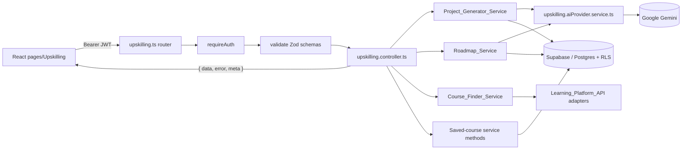
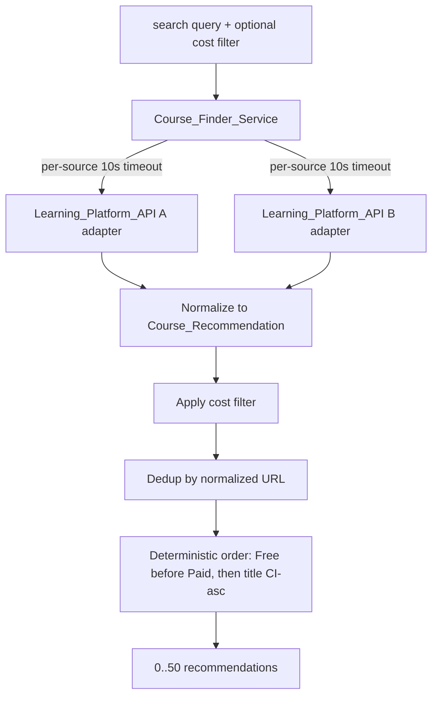

# Design Document

## Overview

The Upskilling module (Module 4, branded **"Career Roadmap & Learning Engine"**) adds three sub-features to StayQualifAI: a **Role-Based Project Generator**, a **Career Goal Roadmap** with milestone tracking, and a **Course & Certificate Finder**. It follows the established platform architecture exactly — `Route → Controller → Service → Supabase client` — is mounted under `/api/v1/upskilling/*`, and surfaces its UI at `frontend/src/pages/Upskilling/`.

The module is deliberately self-contained per the platform's domain-isolation rule:

- **No cross-module imports.** It defines its own AI wrapper (`upskilling.aiProvider.service.ts`) by reusing the same pattern as `interview.aiProvider.service.ts` (lazy client, JSON-mode generation, Zod validation, `AbortController` timeout, failure → `AiProviderError`) rather than importing another module's wrapper.
- **Reuses shared platform infrastructure only.** `requireAuth`, `validate`, the centralized error middleware, and the typed error hierarchy in `backend/src/utils/errors.ts` (`ValidationError`, `NotFoundError`, `ConflictError`, `AuthError`, `AiProviderError`) are platform-wide and reused directly.
- **RLS is the source of truth for ownership.** All tables are prefixed `upskilling_`, have Row Level Security enabled, and are accessed through the per-request JWT-scoped `req.supabase` client. Ownership failures surface as `NotFoundError` (404), never 403, so the existence of other users' data is never revealed.
- **Consistent envelope.** All responses use the `{ data, error, meta }` shape; list responses set `meta.total`, single-resource and action responses set `meta` to `null`.

The module splits into three functional concerns backed by distinct services:

| Concern | Service | External dependency |
|---------|---------|--------------------|
| Project generation | `Project_Generator_Service` | `Upskilling_AI_Provider` (Gemini) |
| Roadmap generation + tracking | `Roadmap_Service` | `Upskilling_AI_Provider` (Gemini) |
| Course/certificate discovery | `Course_Finder_Service` | one or more `Learning_Platform_API` sources |

### Requirements Coverage Summary

| Requirement | Addressed by |
|-------------|--------------|
| 1. Role-Based Project Generation | `Project_Generator_Service`, `upskilling.aiProvider.service.ts`, generation Zod schema |
| 2. Project Suggestion Persistence | `upskilling_project_suggestions` table, project persistence service methods |
| 3. Career Goal Roadmap Generation | `Roadmap_Service`, AI provider, roadmap generation Zod schema |
| 4. Career Roadmap Persistence & Milestone Tracking | `upskilling_roadmaps` + `upskilling_milestones` tables, tracking service methods |
| 5. Course & Certificate Finding | `Course_Finder_Service`, Learning_Platform_API adapters, dedup + ordering utilities |
| 6. Saved Course Management | `upskilling_saved_courses` table, saved-course service methods |
| 7. Authentication & Ownership Isolation | `requireAuth` middleware, RLS policies, JWT-scoped `req.supabase` |
| 8. Upskilling Module Navigation | `pages/Upskilling/` tabbed layout, `upskilling.store.ts` |

## Architecture

### Request Flow



Every route threads middleware in the fixed order `requireAuth → validate → controller handler`. `requireAuth` runs first, so an unauthenticated request never reaches validation or business logic (Requirement 7.1, 7.2). The controller narrows `req.user` and `req.supabase`, then delegates to a service; it never touches Gemini, a Learning_Platform_API, or Supabase directly.

### Backend File Layout

```
backend/src/
  routes/
    upskilling.ts                       # Router: auth → validate → handler
    upskilling.schemas.ts               # Zod request schemas (body/params/query)
  controllers/
    upskilling.controller.ts            # Envelope shaping + service orchestration
  services/
    upskilling.service.ts               # Facade re-exporting the sub-services
    upskilling.aiProvider.service.ts    # Per-module Gemini wrapper (pattern reuse)
    upskilling.projectGenerator.service.ts
    upskilling.roadmap.service.ts
    upskilling.courseFinder.service.ts
  types/
    upskilling.types.ts                 # Shared interfaces (mirrored to frontend)
  utils/
    upskillingCourseDedup.ts            # URL normalization + dedup + ordering
backend/supabase/migrations/
    <timestamp>_create_upskilling_tables.sql
backend/tests/
    upskilling.*.test.ts
```

### Frontend File Layout

```
frontend/src/
  pages/Upskilling/
    UpskillingPage.tsx                  # Tab shell (Projects | Roadmap | Courses)
    ProjectsTab.tsx
    RoadmapTab.tsx
    CoursesTab.tsx
  components/Upskilling/                # Presentational cards, milestone list, etc.
  stores/upskilling.store.ts            # Zustand store (active tab + per-feature state)
  services/upskilling.service.ts        # API client calls (attaches Bearer token)
  types/upskilling.types.ts             # Mirrored interfaces
```

### Authentication and Tenancy

The module owns no auth logic. The shared `requireAuth` middleware verifies the Supabase JWT, attaches `req.user`, and builds a per-request JWT-scoped `req.supabase`. All service methods receive `req.supabase` and `userId`, so:

- A missing/malformed/expired/invalid token is rejected with `AuthError` (HTTP 401) before any controller runs (Requirements 7.1, 7.2).
- Every query runs under RLS, scoped to the authenticated user (Requirement 7.3).
- Inserts set `user_id = auth.uid()` via the JWT-scoped client (Requirement 7.5).
- A read/update/delete of another user's row returns zero rows under RLS, which the service maps to `NotFoundError` (HTTP 404) — never 403 (Requirement 7.4).
- RLS is enabled on every `upskilling_` table (Requirement 7.6).

### AI Provider Wrapper

`upskilling.aiProvider.service.ts` exposes a single `generateJson<T>({ prompt, schema, systemInstruction?, timeoutMs? })` function that mirrors the interview module's wrapper: lazily constructed, key-rotating Gemini client; JSON-mode generation; `AbortController` timeout; and uniform translation of **any** failure (missing key, network error, timeout, empty/non-JSON response, schema mismatch) into a typed `AiProviderError`. Callers (`Project_Generator_Service`, `Roadmap_Service`) never see Gemini internals (Requirements 1.6, 3.6).

The project generator uses a 20-second timeout (Requirement 1.1); the roadmap generator uses a 20-second timeout (Requirements 3.1, 3.6). The generated payload is validated against a strict Zod schema so out-of-bounds AI output is treated as a provider failure rather than persisted.

### Course Finder Source Aggregation



Each Learning_Platform_API adapter is queried concurrently with an independent 10-second `AbortController` timeout. A source that errors, is unavailable, or exceeds its timeout is excluded; results from remaining sources are still returned (Requirement 5.7). Only when **every** source fails does the service raise an error indicating recommendations are temporarily unavailable (Requirement 5.8). Aggregated results are filtered by cost, deduplicated by normalized URL, ordered deterministically, and capped at 50.

## Components and Interfaces

### Routes (`upskilling.ts`)

All routes are authenticated; bodies/params/query are validated before the controller runs.

| Method | Path | Validation | Handler | Requirements |
|--------|------|-----------|---------|--------------|
| POST | `/projects/generate` | body | `generateProjectsHandler` | 1.1–1.6 |
| POST | `/projects` | body | `saveProjectHandler` | 2.1, 2.6, 2.7 |
| GET | `/projects` | — | `listProjectsHandler` | 2.2, 2.3 |
| DELETE | `/projects/:id` | params | `deleteProjectHandler` | 2.4, 2.5 |
| POST | `/roadmaps/generate` | body | `generateRoadmapHandler` | 3.1–3.6 |
| POST | `/roadmaps` | body | `saveRoadmapHandler` | 4.1, 4.2 |
| GET | `/roadmaps` | — | `listRoadmapsHandler` | 4.3 |
| GET | `/roadmaps/:id` | params | `getRoadmapHandler` | 4.7, 4.8 |
| PATCH | `/roadmaps/:roadmapId/milestones/:milestoneId` | params + body | `updateMilestoneHandler` | 4.4, 4.5, 4.6, 4.8 |
| DELETE | `/roadmaps/:id` | params | `deleteRoadmapHandler` | 4.8, 4.9 |
| GET | `/courses/search` | query | `searchCoursesHandler` | 5.1–5.9 |
| POST | `/courses/saved` | body | `saveCourseHandler` | 6.1, 6.2, 6.4 |
| GET | `/courses/saved` | — | `listSavedCoursesHandler` | 6.3 |
| DELETE | `/courses/saved/:id` | params | `deleteSavedCourseHandler` | 6.5, 6.6 |

### Controller (`upskilling.controller.ts`)

Mirrors the jobsearch controller pattern: an `asyncHandler` wrapper forwards thrown typed errors to `next()`; `requireUserId(req)` and `requireSupabase(req)` narrow the auth-provided values; a `successEnvelope`/`listEnvelope` helper shapes `{ data, error, meta }`. Action responses (DELETE) return `{ data: null, error: null, meta: null }`; list responses set `meta.total`.

### Services

**`Project_Generator_Service`** (`upskilling.projectGenerator.service.ts`)
- `generateProjects(input: IGenerateProjectsInput): Promise<IProjectSuggestion[]>` — builds the Gemini prompt (incorporating optional focus skills), calls `generateJson` with the project schema (20s timeout), and returns 3–5 suggestions. Schema enforces all per-suggestion bounds (Requirement 1.2) and the focus-skill coverage constraint (Requirement 1.3).
- `saveProject(supabase, userId, input): Promise<IProjectSuggestion>` — persists a suggestion (Requirements 2.1, 2.7).
- `listProjects(supabase, userId): Promise<IProjectSuggestion[]>` — returns the user's suggestions ordered by `created_at` DESC, then `id` ASC (Requirements 2.2, 2.3).
- `deleteProject(supabase, userId, id): Promise<void>` — deletes; zero rows → `NotFoundError` (Requirements 2.4, 2.5).

**`Roadmap_Service`** (`upskilling.roadmap.service.ts`)
- `generateRoadmap(input: IGenerateRoadmapInput): Promise<IRoadmapDraft>` — calls `generateJson` with the roadmap schema (20s timeout); produces 3–12 milestones with contiguous sequence positions and total duration in `(0, 156]` weeks (Requirements 3.1–3.4, 3.6).
- `saveRoadmap(supabase, userId, draft): Promise<IRoadmap>` — persists the roadmap and its milestones (completion defaults false / null timestamp), preserving count and ordering (Requirements 4.1, 4.2).
- `listRoadmaps(supabase, userId): Promise<IRoadmapSummary[]>` — ordered by `created_at` DESC (Requirement 4.3).
- `getRoadmap(supabase, userId, id): Promise<IRoadmapDetail>` — returns milestones plus `completedCount`/`totalCount` (Requirements 4.7, 4.8).
- `setMilestoneCompletion(supabase, userId, roadmapId, milestoneId, completed): Promise<IMilestone>` — idempotent set: completing an already-complete milestone leaves state/timestamp unchanged; uncompleting clears the timestamp (Requirements 4.4–4.6, 4.8).
- `deleteRoadmap(supabase, userId, id): Promise<void>` — cascade-deletes milestones (Requirements 4.8, 4.9).

**`Course_Finder_Service`** (`upskilling.courseFinder.service.ts`)
- `searchCourses(input: ISearchCoursesInput): Promise<ICourseRecommendation[]>` — fans out to Learning_Platform_API adapters with per-source 10s timeouts, normalizes, applies the optional cost filter, deduplicates by normalized URL, orders deterministically, and caps at 50 (Requirements 5.1–5.9).
- `saveCourse(supabase, userId, input): Promise<ISavedCourse>` — persists a bookmark; duplicate normalized URL → `ConflictError` (Requirements 6.1, 6.4).
- `listSavedCourses(supabase, userId): Promise<ISavedCourse[]>` — ordered by `created_at` DESC, then `url` ASC (Requirement 6.3).
- `deleteSavedCourse(supabase, userId, id): Promise<void>` — zero rows → `NotFoundError` (Requirements 6.5, 6.6).

**Learning_Platform_API adapter interface** — each source implements:
```ts
interface ILearningPlatformAdapter {
  readonly sourceName: string;
  search(query: string, signal: AbortSignal): Promise<ICourseRecommendation[]>;
}
```
This isolates each external catalog behind a normalizer so the finder treats every source uniformly.

### Pure Utilities (`upskillingCourseDedup.ts`)

- `normalizeUrl(url: string): string` — lowercases scheme/host, strips trailing slash and default ports, used for both dedup (Requirement 5.4) and the saved-course conflict check (Requirement 6.4).
- `dedupeByNormalizedUrl(recs: ICourseRecommendation[]): ICourseRecommendation[]` — keeps the first occurrence per normalized URL (Requirement 5.4).
- `orderRecommendations(recs: ICourseRecommendation[]): ICourseRecommendation[]` — Free before Paid, then title in case-insensitive ascending order (Requirement 5.9).

### Frontend (`pages/Upskilling/`)

`UpskillingPage.tsx` renders an underline-style tab bar (Projects | Roadmap | Courses, left-to-right). Active tab state lives in `upskilling.store.ts` (Zustand), defaulting to `Projects`. Switching tabs swaps content client-side (no page reload) within 300 ms, applies a purple bottom border to the active tab only, ensures exactly one active tab, and exposes a keyboard-accessible focus indicator distinct from the active border; Enter/Space activates the focused tab (Requirement 8.1–8.7). The store also holds per-feature view state (generated projects, current roadmap, search results). API calls go through `services/upskilling.service.ts`, which attaches the Bearer token.

## Data Models

### TypeScript Interfaces (`upskilling.types.ts`, mirrored to frontend)

```ts
export type DifficultyLevel = 'Beginner' | 'Intermediate' | 'Advanced';
export type CostClassification = 'Free' | 'Paid';

// --- Projects -------------------------------------------------------------
export interface IGenerateProjectsInput {
  targetRole: string;          // 2..100 non-whitespace chars
  focusSkills?: string[];      // 1..10 entries, each 1..50 non-whitespace chars
}

export interface IProjectSuggestion {
  id: string;                  // present once persisted
  targetRole: string;
  title: string;               // 3..150 chars
  description: string;         // 50..1000 chars
  demonstratedSkills: string[];// 1..10 unique non-empty, each 1..50 nw chars
  difficulty: DifficultyLevel;
  estimatedEffortHours: number;// integer 1..500
  createdAt: string;           // ISO timestamp (persisted records)
}

// --- Roadmaps -------------------------------------------------------------
export interface IGenerateRoadmapInput {
  currentRole: string;         // 2..100 non-whitespace chars
  targetRole: string;          // 2..100 non-whitespace chars
  targetDurationMonths: number;// integer 1..36
}

export interface IMilestone {
  id: string;
  sequence: number;            // contiguous, starts at 1, step 1
  title: string;               // 1..150 non-whitespace chars
  description: string;         // 20..1000 chars
  skills: string[];            // 0..10 unique, each 1..50 nw chars
  estimatedDurationWeeks: number; // integer 1..156
  completed: boolean;          // defaults false
  completedAt: string | null;  // defaults null
}

export interface IRoadmapDraft {
  currentRole: string;
  targetRole: string;
  targetDurationMonths: number;
  milestones: Omit<IMilestone, 'id' | 'completed' | 'completedAt'>[];
}

export interface IRoadmap {
  id: string;
  currentRole: string;
  targetRole: string;
  targetDurationMonths: number;
  createdAt: string;
  milestones: IMilestone[];
}

export interface IRoadmapSummary {
  id: string;
  currentRole: string;
  targetRole: string;
  targetDurationMonths: number;
  createdAt: string;
  completedCount: number;      // 0..totalCount
  totalCount: number;
}

export interface IRoadmapDetail extends IRoadmap {
  completedCount: number;
  totalCount: number;
}

// --- Courses --------------------------------------------------------------
export interface ISearchCoursesInput {
  query: string;               // 2..100 non-whitespace chars
  cost?: CostClassification;   // optional filter
}

export interface ICourseRecommendation {
  title: string;               // 1..200 chars
  provider: string;            // 1..100 chars
  url: string;                 // HTTPS
  cost: CostClassification;
  rating?: number;             // optional
}

export interface ISavedCourse {
  id: string;
  title: string;               // 1..150 chars
  provider: string;            // 1..100 chars
  url: string;                 // HTTPS, <= 2048 chars
  cost: CostClassification;
  createdAt: string;
}
```

### Database Schema (`upskilling_*` tables, RLS enabled)

All tables include `user_id uuid NOT NULL REFERENCES auth.users(id)` and `created_at timestamptz NOT NULL DEFAULT now()`, with RLS policies scoping every operation to `auth.uid() = user_id` (parent-scoped for milestones). DDL is applied via `mcp_supabase_apply_migration`.

**`upskilling_project_suggestions`**

| Column | Type | Notes |
|--------|------|-------|
| id | uuid PK | `gen_random_uuid()` |
| user_id | uuid NOT NULL | FK `auth.users(id)` |
| target_role | varchar(100) NOT NULL | |
| title | varchar(150) NOT NULL | CHECK length ≥ 3 |
| description | varchar(1000) NOT NULL | CHECK length ≥ 50 |
| demonstrated_skills | text[] NOT NULL | 1..10 entries |
| difficulty | text NOT NULL | CHECK in (Beginner, Intermediate, Advanced) |
| estimated_effort_hours | integer NOT NULL | CHECK between 1 and 500 |
| created_at | timestamptz NOT NULL | |

Index: `(user_id, created_at DESC, id ASC)` for the list sort (Requirement 2.2).

**`upskilling_roadmaps`**

| Column | Type | Notes |
|--------|------|-------|
| id | uuid PK | |
| user_id | uuid NOT NULL | FK `auth.users(id)` |
| current_role | varchar(100) NOT NULL | |
| target_role | varchar(100) NOT NULL | |
| target_duration_months | integer NOT NULL | CHECK between 1 and 36 |
| created_at | timestamptz NOT NULL | |

Index: `(user_id, created_at DESC)` (Requirement 4.3).

**`upskilling_milestones`**

| Column | Type | Notes |
|--------|------|-------|
| id | uuid PK | |
| roadmap_id | uuid NOT NULL | FK `upskilling_roadmaps(id) ON DELETE CASCADE` (Requirement 4.9) |
| sequence | integer NOT NULL | contiguous from 1 |
| title | varchar(150) NOT NULL | |
| description | varchar(1000) NOT NULL | CHECK length ≥ 20 |
| skills | text[] NOT NULL DEFAULT '{}' | 0..10 entries |
| estimated_duration_weeks | integer NOT NULL | CHECK between 1 and 156 |
| completed | boolean NOT NULL DEFAULT false | (Requirement 4.2) |
| completed_at | timestamptz | NULL default (Requirement 4.2) |

Constraint: `UNIQUE (roadmap_id, sequence)`. RLS via the parent roadmap's `user_id` (EXISTS subquery, mirroring `jobsearch_stage_history`).

**`upskilling_saved_courses`**

| Column | Type | Notes |
|--------|------|-------|
| id | uuid PK | |
| user_id | uuid NOT NULL | FK `auth.users(id)` |
| title | varchar(150) NOT NULL | |
| provider | varchar(100) NOT NULL | |
| url | varchar(2048) NOT NULL | HTTPS |
| normalized_url | varchar(2048) NOT NULL | for conflict detection |
| cost | text NOT NULL | CHECK in (Free, Paid) |
| created_at | timestamptz NOT NULL | |

Constraint: `UNIQUE (user_id, normalized_url)` enforces the saved-course conflict rule at the database level (Requirement 6.4). Index: `(user_id, created_at DESC, url ASC)` (Requirement 6.3).

## Correctness Properties

*A property is a characteristic or behavior that should hold true across all valid executions of a system — essentially, a formal statement about what the system should do. Properties serve as the bridge between human-readable specifications and machine-verifiable correctness guarantees.*

These properties are derived from the prework analysis. UI behaviors (Requirement 8 except 8.5), the live AI/Learning-platform timeouts (1.1, 3.1, 5.1 timing), the JWT-scoped-client/RLS-enabled configuration (7.3, 7.6), and the "exactly one Owner" structural invariant (2.7) are validated by example-based, integration, or smoke tests rather than properties (see Testing Strategy). Redundant per-record ownership and persistence criteria have been consolidated as noted in the prework reflection.

### Property 1: Project generation count is bounded

*For any* valid Target_Role (and optional valid focus-skills list), the Project_Generator_Service returns between 3 and 5 Project_Suggestions.

**Validates: Requirements 1.1**

### Property 2: Every generated Project_Suggestion satisfies its field bounds

*For any* Project_Suggestion produced or accepted by the module, the title is 3–150 characters, the description is 50–1000 characters, the demonstrated skills are 1–10 unique non-empty entries each 1–50 non-whitespace characters, the difficulty is one of Beginner/Intermediate/Advanced, and the estimated effort is a whole number of hours in 1–500; output violating any bound is rejected as an AI provider error.

**Validates: Requirements 1.2, 2.6**

### Property 3: Focus skills are covered by generated suggestions

*For any* valid focus-skills list supplied to project generation, the union of demonstrated skills across the returned Project_Suggestions includes at least one of the provided focus skills.

**Validates: Requirements 1.3**

### Property 4: Project generation input validation

*For any* project generation request whose Target_Role has fewer than 2 non-whitespace characters or more than 100 characters, or whose focus-skills list has more than 10 entries or any entry shorter than 1 non-whitespace character or longer than 50 characters, the module rejects the request with a validation error and produces no suggestions.

**Validates: Requirements 1.4, 1.5**

### Property 5: AI provider failure is surfaced uniformly (projects)

*For any* AI provider failure mode (error, timeout, or output not satisfying the expected schema) during project generation, the module returns an AI provider error and persists no record.

**Validates: Requirements 1.6**

### Property 6: Project suggestion persistence round-trip with owner

*For any* valid Project_Suggestion saved by a user, reading it back returns equal field values, a unique identifier, and an owner equal to the saving user.

**Validates: Requirements 2.1, 2.7, 7.5**

### Property 7: Saved project list is owner-scoped and ordered

*For any* set of persisted Project_Suggestions across users, listing as a given user returns exactly that user's suggestions (an empty list when none), sorted by creation timestamp descending and, for equal timestamps, by identifier ascending.

**Validates: Requirements 2.2, 2.3**

### Property 8: Roadmap generation count is bounded

*For any* valid roadmap generation request, the Roadmap_Service produces between 3 and 12 Milestones.

**Validates: Requirements 3.1**

### Property 9: Generated Milestones form a contiguous ordered sequence

*For any* generated Career_Roadmap, the Milestone sequence positions are exactly 1..n with no gaps or duplicates.

**Validates: Requirements 3.2**

### Property 10: Every generated Milestone satisfies its field bounds

*For any* Milestone in a generated Career_Roadmap, the title is 1–150 non-whitespace characters, the description is 20–1000 characters, the skills are 0–10 unique entries each 1–50 non-whitespace characters, and the estimated duration is a whole number of weeks in 1–156.

**Validates: Requirements 3.3**

### Property 11: Roadmap total duration is bounded

*For any* generated Career_Roadmap, the sum of its Milestones' estimated durations in weeks is greater than 0 and at most 156.

**Validates: Requirements 3.4**

### Property 12: Roadmap generation input validation

*For any* roadmap generation request whose target duration is not a whole number or is outside 1–36 months, or whose current role or Target_Role has fewer than 2 non-whitespace characters or more than 100 characters, the module rejects the request with a validation error and generates no Career_Roadmap.

**Validates: Requirements 3.5**

### Property 13: AI provider failure is surfaced uniformly with no partial persistence (roadmaps)

*For any* AI provider failure mode (error, timeout, or output not satisfying the expected schema) during roadmap generation, the module returns an AI provider error and persists no partial Career_Roadmap or Milestone.

**Validates: Requirements 3.6**

### Property 14: Roadmap persistence round-trip with owner and default completion

*For any* generated Career_Roadmap saved by a user, reading it back preserves the Milestone count and contiguous sequence ordering, returns field values equal to the draft, sets the owner to the saving user, and persists every Milestone with completion state not-completed and an empty completion timestamp.

**Validates: Requirements 4.1, 4.2, 7.5**

### Property 15: Saved roadmap list is owner-scoped and ordered

*For any* set of persisted Career_Roadmaps across users, listing as a given user returns exactly that user's roadmaps sorted by creation timestamp descending.

**Validates: Requirements 4.3**

### Property 16: Marking completion is idempotent

*For any* owned Milestone, marking it completed once and then marking it completed again leaves its completion state and completion timestamp identical to their values after the first completion.

**Validates: Requirements 4.4, 4.5**

### Property 17: Complete-then-uncomplete restores the uncompleted state

*For any* owned Milestone, marking it completed and then marking it not-completed returns its completion state to not-completed and clears its completion timestamp to empty.

**Validates: Requirements 4.6**

### Property 18: Completed count is consistent and bounded

*For any* owned Career_Roadmap with any subset of its Milestones completed, viewing it returns a completed-Milestone count equal to the number of completed Milestones, which is between 0 and the total Milestone count inclusive, alongside that total.

**Validates: Requirements 4.7**

### Property 19: Deleting a roadmap removes all its milestones

*For any* owned Career_Roadmap, deleting it removes the roadmap and all of its associated Milestones, leaving no orphan Milestones, and returns a success response with an empty data payload.

**Validates: Requirements 4.9**

### Property 20: Cross-user access returns not-found and mutates nothing

*For any* persisted Project_Suggestion, Career_Roadmap, Milestone, or Saved_Course owned by one user, a read, update, or delete referencing it by another user (or referencing a non-existent identifier) returns a not-found error and leaves the targeted record unchanged.

**Validates: Requirements 2.4, 2.5, 4.8, 6.6, 7.4**

### Property 21: Course search result count is capped

*For any* course search over the aggregated Learning_Platform_API results, the Course_Finder_Service returns between 0 and 50 normalized Course_Recommendations.

**Validates: Requirements 5.1**

### Property 22: Every Course_Recommendation satisfies its field bounds

*For any* normalized Course_Recommendation returned by the finder, the title is 1–200 characters, the provider name is 1–100 characters, the URL uses the HTTPS scheme, and the cost classification is one of Free or Paid.

**Validates: Requirements 5.2**

### Property 23: Cost filter returns only matching recommendations

*For any* course search with a cost filter of Free or Paid, every returned Course_Recommendation has the selected cost classification.

**Validates: Requirements 5.3**

### Property 24: Recommendations are deduplicated by normalized URL

*For any* aggregated set of Course_Recommendations drawn from more than one source, no two returned recommendations share the same normalized URL.

**Validates: Requirements 5.4**

### Property 25: Recommendations are returned in deterministic order

*For any* set of returned Course_Recommendations, all Free recommendations precede all Paid recommendations, and within the same cost classification recommendations are ordered by title in case-insensitive ascending order.

**Validates: Requirements 5.9**

### Property 26: Partial source failure still returns surviving sources

*For any* proper subset of Learning_Platform_API sources that are unavailable, error, or exceed their per-source timeout, the Course_Finder_Service excludes those sources and returns the recommendations aggregated from the remaining successful sources.

**Validates: Requirements 5.7**

### Property 27: Course search query validation

*For any* course search whose query has fewer than 2 non-whitespace characters or more than 100 non-whitespace characters, the module rejects the request with a validation error.

**Validates: Requirements 5.6**

### Property 28: Saved course persistence round-trip with owner

*For any* valid Course_Recommendation saved by a user, reading it back returns equal field values (title, provider, URL, cost), a unique identifier, and an owner equal to the saving user.

**Validates: Requirements 6.1, 7.5**

### Property 29: Saved course save validation

*For any* save request missing a title, provider, URL, or cost classification, or whose URL does not use the HTTPS scheme, or whose cost classification is not Free or Paid, or whose title, provider, or URL exceeds its maximum length, the module rejects the request with a validation error and persists no record.

**Validates: Requirements 6.2**

### Property 30: Saved course list is owner-scoped and ordered

*For any* set of persisted Saved_Courses across users, listing as a given user returns exactly that user's Saved_Courses sorted by creation timestamp descending and, for equal timestamps, by URL ascending.

**Validates: Requirements 6.3**

### Property 31: Duplicate saved-course URL is rejected as a conflict

*For any* Saved_Course already persisted for a user, a subsequent save whose URL normalizes to the same value is rejected with a conflict error and leaves the existing Saved_Course unchanged.

**Validates: Requirements 6.4**

### Property 32: Exactly one navigation tab is active

*For any* sequence of tab-selection actions applied to the Upskilling navigation state, exactly one of the three tabs (Projects, Roadmap, Courses) is in the active state after each action.

**Validates: Requirements 8.5**

## Error Handling

All errors flow through the shared centralized error middleware, which serializes any `AppError` into the `{ data: null, error: { type, message, details? }, meta }` envelope and maps the HTTP status. The module reuses the existing typed hierarchy in `backend/src/utils/errors.ts` — it defines no new error types.

| Condition | Error type | HTTP | Requirements |
|-----------|-----------|------|--------------|
| Missing/malformed/expired/invalid JWT | `AuthError` | 401 | 7.1, 7.2 |
| Invalid request body/params/query (Zod) | `ValidationError` | 400 | 1.4, 1.5, 2.6, 3.5, 5.6, 6.2 |
| Record absent or owned by another user | `NotFoundError` | 404 | 2.5, 4.8, 6.6, 7.4 |
| Duplicate saved-course normalized URL | `ConflictError` | 409 | 6.4 |
| Gemini failure/timeout/bad schema | `AiProviderError` | 502 | 1.6, 3.6 |
| All Learning_Platform_API sources fail | `AiProviderError` (provider-unavailable message) | 502 | 5.8 |
| Unexpected failure | `InternalError` | 500 | — |

Key handling rules:

- **Validation runs before the controller.** Zod schemas in `upskilling.schemas.ts` reject malformed input via the shared `validate` middleware; each issue's `path` identifies the offending field and the message states the accepted range/value (Requirements 1.4, 1.5, 2.6, 3.5, 5.6, 6.2). No business logic or persistence runs on a rejected request.
- **AI output is validated, never trusted.** Generation results are parsed against strict Zod schemas inside the AI wrapper; out-of-bounds output becomes an `AiProviderError`, so a partial/invalid roadmap or suggestion is never persisted (Requirements 1.6, 3.6).
- **Ownership failures look like absence.** Services translate "zero rows affected" (under RLS) into `NotFoundError`, never `AuthError`/403, so the existence of other users' records is not revealed (Requirement 7.4).
- **Conflict precedes insert.** The saved-course `UNIQUE (user_id, normalized_url)` constraint is the source of truth; the service maps a unique-violation to `ConflictError` and leaves the existing row untouched (Requirement 6.4).
- **Per-source isolation.** Each Learning_Platform_API call is wrapped so a single source's error/timeout is swallowed and excluded; only an all-sources-failed condition raises a typed error (Requirements 5.7, 5.8).

## Testing Strategy

The module uses a dual approach: **property-based tests** for the universal properties above and **example/integration/smoke tests** for the criteria the prework classified as non-property.

### Property-Based Tests

- Library: **fast-check** with the existing test runner (matching the backend test setup). Property tests run a **minimum of 100 iterations** each.
- Each property test is tagged with a comment of the form:
  `// Feature: upskilling, Property {number}: {property_text}`
- Each property in the section above maps to a **single** property-based test (Properties 1–32).
- AI-dependent properties (1, 2, 3, 5, 8–14) use a **mocked `Upskilling_AI_Provider`** so generation logic, schema validation, and persistence guarantees are exercised deterministically and cheaply without live Gemini calls.
- Course-finder properties (21–27, 31) use **mocked `ILearningPlatformAdapter` implementations** with generators that produce varied recommendation sets (colliding normalized URLs, mixed cost, varied casing/titles, failing/timing-out subsets).
- Persistence/ownership properties (6, 7, 14, 15, 18, 19, 20, 28, 30) run against a **test Supabase project/schema** (or an RLS-faithful test harness) seeded with multiple owners, asserting RLS scoping, ordering, round-trips, and cascade behavior.
- Pure-utility properties (24, 25, and the normalization underpinning 31) target `upskillingCourseDedup.ts` directly with generated inputs.
- Navigation invariant (Property 32) tests the Zustand `upskilling.store.ts` reducer over random sequences of tab-selection actions.

### Example-Based Unit Tests

- Delete success envelopes: project delete (2.4), saved-course delete (6.5) return `{ data: null, error: null, meta: null }`.
- No-match search returns an empty list (5.5).
- All-sources-failed returns the temporarily-unavailable error (5.8).
- Empty saved/list cases (2.3) as explicit examples alongside the ordering property.

### Integration Tests

- Live-timeout behavior for project generation and roadmap generation (1.1, 3.1 — 20s) and course search (5.1 — 15s, per-source 10s) using controllable slow mocks/stubs, with 1–3 representative cases.
- Auth gating on the module mount: missing/malformed header → 401 (7.1) and expired/invalid token → 401 (7.2), asserting no controller side effects.

### Smoke / Configuration Checks

- Migration assertions that RLS is enabled on all four `upskilling_` tables (7.6) and that `user_id` is `NOT NULL` (2.7), runnable via the Supabase advisors/migration inspection.
- A review-level check that every service method accepts and uses the per-request `req.supabase` client (7.3).

### Frontend Component Tests

- Tab structure and order (8.1), tab switching shows only active content without reload (8.2), active-tab purple bottom border / inactive none (8.3), default Projects view (8.4), visible focus indicator distinct from the active border (8.6), and Enter/Space activation (8.7) via React Testing Library component tests.
